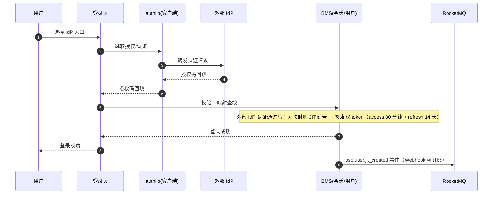

# 概要设计 · 身份认证（SSO）

> BMS · 外部 IdP、JIT 建号与 OIDC Provider

[概要设计](01_概要设计_总览.md) › 26-身份认证（SSO）　|　[← 26-租户管理](26_概要设计_租户管理.md)　|　[28-报表中心 →](28_概要设计_报表中心.md)

## 1. 模块概述与职责 

本节对应[《项目规划说明》](../../规划/项目规划说明.md)「功能模块」之**身份认证（SSO）**模块，与「认证与安全（SSO 单点登录）」「选型说明（authlib）」「系统集成（BMS 兼作 IdP）」「初始化数据（默认 IdP 占位）」「移动端免登」等章节；架构设计依据[《架构设计》](../架构设计/01_架构设计_总览.md)**10-认证与会话**节点。

身份认证（SSO）模块提供外部身份集成：租户外部 IdP 配置（OIDC/CAS/企业微信/钉钉）、SSO 首次登录 JIT 自动建号、BMS 兼作 IdP（OIDC Provider）、本地账号密码登录并存（超管应急通道）。认证基座为 authlib。

- **职责边界**：只负责外部身份集成与映射；token 签发、[会话管理](14_概要设计_会话管理.md)、密码策略由认证与会话子系统统一承载（本模块复用其结果）
- **与相邻模块协作**：[租户管理](26_概要设计_租户管理.md)（IdP 配置存租户库、开通种子默认占位）、[用户管理](03_概要设计_用户管理.md)（SSO 身份绑定查看、JIT 建号落 sys_user）、多租户路由（sys_user_identity 定位租户）、事件总线（sso.user.jit_created）

## 2. 功能分解与业务流程 

### 2.1 功能点分解

| 功能点 | 说明 | 权限码 |
| --- | --- | --- |
| 外部 IdP 配置 | oidc/cas/wecom/dingtalk 类型配置（config JSON、启停），登录页展示租户配置的 IdP 入口 | idp:manage |
| SSO 登录 | OIDC 为主 + CAS 兼容，authlib 客户端接入 Keycloak/AD/Authing 等 | —（登录入口） |
| JIT 自动建号 | SSO 首登经 sys_user_identity 全局映射定位租户与用户并自动建号，防并发重复建号 | —（认证链路） |
| BMS 兼作 IdP | OIDC Provider 授权码流程，第三方系统以 BMS 租户用户体系单点登录，客户端注册 sys_client | open:manage（客户端） |
| 企业微信/钉钉免登 | 复用同一外部身份框架，移动端内嵌 H5 走各自 OAuth 免登 | —（登录入口） |
| 本地登录并存 | 账号密码登录（超管应急通道，防 IdP 故障锁死） | —（登录入口） |
| SSO 身份绑定查看 | 用户管理模块内查看用户的外部身份绑定 | sso:bind |

### 2.2 业务规则

- IdP 类型枚举：oidc / cas / wecom / dingtalk；config 为 JSON 配置（端点、client_id 等），密钥类只走 Secret 管理
- 登录页展示租户配置的 IdP 入口（sys_identity_provider）；外部 IdP 认证回跳后经 sys_user_identity 全局映射定位租户，JIT 自动建号并签发 BMS 双 token
- JIT 建号并发防护：sys_user_identity 唯一约束防并发重复建号（idp_key + external_id）
- 本地账号密码登录并存：超管应急通道，防 IdP 故障锁死（登录失败限流 + 图形验证码策略照常生效）
- BMS 兼作 IdP：OIDC Provider 授权码流程，客户端注册复用 sys_client（redirect_uris/grant_types 扩展字段）

### 2.3 业务流程

1. SSO 登录：登录页选择 IdP 入口 → 跳转外部 IdP → 认证回跳（授权码）→ 校验 → sys_user_identity 定位租户与用户 → 无则 JIT 建号 → 签发 BMS 双 token → 落 sso.user.jit_created 事件（首登）
2. 第三方接入 BMS：第三方系统注册客户端（sys_client）→ 授权码流程 → BMS 签发自身 token → 第三方以 BMS 用户体系登录
3. **异常分支**：IdP 故障/超时 → 明确错误提示并引导本地登录（应急通道）；回跳 state 不匹配/校验失败 → 拒绝并记录登录失败日志；JIT 建号并发冲突 → 唯一约束拦截，重试后命中既有映射

## 3. 关键时序与协作 

- **与多租户路由协作**：sys_user_identity 为【平台库】全局映射（idp_key + external_id → tenant_id + user_id），登录时定位租户后路由到对应租户库
- **与会话管理协作**：SSO 登录同样签发 BMS 双 token（access 30 分钟 + refresh 14 天滚动轮换），会话记录与 Redis 标记照常
- **与事件总线协作**：sso.user.jit_created 事件（Webhook 可订阅）

## 4. 数据模型与表设计 

### 4.1 表结构

| 表 | 关键字段 | 说明 |
| --- | --- | --- |
| sys_identity_provider | name、type（oidc/cas/wecom/dingtalk）、config、status | 【租户库】租户外部 IdP 配置，登录页入口依据 |
| sys_user_identity | idp_key、external_id、tenant_id、user_id | 【平台库】SSO 全局身份映射，登录时定位租户与用户；唯一约束防并发重复建号 |
| sys_client | client_id、client_secret_hash、name、scopes、ip_whitelist、redirect_uris、grant_types、status | 【租户库】第三方应用（OAuth2 Client Credentials + OIDC 授权码客户端，支撑 BMS 兼作 IdP） |

### 4.2 索引与策略

- sys_user_identity：idp_key + external_id 唯一索引（JIT 并发防护核心）
- sys_client：client_id 唯一索引；client_secret 只存哈希（client_secret_hash）
- 数据流转：IdP 配置存租户库（开通时默认占位）；身份映射存平台库（跨租户全局定位）；绑定关系在用户管理模块内查看

## 5. 接口设计 

### 5.1 REST 接口清单

| 方法 | 路径 | 说明 | 权限码 |
| --- | --- | --- | --- |
| GET | /api/v1/idp/providers | IdP 配置列表（租户库） | idp:manage |
| POST | /api/v1/idp/providers | 新建 IdP 配置（type/config 校验） | idp:manage |
| PUT | /api/v1/idp/providers/{id} | 修改 IdP 配置 | idp:manage |
| DELETE | /api/v1/idp/providers/{id} | 删除 IdP 配置 | idp:manage |
| GET | /api/v1/idp/providers/{id}/test | 连通性测试（外部 IdP 握手验证） | idp:manage |
| GET | /api/v1/auth/sso/providers | 登录页 IdP 入口列表（公开） | — |
| GET/POST | /api/v1/auth/sso/{type}/callback | SSO 授权码回跳（登录链路） | — |
| GET | /api/v1/users/{id}/identities | SSO 身份绑定查看（用户管理内） | sso:bind |

### 5.2 分页 / 幂等 / 限流

- 分页：IdP 配置与身份绑定列表标准分页（page + size）
- 幂等：JIT 建号为天然幂等设计（唯一约束兜底，重复回跳命中既有映射）；回调不重复建号
- 限流：SSO 回调与登录接口叠加 slowapi 限流（IP/用户维度，Redis 后端），防回跳风暴与爆破

### 5.3 发布的事件

| 事件 | 触发时机 | 载荷 | Webhook 订阅 |
| --- | --- | --- | --- |
| sso.user.jit_created | SSO 首登自动建号 | user_id、idp_key | 是 |

## 6. 权限与配置 

### 6.1 权限码分配

| 权限码 | 业务 | 动作 | 说明 |
| --- | --- | --- | --- |
| idp:manage | idp | manage | 外部 IdP 配置，默认归属安全管理员 |
| sso:bind | sso | bind | SSO 身份绑定查看/管理，默认归属系统管理员 |

idp / sso 业务与 manage / bind 动作码由【平台库】sys_business/sys_action 统一维护；按权限模型，安全管理员负责 IdP 配置（安全侧），系统管理员负责身份绑定查看（用户侧）。

### 6.2 菜单挂接

- 「IdP 配置」挂表单（菜单→表单→业务 idp 对照关系），按钮挂 manage 动作；「SSO 身份绑定」作为用户管理内子入口，挂 bind 动作

### 6.3 sys_config 参数与种子数据

| 类型 | 项目 | 说明 |
| --- | --- | --- |
| sys_config | SSO 回调域名、JIT 建号默认启用开关、会话/IdP 超时参数等 | 认证运行参数 |
| 种子数据 | 租户开通时默认 IdP 占位配置（租户开通流程自动执行） | 对应规划说明「租户开通种子」 |

## 7. 错误码与异常处理 

### 7.1 错误码段

按规划说明 5 位错误码分段表，本模块归属 **2xxxx（20001-29999）认证（登录/刷新/登出/验证码/找回密码/会话）** 段，一经发布稳定不变；文案由前端按 i18n 映射，后端不承担文案拼装。示例：

| 错误码 | 含义 |
| --- | --- |
| 20051 | IdP 配置不存在或已停用 |
| 20052 | SSO 回调校验失败（state 不匹配/签名无效） |
| 20053 | 外部 IdP 不可达或超时 |
| 20054 | 外部身份未匹配租户用户且 JIT 建号被拒绝 |
| 20055 | 身份映射冲突（并发建号唯一约束拦截） |
| 20056 | 本地登录锁定/限流（应急通道保护） |

### 7.2 异常处理要求

- IdP 故障/超时：明确错误提示并引导本地登录（超管应急通道），防止锁死（对应「防 IdP 故障锁死」）
- 回跳校验：state 与签名校验失败拒绝登录并记录登录失败日志（防 CSRF/伪造回调）
- JIT 建号并发：唯一约束兜底防重复建号；失败重试命中既有映射
- 敏感信息：client_secret 只存哈希、config 中密钥走 Secret 管理，日志脱敏（token/密钥不落原始值）

## 8. 页面清单与验收要点 

### 8.1 页面清单

| 端 | 页面 | 内容 |
| --- | --- | --- |
| PC | IdP 配置 | IdP 列表、新建/编辑（type/config）、启停、连通性测试 |
| PC | SSO 身份绑定 | 用户管理模块内查看外部身份绑定（idp_key + external_id） |
| PC / 移动端 | 登录页 | 账号密码登录 + 租户配置的 IdP 入口展示（企业微信/钉钉内免登） |

### 8.2 验收要点

- SSO 登录（OIDC）与 JIT 建号可用（对应规划说明阶段二与 MVP 验收「SSO 登录（OIDC）与 JIT 建号可用」）
- BMS 作 IdP 供第三方登录通过（「BMS 作 IdP 供第三方登录通过」）
- 本地登录应急通道验证：IdP 故障场景下本地账号可登录
- 企业微信/钉钉免登复用同一外部身份框架（移动端免登 E2E）
- 租户开通默认 IdP 占位配置存在（对应「初始化数据」）
- sso.user.jit_created 事件经 Webhook 推送成功；登录失败日志完整

> 概要设计节点 · 与《项目规划说明》《架构设计》《文档生成规范》《命名规范》配套 · 生成日期：2026-08-06