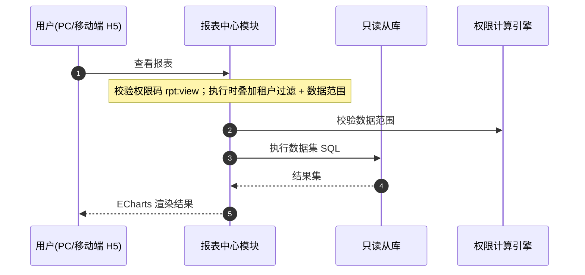

# 概要设计 · 报表中心

> BMS · 数据集、报表与大屏

[概要设计](01_概要设计_总览.md) › 28-报表中心　|　[← 27-身份认证 SSO](27_概要设计_身份认证SSO.md)　|　[29-审计合规 →](29_概要设计_审计合规.md)

## 1. 模块概述与职责 

本节对应[《项目规划说明》](../../规划/项目规划说明.md)「功能模块」之**报表中心**模块，与「选型说明（ECharts）」「前端页面清单」「多数据源策略（读写分离）」「性能与高并发设计（只读从库）」「阶段十五 AI（NL2SQL）」等章节；架构设计依据[《架构设计》](../架构设计/01_架构设计_总览.md)**19-报表BI**节点。

报表中心模块提供数据集管理（SQL 建模）、拖拽报表设计器（ECharts）、可视化大屏（自由画布 + 轮播播放）与报表移动端查看（数据查询）。数据集 SQL 在只读从库执行并叠加安全校验。

- **职责边界**：只负责数据集建模、报表/大屏配置与渲染数据取数；不承载业务数据存储，不承载 AI 问数（阶段十五智能报表助手独立交付，仅在数据集白名单内生成 SQL）
- **与相邻模块协作**：数据访问与分片（读写分离路由、只读从库）、权限计算引擎（rpt 权限码 + 动作级数据范围叠加）、前端（ECharts 渲染、大屏拖拽画布）、移动端 H5（数据查询）

## 2. 功能分解与业务流程 

### 2.1 功能点分解

| 功能点 | 说明 | 权限码 |
| --- | --- | --- |
| 数据集管理 | SQL 建模：code/name/source_key（只读从库数据源）/sql_text/fields/status | rpt:design |
| 报表设计器 | 拖拽设计：选择数据集 + ECharts 图表配置（chart_config）+ 布局（layout） | rpt:design |
| 报表查看 | 按数据集参数查询渲染，支持图表/表格视图 | rpt:view |
| 大屏设计器 | 自由画布设计器（canvas_config 配置） | rpt:design |
| 大屏播放 | 轮播播放页（独立路由，默认需权限） | rpt:view |
| 报表移动端查看 | 移动端 H5 数据查询页查看报表 | rpt:view |

### 2.2 业务规则

- 数据集 SQL 安全校验：只读从库强制执行、语句类别白名单（仅 SELECT）、参数化防注入、字段清单（fields）声明且禁止返回未声明字段
- 数据集白名单：页面禁止任意 SQL 输入，仅可保存经平台审核的数据集；AI 问数（阶段十五）仅在白名单内生成与执行
- 数据集执行绑定当前租户数据源；查询强制租户隔离
- 报表/大屏执行时叠加租户与动作级数据范围过滤（数据权限规则解析结果强制叠加，任何规则不得跨租户）
- 报表图表基于 ECharts（管理端全场景图表类型）；大屏轮播播放默认需权限

### 2.3 业务流程

1. 数据集建模：设计者编写/保存 SQL → 语法与安全校验（仅 SELECT/白名单）→ 测试执行（只读从库）→ 确认字段清单 → 启用
2. 报表设计：选择数据集 → 拖拽图表组件 → 配置 ECharts option（chart_config）→ 布局保存 → 发布
3. 查看：用户进入报表 → 按数据集参数查询（只读从库）→ 权限与数据范围过滤 → ECharts 渲染
4. **异常分支**：SQL 校验失败/超时 → 明确错误并拒绝执行；数据集停用 → 关联报表渲染失败提示；从库不可用 → 降级提示（只读模式下行接口明确报错）

## 3. 关键时序与协作 

- **与读写分离协作**：数据集执行强制只读从库（隔离生产读写），报表查询不走主库
- **与权限计算引擎协作**：报表/大屏按权限码与数据范围过滤，执行时叠加租户与动作级数据范围
- **与前端协作**：ECharts 渲染；大屏设计器为自由画布拖拽（canvas_config 持久化）；移动端复用后端 API

## 4. 数据模型与表设计 

### 4.1 表结构

| 表 | 关键字段 | 说明 |
| --- | --- | --- |
| rpt_dataset | code、name、source_key、sql_text、fields、status | 【租户库】报表数据集（SQL 建模，只读从库执行），字段清单声明 |
| rpt_report | code、name、dataset_id、chart_config、layout、status | 【租户库】拖拽报表（ECharts 配置），dataset_id 逻辑外键引用数据集 |
| rpt_screen | code、name、canvas_config、status | 【租户库】可视化大屏（自由画布配置） |

### 4.2 索引与策略

- code 唯一索引（三表统一）；status 索引（启停过滤）；rpt_report.dataset_id 建索引（报表按数据集关联）
- 数据集 SQL 执行超时限制（防长查询拖垮从库）；慢查询纳入慢查询日志走查
- 数据流转：数据集定义 → 报表/大屏引用 → 执行时按当前租户数据源取数；配置存租户库，随租户隔离

## 5. 接口设计 

### 5.1 REST 接口清单

| 方法 | 路径 | 说明 | 权限码 |
| --- | --- | --- | --- |
| GET | /api/v1/rpt/datasets | 数据集列表（分页 + 筛选 code/name/status） | rpt:design |
| POST | /api/v1/rpt/datasets | 新建数据集（SQL 校验 + 字段清单确认） | rpt:design |
| PUT | /api/v1/rpt/datasets/{id} | 修改数据集 | rpt:design |
| POST | /api/v1/rpt/datasets/{id}/test | 测试执行（只读从库，限时） | rpt:design |
| GET/POST/PUT | /api/v1/rpt/reports… | 报表定义管理（含 chart_config/layout） | rpt:design |
| GET | /api/v1/rpt/reports/{id}/data | 报表数据查询（参数 + 权限/数据范围过滤） | rpt:view |
| GET/POST/PUT | /api/v1/rpt/screens… | 大屏定义管理（canvas_config） | rpt:design |
| GET | /api/v1/rpt/screens/{id}/play | 大屏播放数据（轮播数据拉取） | rpt:view |

### 5.2 分页 / 幂等 / 限流

- 分页：page + size 标准分页；报表数据结果集限深（大数据量提示用筛选）
- 幂等：报表/大屏定义写接口支持 Idempotency-Key（防重复提交）
- 限流：数据集执行与报表数据查询接口接口级限流（slowapi，Redis 后端），防报表风暴拖垮从库；数据集执行超时限制

### 5.3 发布的事件

> 报表中心不直接发布可订阅业务事件；数据集慢查询纳入慢查询日志走查（对应报表 BI 架构节点「可观测性」协调项）。

## 6. 权限与配置 

### 6.1 权限码分配

| 权限码 | 业务 | 动作 | 说明 |
| --- | --- | --- | --- |
| rpt:design | rpt | design | 数据集/报表/大屏设计，默认归属普通角色（按分配） |
| rpt:view | rpt | view | 报表/大屏查看，默认归属普通角色 |

rpt 业务与 design/view 动作码由【平台库】sys_business/sys_action 统一维护；报表执行时叠加动作级数据范围（sys_data_scope）与租户强制过滤。

### 6.2 菜单挂接

- 「数据集管理」「报表设计器」「报表查看」「大屏设计器」「大屏播放」挂对应表单（菜单→表单→业务 rpt 对照关系），按钮挂 design/view 动作；移动端「数据查询」入口复用 rpt:view

### 6.3 sys_config 参数与种子数据

| 类型 | 项目 | 说明 |
| --- | --- | --- |
| sys_config | 数据集执行超时、结果集行数上限、报表接口限流阈值等 | 报表运行参数 |
| 种子数据 | 报表菜单/表单/按钮/字段挂接与 rpt 业务/动作码 | 随平台统一菜单与权限种子下发 |

## 7. 错误码与异常处理 

### 7.1 错误码段

按规划说明 5 位错误码分段表，本模块归属 **9xxxx（90001-99999）报表/审计/归档/监控** 段，一经发布稳定不变；文案由前端按 i18n 映射，后端不承担文案拼装。示例：

| 错误码 | 含义 |
| --- | --- |
| 90001 | 数据集不存在或已停用 |
| 90002 | 数据集 SQL 校验失败（非 SELECT/白名单外语句） |
| 90003 | 数据集执行超时或从库不可用 |
| 90004 | 报表/大屏不存在或已停用 |
| 90005 | 查询结果超出限制（结果集行数上限） |
| 90006 | 报表查询过于频繁（限流） |

### 7.2 异常处理要求

- SQL 安全：语句类别白名单（仅 SELECT）+ 参数化防注入，从源头拒绝任意 SQL（对应「报表 SQL 安全执行」测试项）
- 只读约束：强制 read-only 连接执行（禁用写语句），数据集执行绑定当前租户数据源
- 超时与限流：数据集执行超时限制 + 接口限流，防止长查询与报表风暴影响从库
- 数据范围叠加：执行时叠加租户与动作级数据范围，任何规则不得跨租户（对应「检索/报表权限与租户过滤」验收）

## 8. 页面清单与验收要点 

### 8.1 页面清单

| 端 | 页面 | 内容 |
| --- | --- | --- |
| PC | 数据集管理 | 数据集列表、SQL 编辑器（语法/安全校验）、字段清单确认、测试执行 |
| PC | 报表设计器 | 数据集选择、ECharts 图表拖拽配置（chart_config）、布局保存 |
| PC | 报表查看 | 报表渲染（图表/表格）、参数筛选 |
| PC | 大屏设计器 / 大屏播放 | 自由画布拖拽设计（canvas_config）、轮播播放页 |
| 移动端 H5 | 数据查询 | 报表移动端查看（复用后端 API 与会话体系） |

### 8.2 验收要点

- 报表与大屏全链路可用（对应规划说明阶段十一「报表与大屏全链路可用」）
- 数据集 SQL 安全执行验证：只读从库、防注入、白名单（「报表 SQL 安全执行」与「NL2SQL 安全执行验证」）
- 报表/大屏数据权限过滤生效：租户隔离 + 动作级数据范围叠加验证
- 移动端数据查询可用（移动端 H5「数据查询」E2E）
- 大屏轮播播放与独立路由可用（默认需权限）
- 数据集慢查询纳入慢查询日志走查（可观测性协调项）

> 概要设计节点 · 与《项目规划说明》《架构设计》《文档生成规范》《命名规范》配套 · 生成日期：2026-08-06