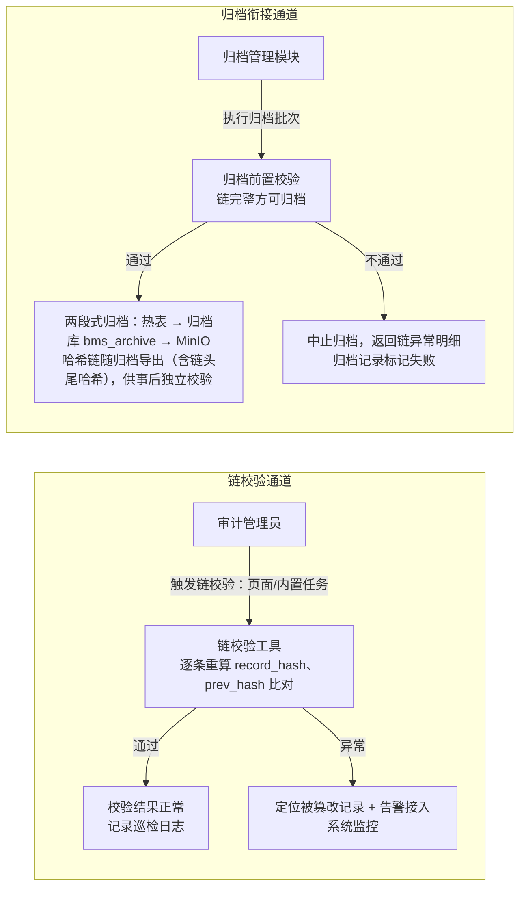

# 概要设计 · 审计合规

> BMS · 字段级变更审计与哈希链防篡改

[概要设计](01_概要设计_总览.md) › 29-审计合规　|　[← 28-报表中心](28_概要设计_报表中心.md)　|　[30-国际化管理 →](30_概要设计_国际化管理.md)

本节对应[《项目规划说明》](../../规划/项目规划说明.html)「功能模块」之**审计合规**模块，与「审计合规」「权限模型」
「数据规范」「多数据源策略」「API 设计规范」等章节；架构设计依据[《架构设计》](../架构设计/01_架构设计_总览.md)15-审计哈希链、
09-数据访问与分片节点。

## 1. 模块概述与职责 <a id="overview"></a>

审计合规模块保证关键数据变更可追溯、审计记录不可篡改、管理角色权限互斥，满足等保管理要求。
模块定位为平台级安全基础设施，不产生业务数据，而是记录与保护其他模块产生的审计数据。

- **字段级变更审计**：关键表经 ORM 事件自动记录字段级旧值/新值至 `sys_data_audit_log`，按月分表
- **哈希链防篡改**：审计日志逐条哈希串联（`prev_hash` + `record_hash`），分片表内成链、跨月表首尾衔接，经 RocketMQ 按租户分区有序消费保证链序，提供链校验工具定期巡检
- **三权分立管理**：系统管理员/安全管理员/审计管理员权限互斥，同一用户不得兼任；审计管理员只读全部日志与审计数据
- **合规留存归档**：审计数据 90 天热表 + 归档冷存储，哈希链随归档一并导出供事后校验，归档前强制链完整性校验，合规销毁记录销毁日志备查

职责边界：本模块**不发布独立事件**，只消费审计链相关写入事件（经事件总线异步落库保证链序），归档执行由[归档管理](31_概要设计_归档管理.md)模块负责、本模块提供归档前链校验前置条件。

相邻模块协作：与**[操作日志](11_概要设计_操作日志.md)/[登录日志](12_概要设计_登录日志.md)/开放接口日志**共用哈希链机制（15-审计哈希链节点）；与**数据访问与分片**协作完成按月分片落库；与**[任务调度](24_概要设计_任务调度.md)**协作完成链校验巡检；与**权限计算引擎**协作完成三权分立下的 log 业务权限。

## 2. 功能分解与业务流程 <a id="functions"></a>

### 2.1 功能点分解 <a id="functions-breakdown"></a>

| 功能点 | 说明 | 归属业务码 |
| --- | --- | --- |
| 字段级变更审计 | 关键表 ORM 事件自动记录字段旧值/新值，落 `sys_data_audit_log`（按月分表） | log |
| 哈希链构造与写入 | `record_hash = SHA256(prev_hash + 规范化记录内容)`，经 RocketMQ 分区有序消费保证链序 | log |
| 链校验与巡检 | 链校验工具逐条重算比对，定期巡检（内置任务），结果接入系统监控告警 | log |
| 三权分立管理 | 三类管理员角色互斥、同一用户不得兼任；审计管理员只读全部日志与审计数据 | role（安全侧） |
| 合规留存与销毁 | 90 天热表 + 归档冷存储；哈希链随归档导出；合规销毁记录销毁日志备查 | archive / log |
| 审计数据查询 | 数据变更审计列表查询（含按月分片检索与归档库只读查询） | log |

### 2.2 业务规则 <a id="functions-rules"></a>

- 关键表清单：`sys_user`、`sys_role`、`sys_role_assign`、`sys_role_permission`、`sys_role_field`、`sys_post`、`sys_dept`、`sys_notice`、`sys_tenant_quota`、`sup_supplier`、`wf_process`、`pur_purchase_*` 等，变更经 ORM 事件自动记录，无需业务代码侵入
- 哈希链规则：`record_hash = SHA256(prev_hash + 规范化记录内容)`；`prev_hash` 取当前分片表末条 `record_hash`；新分片表首条 `prev_hash` = 上月末条 `record_hash`（跨月衔接）；首月链头为约定初始值
- 链序保证：审计事件经 RocketMQ 分区有序消费（分区键 = 租户），同租户串行追加，杜绝并发写乱序破坏 `prev_hash` 衔接；跨月切换由事件消费逻辑保证（新月份分片表已由 Celery 任务预创建）
- 三权互斥：系统/安全/审计三类内置角色权限互斥、同一用户不得兼任；审计管理员只读全部日志与审计数据，无任何写权限
- 合规留存：审计数据 90 天热表 + 归档冷存储；归档前必须链校验通过（链完整方可归档）；哈希链随归档一并导出（含链头尾哈希）供事后独立校验
- 合规销毁：含审计数据销毁在内的一切销毁动作均记录销毁日志备查
- 敏感字段脱敏：操作日志敏感字段（密码、token、密钥）脱敏后记录，不落原始值

### 2.3 流程步骤 <a id="functions-flow"></a>

字段级变更审计主流程（含异常分支）：

1. 业务模块写操作提交成功 → ORM 事件（after_update/after_insert）捕获变更字段旧值/新值
2. 构造审计事件载荷（table_name、record_id、field、old_value、new_value、operator_id）发布至 RocketMQ
3. event-worker 按租户分区有序消费，读取分片表末条 `record_hash` 作为 `prev_hash`，计算 `record_hash` 后串行追加写入当月分片表
  - 异常分支：写入失败 → 消息重试（ack 确认机制）；重试仍失败 → 记录失败并告警，该条不再入链（链校验可定位缺口）
  - 异常分支：跨月写入 → 消费逻辑取上月末条 `record_hash` 作链头 `prev_hash`，写入新月份分片表
4. 链校验工具定期巡检：逐条重算 `record_hash` 与 `prev_hash` 比对，定位被篡改记录，异常告警接入系统监控
5. 归档前：归档管理模块触发链完整性校验，链完整方可执行两段式归档；哈希链随归档导出（含链头尾哈希）

## 3. 关键时序与协作 <a id="sequence"></a>

### 3.1 审计写入与链序保证 <a id="sequence-write"></a>

```mermaid
graph TD
    A[业务模块<br/>写事务提交 → ORM 事件捕获字段旧值/新值 → 发布审计事件<br/>载荷: table_name / record_id / field / old / new / operator_id] --> B[RocketMQ 事件总线<br/>分区键 = 租户，分区有序消息]
    B --> C[event-worker 消费者<br/>同租户串行追加，保证 prev_hash 衔接<br/>读当月分片表末条 record_hash 作为 prev_hash<br/>record_hash = SHA256(prev_hash + 规范化记录内容)]
    C --> D[sys_data_audit_log_yyyyMM<br/>按月分片，新月份表由 Celery 预创建]
```

与缓存/任务队列协作：审计写入全程不读缓存、不经过 Redis（避免缓存引入链序不确定）；Celery 承担分片表预创建与链校验巡检任务；链校验结果与异常告警接入系统监控（Alertmanager）。

### 3.2 链校验与归档衔接 <a id="sequence-verify"></a>



## 4. 数据模型与表设计 <a id="data"></a>

核心表：`sys_data_audit_log`（租户库，按月分片，物理表名带 yyyyMM 后缀，逻辑表名不带后缀）。审计数据物理保留、不做软删除，统一 UTC 时间存储，雪花 ID 主键。

| 字段 | 类型 | 说明 |
| --- | --- | --- |
| id | bigint | 雪花 ID 主键 |
| table_name | varchar | 被审计表名 |
| record_id | bigint | 被审计记录主键 |
| field | varchar | 变更字段名 |
| old_value | text | 变更前值（JSON 序列化，敏感字段脱敏） |
| new_value | text | 变更后值（JSON 序列化，敏感字段脱敏） |
| operator_id | bigint | 操作人用户 ID |
| created_at | datetime | 记录时间（UTC），分片键 |
| prev_hash | char(64) | 前一条记录哈希（链序衔接依据） |
| record_hash | char(64) | 本条记录哈希，`SHA256(prev_hash + 规范化记录内容)` |

- **索引**：`(table_name, record_id)` 组合索引、`created_at` 排序索引、`operator_id` 外键索引
- **分片**：按月分片（分片键 = 时间），与操作日志/登录日志/开放接口日志共用分片机制（09-数据访问与分片节点）；新月份分片表由 Celery 定时任务提前创建
- **归档策略**：90 天热表，归档前置链校验，哈希链随归档导出（含链头尾哈希）；归档数据落归档库（bms_archive，带 tenant_id 与原库表标识，只读查询），按保留期转对象存储冷化
- **数据流转**：ORM 事件 → RocketMQ → event-worker 链式写入当月分片表 → 90 天后两段式归档（归档库 → MinIO）→ 过期归档文件物理清理（销毁记录备查）

> 审计数据只做物理保留与归档，不参与业务软删除（deleted_at）机制；链式字段 `prev_hash`/`record_hash` 由事件消费逻辑计算写入，禁止业务代码直接修改。

## 5. 接口设计 <a id="api"></a>

| 方法 | 路径 | 说明 | 权限码 |
| --- | --- | --- | --- |
| GET | /api/v1/audit/data-changes | 数据变更审计分页查询（可按表名/记录 ID/操作人/时间范围筛选，按月分片路由） | log:query |
| GET | /api/v1/audit/data-changes/{id} | 变更记录详情（含链字段 prev_hash/record_hash） | log:query |
| GET | /api/v1/audit/chain/verify | 触发/查询链完整性校验结果（按租户/月份范围，返回被篡改记录定位） | log:manage |
| GET | /api/v1/audit/archive/query | 归档审计数据只读查询（bms_archive 库，审计管理员权限） | log:query |

- 分页：查询参数 `page`（从 1 起）、`size`；响应 `{list, total, page, size}`；大数据量列表游标分页兜底（last_id + 排序键索引）
- 查询强制带分片键条件（时间范围），无分片键查询拒绝执行或全分片扫描告警
- 全部接口 Bearer access token 鉴权，`require_permission` 依赖强制校验；只读接口，本模块无写接口
- 限流：slowapi 接口级限流（IP / 用户维度），链校验等重操作单独限流
- 幂等：本模块全部为只读接口，不涉及幂等键
- 发布事件：**无独立事件**，本模块消费审计链写入事件（经 RocketMQ 分区有序消费），归档衔接由归档管理模块的 `archive.completed` 事件驱动

## 6. 权限与配置 <a id="permission"></a>

| 权限码 | 业务:动作 | 说明 | 默认归属 |
| --- | --- | --- | --- |
| 审计查询 | log:query | 数据变更审计与归档数据只读查询 | 审计管理员 |
| 审计管理 | log:manage | 链校验触发、巡检结果查看 | 审计管理员 |

- **菜单挂接**：数据变更审计菜单挂「审计合规」表单（菜单→表单→业务，业务码 log），按钮挂动作（查询按钮 → log:query）；菜单/权限码名称多语言走 i18n 附表
- **三权分立**：三类内置管理员角色（系统/安全/审计）权限互斥、同一用户不得兼任；审计管理员只读全部日志与审计数据，无写权限——互斥由角色分配与主体绑定（sys_role_assign）约束，越权与兼任校验在角色管理侧强制
- **sys_config 参数**（建议键名，租户库可覆盖）：审计热表留存天数（默认 90）、链校验巡检 cron、链异常告警开关
- **种子数据**：租户开通流程自动预置四类审计日志（操作/登录/开放接口/数据变更）90 天归档策略；审计管理员角色由租户开通首建的系统管理员创建

## 7. 错误码与异常处理 <a id="errors"></a>

按《项目规划说明》5 位错误码分段表，本模块归属 9xxxx 段（90001-99999，覆盖报表/审计/归档/监控），段内序号一经发布稳定不变。建议段内分配（91001 起为审计模块保留）：

| 错误码 | 含义 | 处理要求 |
| --- | --- | --- |
| 91001 | 链校验不通过（存在被篡改记录） | 返回被篡改记录定位明细；审计管理员处置；告警接入系统监控 |
| 91002 | 查询缺少分片键（时间范围）条件 | 拒绝执行或返回全分片扫描告警，提示补充时间范围 |
| 91003 | 审计数据不存在（热表与归档库均未命中） | 提示数据已归档至冷存储或不存在 |
| 91004 | 链校验任务进行中 | 提示稍后查询结果 |

- 文案由前端按 i18n 映射（`error.91001` 之类），后端不承担文案拼装
- 写入侧异常：事件消费失败重试、失败告警；链校验巡检异常接入监控告警（Alertmanager：邮件/企业微信/钉钉）
- 归档前校验不通过：中止归档流程并记录失败原因，供归档管理模块展示
- 三权互斥冲突（兼任/越权）错误码归属 3xxxx 用户与组织段，由角色管理侧返回

## 8. 页面清单与验收要点 <a id="pages"></a>

| 端 | 页面 | 说明 |
| --- | --- | --- |
| PC | 数据变更审计 | 变更记录列表（表名/记录 ID/字段/旧值/新值/操作人/时间），按月分片查询，链字段展示 |
| PC | 链校验结果 | 巡检结果与篡改记录定位（可与数据变更审计页面合并入口） |
| PC | 归档数据查询（复用） | 归档库只读查询入口，审计管理员可见（归档管理模块提供） |
| 移动端 | 不提供 | 审计查询仅管理端 |

验收要点：

- 关键表字段级变更自动落 `sys_data_audit_log`，无需业务代码侵入（ORM 事件）；敏感字段脱敏后记录
- 哈希链校验通过：逐条重算一致、跨月首尾衔接正确、篡改模拟可被定位
- 审计链跨归档校验通过（归档后仍可独立校验）
- 三权分立互斥生效：兼任用户不可创建、审计管理员无写权限
- 归档流转可用（热表 → 归档库 → 对象存储），归档前链完整性校验强制生效
- 测试覆盖：字段级审计与哈希链校验（含跨归档链校验）纳入测试策略（《项目规划说明》测试策略节）

> 本文档为 AI 生成 · 概要设计节点 · 与《项目规划说明》《架构设计》《文档生成规范》《命名规范》配套 · 生成日期：2026-08-06