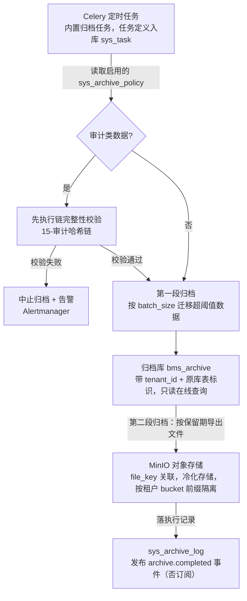
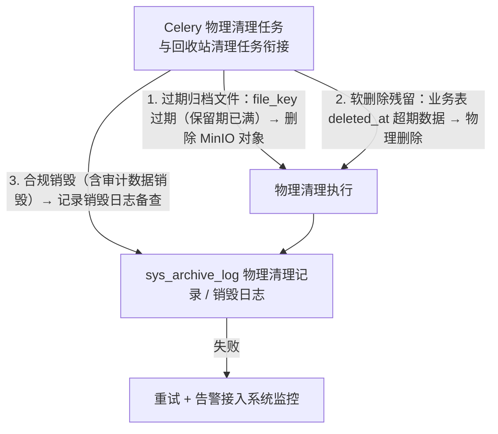

# 概要设计 · 归档管理

> BMS · 两段式归档与物理清理

[概要设计](01_概要设计_总览.md) › 31-归档管理　|　[← 30-国际化管理](30_概要设计_国际化管理.md) · [32-备份管理 →](32_概要设计_备份管理.md)

本节对应[《项目规划说明》](../../规划/项目规划说明.html)「功能模块」之**归档管理**模块，与「部署与运维（备份与恢复/归档）」
「初始化数据」「核心数据表清单」「事件总线事件模型」「审计合规」等章节；架构设计依据[《架构设计》](../架构设计/01_架构设计_总览.md)
15-审计哈希链、09-数据访问与分片节点。

## 1. 模块概述与职责 

归档管理模块承载数据的两段式归档流转：热表数据超阈值迁入归档库（可在线查询），按保留期转对象存储冷化，
并提供物理清理与合规销毁、执行记录与归档数据查询。归档策略**全表可配**，Celery 调度执行。

- **归档策略配置**：`sys_archive_policy`（table_name、time_field、threshold_days、retention_days、target（archive_db/minio）、batch_size、status），全表可配
- **两段式归档**：热表超阈值 → 归档库 bms_archive（可在线查询）；按保留期 → 对象存储 MinIO 冷化
- **归档执行记录**：`sys_archive_log`（policy_id、table_name、archived_count、target、file_key、status、cost_time、started_at、finished_at），含物理清理记录
- **归档数据查询**：只读，带 tenant_id 与原库表标识，审计管理员权限（审计数据场景）
- **物理清理与合规销毁**：过期归档文件与软删除残留由 Celery 物理清理，销毁记录日志备查
- **审计链衔接**：归档前执行审计链完整性校验，链完整方可归档；哈希链随归档一并导出

职责边界：归档库（bms_archive）统一收存各租户归档数据（带 tenant_id 与原库表标识，只读查询），跨库引用用逻辑外键（code）、不建物理外键；归档不改变业务表结构与在线数据语义，只负责数据生命周期流转。

相邻模块协作：与**审计哈希链**协作完成归档前链校验与哈希链随档导出；与**[任务调度](24_概要设计_任务调度.md)**协作经 Celery 调度执行（归档为内置任务）；与**数据访问与分片**协作完成按月分片表的归档；与**[回收站](33_概要设计_回收站.md)**衔接软删除残留的物理清理；与**监控**协作发布执行结果与告警。

## 2. 功能分解与业务流程 

### 2.1 功能点分解 

| 功能点 | 说明 | 归属业务码 |
| --- | --- | --- |
| 归档策略配置 | 全表可配策略（时间字段/阈值天数/保留期/目标/批次大小/启停） | archive |
| 两段式归档执行 | 热表超阈值 → 归档库（可在线查询）；按保留期 → MinIO 冷化；Celery 调度执行 | archive |
| 归档执行记录 | 执行批次、数量、目标、状态、耗时记录（含物理清理记录） | archive |
| 归档数据查询 | 归档库只读查询（带 tenant_id 与原库表标识） | archive（审计数据 log） |
| 物理清理与合规销毁 | 过期归档文件与软删除残留 Celery 物理清理，销毁记录日志备查 | archive |
| 审计链前置校验 | 归档前链完整性校验，链完整方可归档（审计类数据） | archive + log |

### 2.2 业务规则 

- 归档策略全表可配：`sys_archive_policy` 声明表名、时间字段、阈值天数、保留期、目标（archive_db/minio）、批次大小、状态；Celery 调度执行
- 两段式归档：第一段热表超阈值（threshold_days）迁归档库 bms_archive（可在线查询）；第二段按保留期（retention_days）转对象存储 MinIO 冷化
- 归档库统一收存各租户归档数据：数据带 tenant_id 与原库表标识，只读查询；跨库引用用逻辑外键，不建物理外键
- 归档执行记录落 `sys_archive_log`：policy_id、table_name、archived_count、target、file_key、status、cost_time、started_at、finished_at；物理清理同样落记录备查
- 归档前审计链完整性校验：链完整方可归档；哈希链随归档一并导出（含链头尾哈希）供事后独立校验（审计类数据）
- 过期归档文件与软删除残留由 Celery 物理清理（与回收站清理任务衔接）；合规销毁（含审计数据销毁）记录销毁日志备查
- 归档批次结束发布事件 `archive.completed`（policy_id、archived_count、target），Webhook 订阅为**否**，供模块内/监控消费

### 2.3 流程步骤 

归档主流程（含异常分支）：

1. 系统管理员配置归档策略（表名、时间字段、阈值/保留期、目标、批次大小、启用）
2. Celery 调度执行（内置任务）：扫描策略，按时间字段定位超阈值数据
   - 异常分支：审计类数据先执行链完整性校验，不通过 → 中止归档、记录失败原因、告警
3. 第一段：按批次（batch_size）迁移至归档库 bms_archive（带 tenant_id 与原库表标识），可在线查询；迁移完成后清理热表数据并记录执行批次
4. 第二段：按保留期将归档库数据导出为文件（file_key）转存 MinIO 冷化，并从归档库移除
5. 落 `sys_archive_log` 执行记录（含物理清理记录），发布 `archive.completed` 事件
6. 物理清理任务：过期归档文件与软删除残留（回收站衔接）由 Celery 定时清理，销毁记录日志备查
   - 异常分支：清理失败 → 重试 + 告警；销毁前校验保留期已满，防止误删

## 3. 关键时序与协作 

### 3.1 两段式归档流转 

### 3.2 物理清理与合规销毁 

协作组件：**MinIO** 承载冷化归档文件（按租户 bucket 前缀隔离，与备份文件同存储体系，生命周期策略配合）；**Celery**（Redis broker）调度执行归档与物理清理，任务定义入库 sys_task 可页面管理；**事件总线**发布 archive.completed（否订阅）。

## 4. 数据模型与表设计 

核心表：`sys_archive_policy`（策略，租户库）、`sys_archive_log`（执行记录，租户库）；归档库 bms_archive 统一收存各租户归档数据（跨库逻辑引用，不建物理外键）。

| 表 | 关键字段 | 说明 |
| --- | --- | --- |
| sys_archive_policy | table_name、time_field、threshold_days、retention_days、target（archive_db/minio）、batch_size、status | 归档策略，全表可配，Celery 调度执行依据 |
| sys_archive_log | policy_id、table_name、archived_count、target、file_key、status、cost_time、started_at、finished_at | 归档执行记录，含物理清理记录 |
| bms_archive（归档库） | tenant_id、原库表标识、归档数据行 | 统一收存各租户归档数据，只读查询，跨库逻辑引用不建物理外键 |

- **索引**：`sys_archive_policy` status + table_name；`sys_archive_log` policy_id、started_at 排序索引
- **归档流转**：热表 → 归档库 bms_archive（在线查询）→ MinIO 冷化（file_key）→ 过期物理清理；审计类数据（操作/登录/开放接口/数据变更四类日志）90 天归档，归档前链完整性校验、哈希链随档导出
- **分片衔接**：按月分片表（如 sys_operation_log_yyyyMM）按时间阈值整片迁移，分片表内成链、跨月首尾衔接由哈希链机制保证（归档后仍可独立校验）
- **初始化种子**：四类审计日志（操作/登录/开放接口/数据变更）90 天归档策略，租户开通流程自动执行（《项目规划说明》初始化数据节）
- **数据流转**：策略配置 → Celery 批次执行 → 归档库 → MinIO → 执行记录 → 物理清理/销毁日志

> 归档库为独立数据源（bms_archive），各租户归档数据统一收存于此；查询强制 tenant_id 过滤，跨租户访问拒绝；归档文件与备份文件同存 MinIO（按租户 bucket 前缀隔离）。

## 5. 接口设计 

| 方法 | 路径 | 说明 | 权限码 |
| --- | --- | --- | --- |
| GET | /api/v1/archive/policies | 归档策略分页查询 | archive:query |
| POST | /api/v1/archive/policies | 新增归档策略 | archive:manage |
| PUT | /api/v1/archive/policies/{id} | 修改归档策略（阈值/保留期/目标/批次/启停） | archive:manage |
| DELETE | /api/v1/archive/policies/{id} | 删除归档策略（仅停用策略，执行中策略不可删） | archive:manage |
| POST | /api/v1/archive/policies/{id}/trigger | 手动触发一次归档执行 | archive:trigger |
| GET | /api/v1/archive/logs | 归档执行记录分页查询（含物理清理记录） | archive:query |
| GET | /api/v1/archive/data | 归档数据只读查询（归档库，带 tenant_id 与原库表标识筛选） | archive:query（审计数据 log:query） |

- 分页：查询参数 `page`（从 1 起）、`size`；响应 `{list, total, page, size}`
- 幂等：手动触发归档写接口支持幂等键（请求头 Idempotency-Key，Redis SETNX 前置拦截 + 唯一约束兜底）
- 限流：slowapi 接口级限流（IP / 用户维度）；手动触发限流收紧（防误刷执行）
- 鉴权：全部接口 Bearer access token + require_permission 强制校验
- 发布事件：`archive.completed`（policy_id、archived_count、target），Webhook 订阅否

## 6. 权限与配置 

| 权限码 | 业务:动作 | 说明 | 默认归属 |
| --- | --- | --- | --- |
| 归档查询 | archive:query | 策略/执行记录/归档数据查询 | 系统管理员 |
| 归档管理 | archive:manage | 策略配置与删除 | 系统管理员 |
| 归档触发 | archive:trigger | 手动触发归档执行 | 系统管理员 |
| 审计数据归档查询 | log:query | 审计类归档数据只读查询（审计管理员） | 审计管理员 |

- **菜单挂接**：归档策略、归档执行记录、归档数据查询菜单挂「归档管理」表单（业务码 archive），按钮挂动作；审计类归档数据查询由审计管理员经 log 业务访问
- **sys_config 参数**（建议键名）：归档批次默认大小、物理清理保留期兜底值、销毁确认开关
- **种子数据**：初始归档策略种子——四类审计日志（操作/登录/开放接口/数据变更）90 天归档（租户开通流程自动执行）；内置归档任务与物理清理任务入库 sys_task
- 归档任务经任务调度模块管理（sys_task 入库、beat 数据库调度、页面可启停与手动触发）

## 7. 错误码与异常处理 

按《项目规划说明》5 位错误码分段表，本模块归属 9xxxx 段（90001-99999，覆盖报表/审计/归档/监控），段内序号一经发布稳定不变。建议段内分配（93001 起为归档模块保留）：

| 错误码 | 含义 | 处理要求 |
| --- | --- | --- |
| 93001 | 归档策略已存在（同表重复配置） | 策略唯一性校验失败，提示先停用原策略 |
| 93002 | 策略执行中不可修改/删除 | 并发保护，提示等待批次完成 |
| 93003 | 审计链校验不通过，归档中止 | 返回链异常明细，配合审计合规模块处置后再归档 |
| 93004 | 归档批次失败（迁移/导出异常） | 记录失败状态与错误信息，重试 + 告警 |
| 93005 | 归档数据不存在（热表与归档库均未命中） | 提示数据已冷化或不存在 |
| 93006 | 销毁确认缺失（合规销毁须二次确认） | 合规销毁前置确认，防误删 |

- 文案由前端按 i18n 映射，后端不承担文案拼装
- 异常处理：批次失败自动重试（ack 确认机制）+ 告警接入系统监控；物理清理失败重试且销毁前校验保留期已满
- 归档前链校验失败属于审计合规前置条件错误，错误码 9xxxx 段内与审计模块 91001 语义一致，由归档侧承接中止动作

## 8. 页面清单与验收要点 

| 端 | 页面 | 说明 |
| --- | --- | --- |
| PC | 归档策略 | 策略列表与配置（表名/时间字段/阈值/保留期/目标/批次/启停、手动触发） |
| PC | 归档执行记录 | 执行批次详情（数量/目标/状态/耗时/文件 key，含物理清理记录） |
| PC | 归档数据查询 | 归档库只读查询（按租户/原库表标识/时间筛选） |
| 移动端 | 不提供 | 归档管理仅管理端 |

验收要点：

- 归档流转可用：热表 → 归档库（在线查询）→ 对象存储冷化 → 物理清理全链路（《项目规划说明》测试策略节：归档流转（热表→归档库→对象存储→物理清理）纳入测试）
- 审计链跨归档校验通过：归档前链完整性校验强制生效，哈希链随档导出可独立校验
- 策略执行与记录：Celery 调度执行、手动触发可用、执行记录（含物理清理记录）可查
- 初始化种子：租户开通自动执行四类审计日志 90 天归档策略
- 合规销毁：销毁记录日志备查、销毁前保留期校验与二次确认生效

> 本文档为 AI 生成 · 概要设计节点 · 与《项目规划说明》《架构设计》《文档生成规范》《命名规范》配套 · 生成日期：2026-08-06