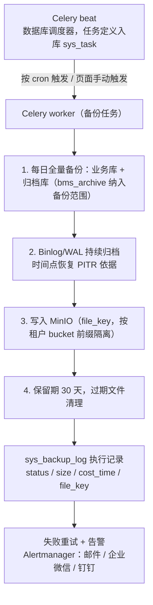
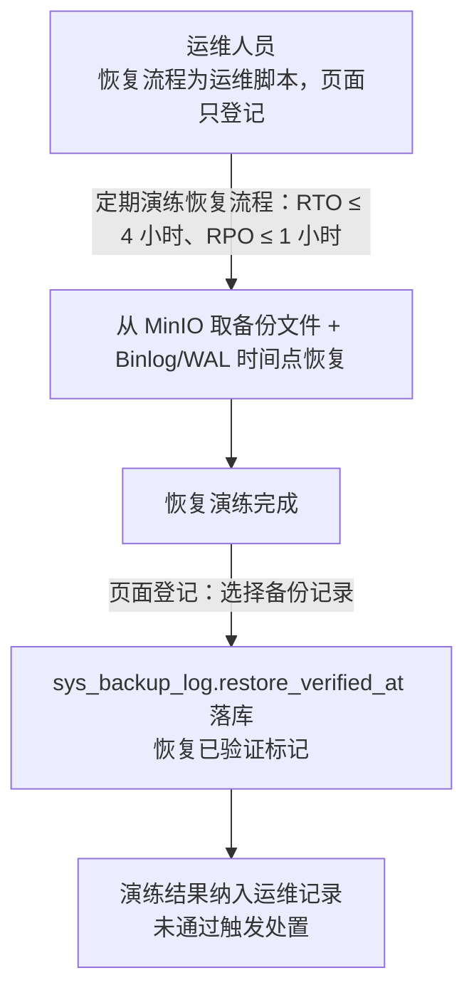

# 概要设计 · 备份管理

> BMS · 备份任务与恢复演练登记

[概要设计](01_概要设计_总览.md) › 32-备份管理　|　[← 31-归档管理](31_概要设计_归档管理.md) · [33-回收站 →](33_概要设计_回收站.md)

本节对应[《项目规划说明》](../../规划/项目规划说明.md)「功能模块」之**备份管理**模块，与「部署与运维（备份与恢复）」
「初始化数据」「核心数据表清单」「开发计划与验收标准」等章节；架构设计依据[《架构设计》](../架构设计/01_架构设计_总览.md)02-目标与约束
节点（可用性 RTO/RPO 质量属性）与部署与运维相关规划。

## 1. 模块概述与职责 

备份管理模块承载数据库备份任务的全生命周期管理：任务配置（周期与保留期）、手动备份、备份记录与
恢复演练登记。对接「每日全量备份 + Binlog/WAL 时间点恢复（PITR）」的既定备份策略，保障恢复时效
目标 RTO ≤ 4 小时、RPO ≤ 1 小时。

- **备份任务配置**：`sys_backup_task`（name、cron、target（db/minio）、retention_days、status、last_run_at），Celery 调度执行，页面配置周期与保留期
- **手动备份**：页面即时触发一次备份，与定时任务共用执行链路
- **备份记录与恢复演练登记**：`sys_backup_log`（task_id、target、file_key、size、status、cost_time、started_at、finished_at、restore_verified_at）
- **备份策略**：数据库每日全量备份 + Binlog/WAL（时间点恢复 PITR），保留 30 天异机存储，归档库纳入备份范围
- **恢复时效**：RTO ≤ 4 小时、RPO ≤ 1 小时，定期演练恢复流程
- **对象存储衔接**：备份文件存 MinIO（S3 兼容对象存储，多实例共享）

职责边界：本模块管理备份任务与记录，实际备份动作由 Celery 任务调用数据库备份工具（dump/Binlog/WAL 归档脚本）执行；恢复动作本身不在页面操作（运维脚本执行），模块只登记恢复演练结果。

相邻模块协作：与**[任务调度](24_概要设计_任务调度.md)**协作（备份任务入库 sys_task，beat 数据库调度）；与**对象存储（MinIO）**协作存储备份文件（按租户 bucket 前缀隔离，与归档文件同体系）；与**[归档管理](31_概要设计_归档管理.md)**衔接（归档库纳入备份范围）；与**[系统监控](23_概要设计_系统监控.md)**协作发布备份失败告警。

## 2. 功能分解与业务流程 

### 2.1 功能点分解 

| 功能点 | 说明 | 归属业务码 |
| --- | --- | --- |
| 备份任务配置 | 任务增改/启停（名称、cron 周期、目标、保留期、last_run_at），Celery 调度执行 | backup |
| 手动备份 | 页面即时触发一次备份，记录独立备份批次 | backup |
| 备份执行 | 每日全量备份 + Binlog/WAL（PITR），文件存 MinIO，保留 30 天异机存储 | backup |
| 备份记录 | 执行批次记录（目标/文件 key/大小/状态/耗时） | backup |
| 恢复演练登记 | 恢复演练结果登记（restore_verified_at），定期演练恢复流程 | backup |

### 2.2 业务规则 

- 备份策略：数据库每日全量备份 + 开启 Binlog/WAL（时间点恢复 PITR）；保留 30 天，异机存储；归档库纳入备份范围
- 任务配置：`sys_backup_task`（name、cron、target（db/minio）、retention_days、status、last_run_at），页面配置周期与保留期，Celery 调度执行；备份任务与记录由页面管理，支持手动备份与恢复演练登记
- 执行记录：`sys_backup_log`（task_id、target、file_key、size、status、cost_time、started_at、finished_at、restore_verified_at）
- 恢复时效目标：RTO ≤ 4 小时、RPO ≤ 1 小时（《架构设计》02-目标与约束 可用性质量属性）；定期演练恢复流程
- MinIO：对象数据定期增量备份 + 生命周期策略；元数据随数据库备份；备份文件按租户 bucket 前缀隔离
- 初始化种子：初始定时任务种子含每日全量备份任务（《项目规划说明》初始化数据节）

### 2.3 流程步骤 

备份执行主流程（含异常分支）：

1. 系统管理员配置备份任务（名称、cron 周期、目标、保留期、启用）
2. Celery 调度（beat 数据库调度器，任务定义入库 sys_task）触发执行；页面亦可手动触发一次备份
   - 异常分支：执行失败 → 记录失败状态与错误信息，重试 + 告警接入系统监控（Alertmanager）
3. 执行每日全量备份（含归档库），Binlog/WAL 持续归档支持 PITR；备份文件写入 MinIO（file_key），更新任务 last_run_at
4. 按保留期（默认 30 天）清理过期备份文件（异机存储策略由存储规划保证）
5. 落 `sys_backup_log` 执行记录；恢复演练后登记 restore_verified_at
   - 异常分支：恢复演练未通过 → 记录演练结果，触发人工处置与复盘

## 3. 关键时序与协作 

### 3.1 备份执行时序 

### 3.2 恢复与演练登记 

协作组件：**MinIO** 存储备份文件（与归档文件同存储体系，定期增量备份 + 生命周期策略，元数据随数据库备份）；**Celery**（Redis broker）调度执行备份任务；**任务调度**模块提供任务入库与页面管理（启停、手动触发）；**系统监控**承接失败告警。

## 4. 数据模型与表设计 

核心表：`sys_backup_task`（任务配置）、`sys_backup_log`（执行记录），位于租户库（备份任务按租户配置，数据库备份对象含平台库/租户库/归档库）。

| 表 | 关键字段 | 说明 |
| --- | --- | --- |
| sys_backup_task | name、cron、target（db/minio）、retention_days、status、last_run_at | 备份任务配置，Celery 调度执行，页面配置周期与保留期 |
| sys_backup_log | task_id、target、file_key、size、status、cost_time、started_at、finished_at、restore_verified_at | 备份执行记录，含恢复演练登记（restore_verified_at） |

- **索引**：`sys_backup_task` status；`sys_backup_log` task_id、started_at 排序索引
- **备份对象**：平台库 + 各租户库 + 归档库（bms_archive 纳入备份范围）；每日全量备份 + Binlog/WAL（PITR）
- **存储**：备份文件存 MinIO（file_key），保留 30 天异机存储；按租户 bucket 前缀隔离；MinIO 对象数据定期增量备份 + 生命周期策略，元数据随数据库备份
- **归档衔接**：归档库纳入备份范围，归档文件与备份文件同存 MinIO；恢复演练验证备份可恢复性（restore_verified_at 标记）
- **初始化种子**：初始定时任务种子含每日全量备份任务（租户开通流程自动执行）
- **数据流转**：任务配置 → Celery 执行 → 全量 + PITR 文件入 MinIO → 执行记录 → 过期清理 → 恢复演练登记

> 备份执行与恢复操作不暴露在线写接口（恢复为运维脚本流程），页面只做任务配置、手动触发与演练登记；备份文件与归档文件同存 MinIO 异机，满足「保留 30 天异机存储」策略。

## 5. 接口设计 

| 方法 | 路径 | 说明 | 权限码 |
| --- | --- | --- | --- |
| GET | /api/v1/backup/tasks | 备份任务分页查询 | backup:query |
| POST | /api/v1/backup/tasks | 新增备份任务（cron、目标、保留期） | backup:manage |
| PUT | /api/v1/backup/tasks/{id} | 修改备份任务（周期/保留期/启停） | backup:manage |
| POST | /api/v1/backup/tasks/{id}/run | 手动触发备份（手动备份） | backup:trigger |
| GET | /api/v1/backup/logs | 备份执行记录分页查询 | backup:query |
| POST | /api/v1/backup/logs/{id}/restore-verify | 恢复演练登记（写入 restore_verified_at） | backup:manage |

- 分页：查询参数 `page`（从 1 起）、`size`；响应 `{list, total, page, size}`
- 幂等：手动触发备份与恢复演练登记写接口支持幂等键（请求头 Idempotency-Key，Redis SETNX 前置拦截 + 唯一约束兜底）
- 限流：slowapi 接口级限流；手动触发备份限流收紧（防误刷）
- 鉴权：全部接口 Bearer access token + require_permission 强制校验
- 发布事件：**无独立事件**；备份执行状态经 sys_backup_log 落库，失败告警走系统监控通道

## 6. 权限与配置 

| 权限码 | 业务:动作 | 说明 | 默认归属 |
| --- | --- | --- | --- |
| 备份查询 | backup:query | 任务与执行记录查询 | 系统管理员 |
| 备份管理 | backup:manage | 任务配置与恢复演练登记 | 系统管理员 |
| 备份触发 | backup:trigger | 手动触发备份 | 系统管理员 |

- **菜单挂接**：备份管理菜单挂「备份管理」表单（业务码 backup），按钮挂动作（查询/配置/手动备份/演练登记）
- **sys_config 参数**（建议键名）：备份保留天数（默认 30）、异机存储开关、备份失败告警开关
- **种子数据**：初始定时任务种子含每日全量备份任务（任务入库 sys_task）；备份任务与记录由页面管理
- 备份任务经任务调度模块管理（sys_task 入库、beat 数据库调度、页面动态管理）

## 7. 错误码与异常处理 

按《项目规划说明》5 位错误码分段表，本模块归属 9xxxx 段（90001-99999，覆盖报表/审计/归档/监控），段内序号一经发布稳定不变。建议段内分配（94001 起为备份模块保留）：

| 错误码 | 含义 | 处理要求 |
| --- | --- | --- |
| 94001 | 备份任务已存在（同名/同目标重复） | 任务唯一性校验失败，提示更换名称或停用原任务 |
| 94002 | 备份执行中不可重复触发 | 并发保护（分布式锁），提示等待当前批次完成 |
| 94003 | 备份执行失败（dump/PITR 文件写入异常） | 记录失败状态与错误信息，自动重试 + 告警 |
| 94004 | 备份文件不存在（已过期清理） | 提示文件已过保留期，需从异机存储找回 |
| 94005 | 恢复演练登记失败（备份记录非成功状态） | 仅成功状态的备份记录可登记演练结果 |

- 文案由前端按 i18n 映射，后端不承担文案拼装
- 异常处理：失败自动重试（ack 确认机制）+ 告警接入系统监控；备份失败不影响业务写链路（异步调度）
- 恢复演练未通过属运维事件，落恢复演练登记并由人工处置，不设在线错误码（恢复为运维脚本流程）

## 8. 页面清单与验收要点 

| 端 | 页面 | 说明 |
| --- | --- | --- |
| PC | 备份管理 | 任务配置（周期/保留期/目标/启停）、手动备份、执行记录与恢复演练登记 |
| 移动端 | 不提供 | 备份管理仅管理端 |

验收要点：

- 备份任务与记录可查、恢复演练登记可用（《项目规划说明》MVP 验收标准）
- 任务配置周期与保留期生效：每日全量备份任务（种子）按 cron 执行，保留 30 天清理生效
- 手动备份可用：页面触发即时执行并落执行记录
- 归档库纳入备份范围：全量备份包含平台库/租户库/归档库，Binlog/WAL 支持 PITR
- 恢复时效目标：定期演练恢复流程，RTO ≤ 4 小时、RPO ≤ 1 小时（与《架构设计》02 可用性质量属性一致）
- 测试覆盖：备份任务执行与恢复演练登记纳入测试策略（《项目规划说明》测试策略节）

> 本文档为 AI 生成 · 概要设计节点 · 与《项目规划说明》《架构设计》《文档生成规范》《命名规范》配套 · 生成日期：2026-08-06