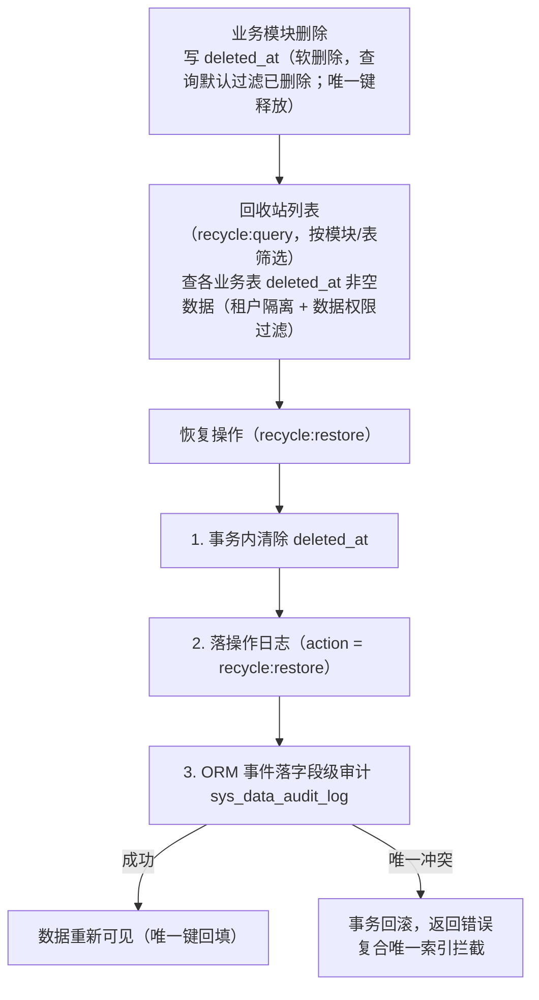
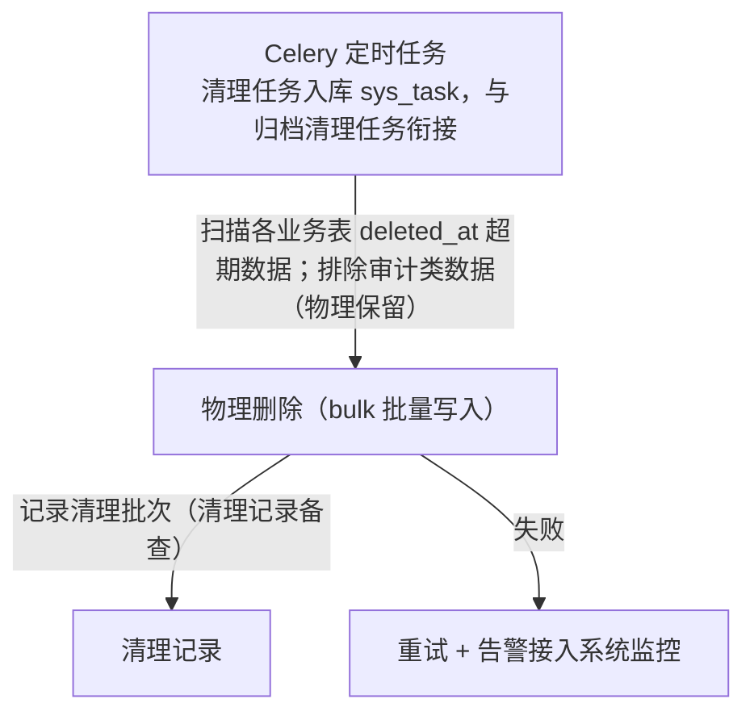

# 概要设计 · 回收站

> BMS · 软删除数据查看与恢复

[概要设计](01_概要设计_总览.md) › 33-回收站　|　[← 32-备份管理](32_概要设计_备份管理.md) · [34-全文检索 →](34_概要设计_全文检索.md)

本节对应[《项目规划说明》](../../规划/项目规划说明.html)「功能模块」之**回收站**模块，与「数据规范（软删除）」
「权限模型」「核心数据表清单」「测试策略」等章节；架构设计依据[《架构设计》](../架构设计/01_架构设计_总览.md)09-数据访问与分片
节点（事务边界与查询规范）。

## 1. 模块概述与职责 

回收站模块承载软删除数据的查看与恢复：复用各业务表 `deleted_at` 软删除机制（无独立表），
按模块展示已删除数据并支持恢复；过期软删除残留由 Celery 定时物理清理（与归档清理任务衔接）。

- **软删除数据查看**：复用 deleted_at，无独立表；查询各业务表 `deleted_at` 非空数据
- **恢复动作**：清除 `deleted_at`，落[操作日志](11_概要设计_操作日志.md)与字段级审计（`sys_data_audit_log`）
- **唯一约束配合**：业务唯一约束建为 (唯一字段, deleted_at) 复合唯一索引——未删行 NULL 多行不冲突，删除写入时间戳释放唯一键；PostgreSQL 可加部分唯一索引优化
- **物理清理**：过期数据由 Celery 定时物理清理（与归档清理任务衔接），清理记录备查
- **按模块展示**：回收站按模块展示，可筛选业务表

职责边界：本模块不新增任何独立表（无独立新表），只提供对软删除数据的统一查看、恢复与清理入口；恢复动作本身由对应业务模块的 repository 层执行（清除 deleted_at）。

相邻模块协作：与**[审计合规](29_概要设计_审计合规.md)**协作（恢复动作落操作日志与字段级审计）；与**[归档管理](31_概要设计_归档管理.md)**衔接物理清理任务；与**[任务调度](24_概要设计_任务调度.md)**协作（清理任务入库 sys_task）；与**数据访问与分片**协作（软删除查询默认过滤规则、唯一索引约束）。

## 2. 功能分解与业务流程 

### 2.1 功能点分解 

| 功能点 | 说明 | 归属业务码 |
| --- | --- | --- |
| 软删除数据查看 | 查询各业务表 deleted_at 非空数据，按模块/表筛选展示 | recycle |
| 恢复 | 清除 deleted_at 恢复数据，落操作日志与字段级审计 | recycle |
| 过期数据物理清理 | Celery 定时物理清理软删除残留（与归档清理任务衔接） | recycle + archive |
| 唯一约束保障 | (唯一字段, deleted_at) 复合唯一索引，删除释放唯一键、恢复回填 | 数据规范层 |

### 2.2 业务规则 

- 软删除：业务数据软删除（deleted_at 时间戳），审计类数据物理保留；查询默认过滤已删除
- 业务唯一约束统一建为 (唯一字段, deleted_at) 复合唯一索引：未删行 deleted_at 为 NULL，SQLite/MySQL/PostgreSQL/达梦 DM8 四库均允许多个 NULL 不冲突（达梦按 Oracle 兼容口径，阶段一验证）；删除时写入时间戳即释放唯一键；PostgreSQL 可另加部分唯一索引优化
- 软删除数据进回收站（recycle 业务：查看/恢复）；恢复即清除 deleted_at；恢复动作落操作日志与字段级审计（sys_data_audit_log）
- 过期软删除残留由 Celery 定时物理清理（与归档清理任务衔接）
- 回收站按模块展示（可筛选表），查询与恢复均在租户边界内、叠加数据权限过滤
- 审计类数据物理保留、不进入回收站（软删除仅针对业务数据）

### 2.3 流程步骤 

删除与恢复主流程（含异常分支）：

1. 业务模块删除数据 → 写 deleted_at 时间戳（软删除），查询默认过滤
2. 回收站查看：按模块/表筛选 deleted_at 非空数据（叠加租户与数据权限过滤）
3. 恢复：清除 deleted_at → 写操作日志 + 字段级审计（sys_data_audit_log）→ 数据重新可见
   - 异常分支：唯一键已被占用（删除期间有新增同名记录）→ 恢复失败，提示唯一冲突（复合唯一索引拦截）
4. 过期数据物理清理：Celery 定时任务扫描 deleted_at 超期数据 → 物理删除（与归档清理任务衔接）
   - 异常分支：清理失败 → 重试 + 告警；清理动作记录备查

## 3. 关键时序与协作 

### 3.1 软删除与恢复时序 

### 3.2 过期数据物理清理 

协作组件：**审计哈希链**承接恢复动作的字段级审计（经 ORM 事件 + RocketMQ 写入链式记录）；**任务调度**承接物理清理任务（sys_task 入库）；**归档管理**与清理任务衔接（过期软删除残留与过期归档文件由 Celery 物理清理）；**数据访问与分片**保障软删除查询默认过滤与复合唯一索引约束（事务边界、bulk 写入）。

## 4. 数据模型与表设计 

本模块**无独立新表**：复用各业务表的软删除字段 `deleted_at` 与审计字段（created_at/created_by/updated_at/updated_by），恢复动作的审计记录复用 `sys_data_audit_log`（审计合规模块表）。

| 字段/机制 | 说明 |
| --- | --- |
| deleted_at（各业务表） | 软删除时间戳（UTC）；NULL 表示未删除，非 NULL 进入回收站 |
| (唯一字段, deleted_at) 复合唯一索引 | 业务唯一约束统一形式；未删行 NULL 多行不冲突，删除写入时间戳释放唯一键；PostgreSQL 可加部分唯一索引优化 |
| 审计字段 | created_at / created_by / updated_at / updated_by 由 ORM 事件自动填充；恢复动作经字段级审计落 sys_data_audit_log |
| 乐观锁 version | 恢复/清理时比对，防止多实例并发覆盖 |

- **索引**：deleted_at 需纳入查询索引（回收站列表按模块/表 + 删除时间筛选）；排序字段、外键、数据权限过滤字段必须建索引
- **清理策略**：过期软删除残留由 Celery 定时物理清理（与归档清理任务衔接）；审计类数据物理保留、不进入回收站
- **数据流转**：删除（写 deleted_at）→ 回收站可见 → 恢复（清除 deleted_at，审计留痕）或超期物理清理（记录备查）
- **表命名**：软删除依赖各业务表既有 deleted_at 字段，不新增表；业务表统一规范（雪花 ID 主键、审计字段、乐观锁、时间 UTC）

> 回收站无独立表是既定设计（复用 deleted_at）；恢复动作必须审计留痕（操作日志 + 字段级审计），唯一约束靠 (唯一字段, deleted_at) 复合唯一索引兜底，恢复冲突在事务内回滚拒绝。

## 5. 接口设计 

| 方法 | 路径 | 说明 | 权限码 |
| --- | --- | --- | --- |
| GET | /api/v1/recycle/modules | 可回收模块/表清单（含各表可筛选字段与数据量） | recycle:query |
| GET | /api/v1/recycle/items | 软删除数据分页查询（按模块/表、删除时间范围筛选，叠加租户与数据权限） | recycle:query |
| GET | /api/v1/recycle/items/{table}/{id} | 软删除数据详情（删除前快照展示） | recycle:query |
| POST | /api/v1/recycle/restore | 恢复软删除数据（清除 deleted_at，落操作日志与字段级审计） | recycle:restore |

- 分页：查询参数 `page`（从 1 起）、`size`；响应 `{list, total, page, size}`
- 幂等：恢复写接口支持幂等键（请求头 Idempotency-Key，Redis SETNX 前置拦截 + 唯一约束兜底）
- 限流：slowapi 接口级限流（IP / 用户维度）
- 鉴权：全部接口 Bearer access token + require_permission 强制校验（两级：业务权限 + 动作权限）
- 发布事件：**无独立事件**；恢复动作经 ORM 事件落操作日志与字段级审计（审计合规模块消费）

## 6. 权限与配置 

| 权限码 | 业务:动作 | 说明 | 默认归属 |
| --- | --- | --- | --- |
| 回收站查询 | recycle:query | 软删除数据查看 | 系统管理员 |
| 回收站恢复 | recycle:restore | 恢复软删除数据 | 系统管理员 |

- **菜单挂接**：回收站菜单挂「回收站」表单（业务码 recycle），恢复按钮挂动作（recycle:restore，默认无按钮权限，授予后可见）
- **sys_config 参数**（建议键名）：软删除物理清理保留天数、清理批次大小
- **种子数据**：回收站无独立表与独立种子；物理清理任务与归档清理任务衔接，入库 sys_task（初始定时任务种子）
- 恢复动作受动作级数据范围校验（写读双向校验，与权限计算引擎一致）

## 7. 错误码与异常处理 

按《项目规划说明》5 位错误码分段表，本模块归属 9xxxx 段（90001-99999，覆盖报表/审计/归档/监控），段内序号一经发布稳定不变。建议段内分配（95001 起为回收站模块保留）：

| 错误码 | 含义 | 处理要求 |
| --- | --- | --- |
| 95001 | 记录不存在或已物理清理 | 提示数据已过期物理清理，无法恢复 |
| 95002 | 恢复唯一冲突（唯一键被占用） | 复合唯一索引拦截，事务回滚；提示冲突字段，需人工处理 |
| 95003 | 数据已被其他操作恢复 | 并发保护（乐观锁 version），提示刷新列表 |
| 95004 | 审计类数据不可恢复/不可清理 | 审计数据物理保留、不进入回收站，拒绝越界操作 |

- 文案由前端按 i18n 映射，后端不承担文案拼装
- 异常处理：恢复动作事务内完成（清除 deleted_at + 审计留痕同事务），失败整体回滚；物理清理失败重试 + 告警
- 越权恢复（超出数据范围）错误码归属 3xxxx 用户与组织段，由权限校验侧返回

## 8. 页面清单与验收要点 

| 端 | 页面 | 说明 |
| --- | --- | --- |
| PC | 回收站 | 按模块/表筛选软删除数据列表、详情查看、恢复操作 |
| 移动端 | 不提供 | 回收站仅管理端 |

验收要点：

- 回收站查看/恢复可用且审计留痕（《项目规划说明》MVP 验收标准：回收站查看/恢复可用且审计留痕）
- 恢复动作落操作日志与字段级审计（sys_data_audit_log）
- 复合唯一索引生效：删除释放唯一键、恢复冲突被拦截回滚；SQLite/MySQL/PostgreSQL/达梦 DM8 四库行为一致（PostgreSQL 部分唯一索引优化）
- 过期数据物理清理生效（与归档清理任务衔接，清理记录备查）
- 查询默认过滤已删除、回收站按模块展示可筛选、租户与数据权限过滤生效
- 测试覆盖：回收站恢复（审计留痕）纳入测试策略（《项目规划说明》测试策略节）

> 本文档为 AI 生成 · 概要设计节点 · 与《项目规划说明》《架构设计》《文档生成规范》《命名规范》配套 · 生成日期：2026-08-15