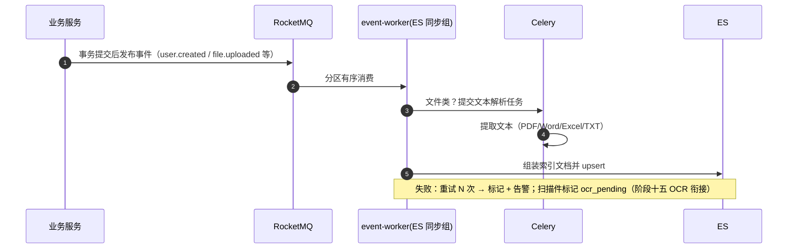
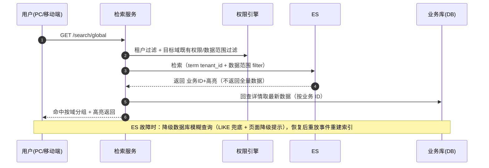

# 概要设计 · 全文检索

> BMS · ES 检索、事件同步与降级兜底（阶段十四）

[概要设计](01_概要设计_总览.md) › 34-全文检索　|　[← 33-回收站](33_概要设计_回收站.md) · [35-AI 能力 →](35_概要设计_AI能力.md)

本节对应[《项目规划说明》](../../规划/项目规划说明.md)「功能模块」之**全文检索**模块与「选型说明（ElasticSearch 8.x）」
「事件总线事件模型」「部署与运维（检索高可用）」「测试策略」「开发计划与验收标准（阶段十四）」章节，
架构设计依据[《架构设计》](../架构设计/01_架构设计_总览.md)20-子系统-全文检索节点。

## 1. 模块概述与职责 

全文检索模块（阶段十四）基于 ElasticSearch 8.x（elasticsearch-py 官方客户端），
为系统提供三类检索能力：**主数据全局搜索**（用户/部门/角色/字典/采购单据/文件元数据/帮助文章）、
**审计日志检索**（操作/登录/开放接口/数据变更，按月索引与分片表对齐）、
**文件内容检索**（PDF/Word/Excel/TXT 解析文本；扫描件 OCR 由阶段十五 AI 支持）。

- **模块定位**：检索能力提供方，覆盖全局搜索（PC 管理端 + 移动端）、审计日志全文检索与文件内容检索；不新增业务权限码，检索入口按目标域既有权限过滤
- **职责边界**：ES 只承担检索匹配——返回业务 ID + 高亮，详情一律回查数据库取最新数据，避免双写一致性难题；数据同步走 RocketMQ 事件驱动异步消费（独立 event-worker 进程，复用现有事件模型），业务侧不做同步双写
- **部署形态**：MVP 单节点部署，生产多节点集群（索引多副本、故障自动分片迁移）；生产开启安全认证
- **协作关系**：
  - 事件总线（[架构 11](../架构设计/12_架构设计_子系统_事件总线.md)）：同步管线经 RocketMQ 事件驱动，event-worker 消费；索引重建时重放事件
  - [任务调度](24_概要设计_任务调度.md)（[架构 12](../架构设计/13_架构设计_子系统_任务调度.md)）：文件文本解析走 Celery 任务；索引重建任务入 sys_task 由页面管理触发
  - 审计哈希链（[架构 14](../架构设计/15_架构设计_子系统_审计哈希链.md)）：审计日志按月索引与分片表归档对齐，归档后索引同步裁剪
  - [文件管理](13_概要设计_文件管理.md)（[架构 15](../架构设计/16_架构设计_子系统_文件管理.md)）：文件内容解析依赖文件元数据与 MinIO 对象（file.uploaded 事件驱动）
  - AI 服务（[架构 21](../架构设计/22_架构设计_子系统_AI服务.md)，阶段十五）：扫描件 OCR 与文件自动分类衔接文本解析；语义搜索与文件问答走 Milvus（独立向量检索，与本模块关键词检索互补）
  - 可观测性（[架构 22](../架构设计/23_架构设计_子系统_可观测性.md)）：索引健康、同步积压纳入 Prometheus 监控

## 2. 功能分解与业务流程 

### 2.1 功能点分解 

| 功能点 | 说明 | 入口/权限 |
| --- | --- | --- |
| 全局搜索（主数据多域聚合） | 跨用户/部门/角色/字典/采购单据/文件元数据/帮助文章多域检索，命中按域分组展示并高亮关键词 | 顶栏常驻入口（PC + 移动端）；按目标域既有业务权限过滤 |
| 审计日志检索 | 操作/登录/开放接口/数据变更四类审计日志全文检索，按类型与时间范围路由到对应按月索引 | log:query（审计管理员） |
| 文件内容检索 | PDF/Word/Excel/TXT 解析文本检索，命中返回文件 ID 与上下文高亮；扫描件标记 OCR 待办（阶段十五处理） | file:query + 动作级数据范围 |
| 事件同步消费 | event-worker ES 同步组消费 RocketMQ 事件，增量 upsert/删除索引文档；消费失败重试 + 死信告警 | 进程内（无接口权限） |
| 文件文本解析 | Celery 任务提取 PDF/Word/Excel/TXT 文本后入库索引；解析失败重试并标记状态 | 进程内（file.uploaded 触发） |
| 索引重建 | 重建任务入 sys_task（页面可触发、可定时）；单索引/按月索引独立重建；重放事件流 + 全量快照兜底；别名切换 | task:trigger（手动触发） |
| 降级兜底 | ES 故障时检索自动降级为数据库模糊查询，页面展示降级提示；恢复后重放事件重建索引 | 自动（sys_config 可关） |
| 索引健康监控 | 索引健康状态、同步积压、解析失败量指标上报 Prometheus，异常告警 | monitor:view |

### 2.2 业务规则 

- **索引统一规范**：全部索引均含 `tenant_id` 字段，查询强制租户隔离（term 过滤）；均记录文档来源业务 ID、域类型与更新时间，软删除/删除事件同步移除或标记，保证索引与库内可见数据一致
- **权限过滤**：查询时对每个目标域叠加两重过滤——租户过滤 + 动作级数据权限范围过滤（将权限范围规则表达式解析结果转换为 ES filter 子句，如 `dept_id in [...]`）；越权内容不进入检索结果
- **只返回 ID 与高亮**：ES 检索结果仅含业务 ID、域标识、标题与高亮片段；页面展示的详情数据回查数据库取最新，避免双写一致性难题
- **按月对齐**：审计日志索引 `bms-log-{类型}-{yyyyMM}` 与分片表（sys_operation_log_{yyyyMM} 等）按月对齐，新月份索引由 Celery 定时任务与分片表预创建联动提前创建
- **归档裁剪**：审计数据按归档策略（90 天热表）归档后，对应月份索引同步裁剪；归档前执行链完整性校验，与索引对齐检查一并进行
- **文本解析**：仅上传完成的文件（file.uploaded 事件）触发解析；解析失败自动重试（限定次数），仍失败标记 `failed` 并告警，支持人工重新解析；无文本层的扫描件标记 `ocr_pending`，由阶段十五 OCR 能力衔接
- **查询约束**：审计日志检索必须携带时间范围（与分片键对齐），单次范围上限防止扫全量索引；查询词长度受限，避免重查询打爆 ES

### 2.3 核心流程与异常分支 

1. **主数据索引同步**：
   1. 业务写入（用户/部门/角色/字典/单据/帮助文章等）事务提交后发布既有事件（如 `user.created`、`dept.changed`、`help.article.published`）
   2. event-worker ES 同步组消费事件，组装索引文档（租户、域、业务 ID、可检索摘要、高亮字段）写入对应索引
   3. 异常分支：消费失败按 RocketMQ 重试机制重试，超过阈值转告警；软删除/删除事件同步移除索引文档
2. **文件内容检索**：
   1. 文件上传完成发布 `file.uploaded`（file_id、sha256、size）
   2. event-worker 收到后提交 Celery 文本解析任务（PDF/Word/Excel/TXT 文本提取）
   3. 解析成功写入 `bms-file` 索引；解析失败重试/标记，扫描件标记 OCR 待办（阶段十五 AI 衔接）
   4. 异常分支：MinIO 对象不可读（已清理/损坏）标记失败并告警；解析超时按任务重试策略处理
3. **检索查询**：
   1. 用户在全局搜索页输入关键词，选择目标域（默认全部可检索域）
   2. 服务层校验用户对目标域的既有权限（业务权限 + 动作级数据范围），组装租户过滤 + 数据范围过滤
   3. ES 检索返回命中（业务 ID + 高亮），按域分组返回；详情数据回查数据库取最新
   4. 异常分支：ES 不可用 → 降级数据库模糊查询兜底（页面降级提示）；目标索引不存在/未就绪 → 返回明确错误码并提示
4. **索引重建**：
   1. 管理员在任务调度页触发（或定时任务）索引重建，任务入 sys_task 异步执行
   2. 按目标索引（单索引或按月索引）重放已落库事件流（事件可追溯），全量快照兜底
   3. 重建期间新旧索引经别名切换，无感替换
   4. 异常分支：同索引已有重建任务在跑 → 拒绝重复触发（错误码 10105）；重建失败记录 sys_task_log 并告警，别名不切换

## 3. 关键时序与协作 

### 3.1 事件同步时序 

### 3.2 查询与降级时序 

## 4. 数据模型与表设计 

本模块**不新增业务表**：检索数据存于 ES 索引（主数据/审计日志/文件三类索引），索引重建任务复用 `sys_task`，
文本解析失败状态标记在 `sys_file` 扩展字段（解析状态）上，事件流已落库可追溯（重建时重放）。

### 4.1 索引规划 

| 索引 | 命名 | 内容与关键字段 | 说明 |
| --- | --- | --- | --- |
| 主数据索引 | `bms-main` | doc_type（user/dept/role/dict/purchase/file_meta/help_article）、biz_id、title、content（可检索摘要）、tenant_id、deleted、updated_at | 按用途分索引；域字段用于多域聚合与分域权限过滤；软删除同步标记 |
| 审计日志索引 | `bms-log-{类型}-{yyyyMM}` | log_type（operation/login/open/data_audit）、record_id、user_id、username、module、action、method、path、ip、status、params（截断存储）、time、prev_hash、record_hash | 按月索引与分片表对齐；哈希链字段随档案留，供链校验交叉验证 |
| 文件内容索引 | `bms-file` | file_id、name、mime_type、content（解析文本）、sha256、uploader_id、parse_status（parsed/failed/ocr_pending）、tenant_id、updated_at | PDF/Word/Excel/TXT 解析文本；扫描件标记 ocr_pending 由阶段十五 AI 处理 |

- **别名机制**：重建期间新旧索引切换用别名（如 `bms-main-alias` 指向当前索引），业务查询始终走别名，重建无感
- **生命周期**：审计日志索引按月创建（与分片表预创建任务联动）；归档裁剪按归档策略执行；主数据/文件索引按文档变更增量维护
- **索引字段**：租户/域/时间等过滤字段按 ES keyword/date 类型处理；中文文本采用分词配置，高亮基于匹配字段；不存大字段全文原样，检索摘要截断存储

### 4.2 数据流转与生命周期 

- **主数据**：业务写入（事务提交）→ 事件发布 → event-worker 消费 → upsert `bms-main`；删除/软删除 → 索引移除/标记；重建时按事件流重放
- **审计日志**：审计日志写入（RocketMQ 异步化 + 哈希链按月分片表）→ 同一消息流供 ES 同步组消费 → 写入 `bms-log-{类型}-{yyyyMM}`；按月分片表预创建时同步预创建索引；归档（90 天）后索引裁剪
- **文件内容**：上传完成 `file.uploaded` → 文本解析任务 → 写入 `bms-file`；解析失败重试后标记，支持人工重新解析；阶段十五 OCR 处理 ocr_pending 后回写索引
- **重建任务**：定义入 `sys_task`（handler 指向重建逻辑），执行记录入 `sys_task_log`；页面可触发与查看进度

## 5. 接口设计 

| 方法 | 路径 | 说明 | 权限码 |
| --- | --- | --- | --- |
| GET | /api/v1/search/global | 全局搜索：多域聚合（q、types、page、size），命中按域分组 + 高亮，详情回查库 | 按目标域既有权限过滤（无统一权限码） |
| GET | /api/v1/search/logs | 审计日志检索（log_type、q、start_time、end_time 必填，跨月自动路由多索引） | log:query |
| GET | /api/v1/search/files | 文件内容检索（q、file_type、page、size），返回文件 ID 与上下文高亮 | file:query |
| POST | /api/v1/search/indexes/rebuild | 触发索引重建（index 指定目标，任务入 sys_task 异步执行） | task:trigger |
| GET | /api/v1/search/indexes | 索引状态查询（健康、文档数、同步积压、最近重建时间） | monitor:view |
| POST | /api/v1/files/{id}/reparse | 文件重新解析（解析失败/OCR 待办的人工重试入口） | file:manage |

- **通用规范**：前缀 `/api/v1`；统一响应 `{code, message, data}`；分页 `page`/`size`，响应 `{list, total, page, size}`；Bearer access token 鉴权 + `require_permission` 两级校验
- **分页**：全局/文件检索 limit/offset 限深（默认 ≤ 100 页）；审计日志检索时间范围必填且单次 ≤ 31 天，超限返回错误码 10107
- **幂等**：索引重建接口支持 `Idempotency-Key` 请求头（Redis SETNX 前置去重）；同索引同时仅允许一个重建任务
- **限流**：检索接口按用户维度限流（如 30 次/分钟），防重查询打爆 ES；ES 客户端短超时（默认 1s）快速失败
- **发布事件**：本模块不发布新事件；消费既有事件（见下表）

| 事件 | 驱动场景 |
| --- | --- |
| user.created / user.updated / user.deleted | 用户域索引增量维护 |
| dept.changed | 部门域索引增量维护（含移动） |
| purchase.apply.submitted / purchase.order.created | 采购单据域索引增量维护（单据其他变更事件按事件模型扩展） |
| file.uploaded | 文件元数据域 + 文件内容解析触发 |
| help.article.published / updated / deleted | 帮助文章域索引维护（草稿不索引） |
| 审计日志消息流 | 操作/登录/开放接口/数据变更日志写入的同一消息流供 ES 同步组消费 |

## 6. 权限与配置 

- **权限码**：本模块**不新增业务/动作权限码**；检索入口按目标域既有权限过滤：
  - 用户/部门/角色域 → 对应 user/post/role 业务查询权限 + 动作级数据范围
  - 字典域 → dict 查询；采购单据域 → purchase 查询权限 + 数据范围
  - 文件元数据域 → file 查询权限 + 数据范围；帮助文章域 → help 查询权限（前台公开文章按已登录用户可见范围）
  - 审计日志检索 → log:query（审计管理员）；索引重建 → task:trigger（任务调度）
- **菜单挂接**：全局搜索不做独立菜单，作为主布局顶栏常驻入口（PC 管理端 + 移动端 H5）；页面内可检索域 = 用户已授予业务权限的并集，无权限域不展示；审计日志检索页签仅 log 权限可见；索引重建任务入任务调度菜单（sys_task，页面可管理触发）
- **sys_config 参数**：

| config_key | 默认值 | 说明 |
| --- | --- | --- |
| search.es_failover_enabled | true | ES 故障降级数据库模糊查询开关 |
| search.timeout_ms | 1000 | ES 查询超时（毫秒），超时快速失败 |
| search.log_index_retention_months | 3 | 审计日志索引保留月数，与 90 天归档策略对齐，归档后裁剪 |
| search.index_rebuild_batch_size | 1000 | 索引重建批次大小（批量 upsert） |

- **种子数据**：索引重建任务定义入 sys_task 种子（手动触发为主，可配置定时增量重建），执行记录入 sys_task_log；生产环境初始化时创建三类索引模板与别名

## 7. 错误码与异常处理 

错误码分段表未为本模块单列段位，本模块错误码位于 **1xxxx 通用段**
（10001-19999 通用：参数校验、限流、系统内部；段内 101xx/102xx 子段为本模块规划，避开 10xxxx/11xxxx/12xxxx 业务模块段，见《[项目规划说明](../../规划/项目规划说明.md)》23.5「错误码段分配表」），一经发布稳定不变：

| 错误码 | 说明 | 场景 |
| --- | --- | --- |
| 10001 | 参数校验失败 | 通用段：q 为空/超长、types 非法、时间范围缺失等 |
| 10101 | 检索服务不可用 | ES 故障且降级失败（连接异常/安全认证失败） |
| 10102 | 检索超时 | ES 查询超过 search.timeout_ms |
| 10103 | 检索服务降级中 | ES 故障已切换数据库模糊查询，提示结果可能不完整 |
| 10104 | 目标索引不存在或未就绪 | 按月索引未预创建、别名未就绪 |
| 10105 | 索引重建任务进行中 | 同索引重复触发重建被拒 |
| 10106 | 文件内容不可检索 | 文件未解析/解析失败/OCR 待办（可经重新解析接口处理） |
| 10107 | 审计日志检索时间范围超限 | 单次检索范围超过 31 天需分次查询 |

- 限流命中返回通用段限流错误码，文案由前端按 i18n 映射
- 异常处理：ES 客户端故障不阻断业务（检索失败降级兜底 + 告警）；同步消费失败重试并告警，积压纳入监控；重建失败记录 sys_task_log，别名不切换；降级期间写入照常（事件落库），恢复后重放事件重建索引

## 8. 页面清单与验收要点 

| 页面 | 端 | 说明 |
| --- | --- | --- |
| 全局搜索 | PC 管理端 | 顶栏搜索框 + 结果页：多域分组/页签、关键词高亮、命中详情跳转（回查库）、审计日志检索页签（log 权限可见）、降级提示条 |
| 全局搜索 | 移动端 H5 | 顶栏搜索 + 结果列表（复用 /api/v1/search/global），高亮与详情跳转 |
| 索引重建管理 | PC 管理端 | 复用任务调度页：重建任务创建/触发/执行记录（sys_task_log），索引状态页签（健康/积压） |

**验收要点**（阶段十四完成标准）：

- 检索命中与高亮正确：三类场景（主数据/审计日志/文件内容）命中准确、高亮正确、详情回查数据库为最新数据
- 权限与租户过滤验证通过：跨租户检索被拒；无目标域权限不返回该域结果；数据范围过滤生效
- 索引重建可用：单索引/按月索引独立重建成功、别名切换无感、事件重放与快照兜底生效、重复触发被拒
- 审计日志按月索引与归档对齐：按月索引与分片表对齐、归档后索引同步裁剪、哈希链字段随档可校验
- 降级兜底生效：ES 故障时数据库模糊查询可用且页面降级提示，恢复后重放事件重建索引
- 文件内容解析：PDF/Word/Excel/TXT 解析入库可检索；解析失败重试/标记与人工重解析可用；扫描件标记 OCR 待办（阶段十五衔接）
- 索引健康与同步积压纳入监控可见；文本解析与重建相关用例纳入测试策略（事件同步、检索权限租户隔离、文件内容解析）

> 本文档为 AI 生成 · 概要设计节点 · 与《项目规划说明》《架构设计》《文档生成规范》《命名规范》配套 · 生成日期：2026-08-15