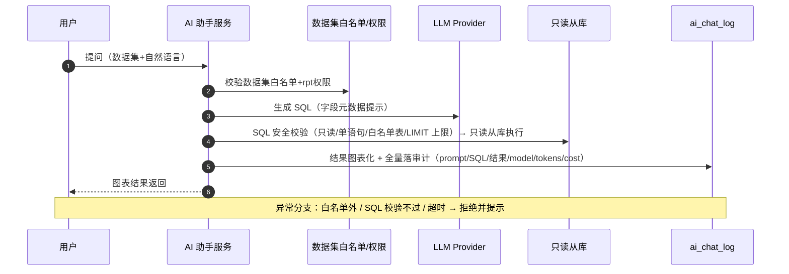
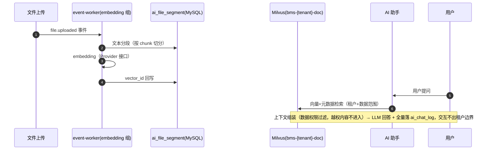
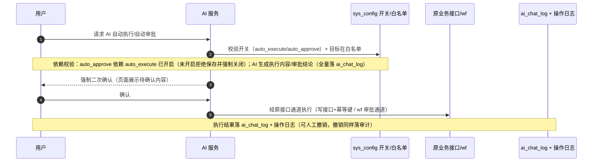
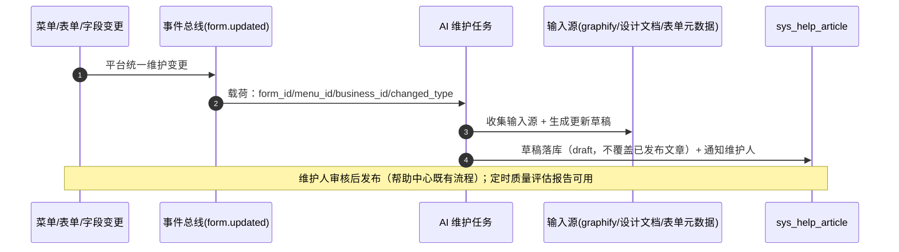

# 概要设计 · AI 能力

> BMS · LLM 适配、八项能力与安全闸门（阶段十五）

[概要设计](01_概要设计_总览.md) › 34-AI 能力　|　[← 34-全文检索](34_概要设计_全文检索.md) · [36-收付款管理 →](36_概要设计_收付款管理.md)

本节对应[《项目规划说明》](../../规划/项目规划说明.html)「功能模块」之**AI 能力**模块与「选型说明（AI（阶段十五））」
「核心数据表清单」「认证与安全（AI 安全）」「事件模型（form.updated）」「部署与运维（Milvus/PaddleOCR）」
「开发计划与验收标准（阶段十五）」章节，架构设计依据[《架构设计》](../架构设计/01_架构设计_总览.md)21-子系统-AI 服务节点
与 20-子系统-全文检索节点（OCR 衔接文本解析）。

## 1. 模块概述与职责 

AI 能力模块（阶段十五）提供统一 LLM 适配层与八项 AI 能力（智能报表助手、智能审批辅助、AI 内容生成、
语义搜索与文件问答、OCR 与文件自动分类、审计异常检测、知识库问答机器人、帮助文档智能维护）。
设计基线：AI 结果默认仅辅助展示、AI 交互全量落审计、自动写操作与自动审批默认关闭。

- **模块定位**：AI 能力统一入口（LLM/embedding/OCR 模型接入、对话、问数、问答、生成、检测）与治理（模型配置、审计、限流、预算）
- **职责边界**：模型接入经统一适配层（模型切换不侵入业务代码）；不直接引入业务写权限——自动执行写操作与自动审批为两个独立可选功能，开关默认关闭；提示词与数据不出租户边界
- **协作关系**：
  - 权限计算引擎（[架构 10](../架构设计/11_架构设计_子系统_权限计算引擎.md)）：对话权限码 `ai:chat`、模型配置 `ai:manage`；RAG 检索上下文遵守动作级数据权限范围
  - 事件总线（[架构 11](../架构设计/12_架构设计_子系统_事件总线.md)）：embedding 管线经 RocketMQ 事件驱动（复用 event-worker）；消费 `form.updated` 驱动帮助草稿更新
  - [报表中心](28_概要设计_报表中心.md)：智能问数（NL2SQL）基于数据集白名单 + 只读从库执行
  - 工作流：审批辅助与自动审批（审批节点白名单）；AI 内容生成（审批意见、申请理由草稿）
  - [文件管理](13_概要设计_文件管理.md)/[全文检索](34_概要设计_全文检索.md)（[架构 15](../架构设计/16_架构设计_子系统_文件管理.md)/[架构 20](../架构设计/21_架构设计_子系统_全文检索.md)）：OCR 衔接文本解析（扫描件 ocr_pending → OCR 后回写）；语义搜索与关键词检索互补
  - 审计哈希链（[架构 14](../架构设计/15_架构设计_子系统_审计哈希链.md)）：ai_chat_log 按月分片；审计异常检测输入源
  - [帮助中心](18_概要设计_帮助中心.md)：帮助文档智能维护（草稿生成、质量评估，人工审核后发布）
  - 可观测性（[架构 22](../架构设计/23_架构设计_子系统_可观测性.md)）：AI 成本/延迟指标；异常检测告警接 Alertmanager

## 2. 功能分解与业务流程 

### 2.1 功能点分解（八项能力） 

| 能力 | 说明 | 结合模块 |
| --- | --- | --- |
| 智能报表助手 | NL2SQL 问数：数据集白名单 + 只读从库 + 安全校验防注入；结果图表化 | 报表中心 |
| 智能审批辅助 | 历史审批 RAG 生成参考意见与风险提示，仅辅助展示，不自动提交 | 工作流 |
| AI 内容生成 | 邮件/通知模板、审批意见、申请理由草稿 | 通知公告、工作流 |
| 语义搜索与文件问答 | Milvus 向量检索 + 文件分段问答（ai_file_segment 落库、向量存 Milvus） | 文件管理、全文检索 |
| OCR 与文件自动分类 | PaddleOCR 本地 + 多模态 API 可切换；扫描件解析、文件自动归类 | 文件管理、全文检索 |
| 审计异常检测 | 行为风控（登录/操作/开放接口/数据变更/AI 交互异常模式），告警接 Alertmanager | 审计哈希链、可观测性 |
| 知识库问答机器人 | 企业微信/钉钉入口；知识源：帮助文章/公告/审批记录/流程文档 | 通知公告、认证与会话 |
| 帮助文档智能维护 | 自动编写/更新帮助草稿 + 质量评估；输入源 graphify 知识图谱 + 设计文档 + 表单元数据；手动/form.updated/定时三种触发；草稿人工审核发布 | 帮助中心 |

### 2.2 业务规则 

- **模型统一适配**：全部模型调用经 Provider 接口（chat / embedding / ocr）；端点与模型配置入库 sys_ai_provider；外部大模型 API（DeepSeek/Qwen 等）默认，私有化端点（Ollama/vLLM）可配；API key 走 Secret 管理（api_key_ref 引用 Secret 名，不落库明文）；模型切换不侵入业务代码
- **AI 交互全量审计**：问答/生成/辅助/自动执行全部落 ai_chat_log（prompt、response、model、tokens、cost），按月分片；存储前按数据脱敏机制掩码手机号/邮箱等注册敏感字段，提示词与响应不出租户边界
- **默认仅辅助**：AI 输出默认以意见、草稿、检索结果、告警建议形式展示，不直接执行业务动作；审批辅助意见仅展示参考，审批结论由人工提交
- **prompt 注入防护**：角色隔离（系统提示词与用户输入分离）、指令约束（限定任务范围与输出格式）、输出校验（敏感操作/敏感信息模式拦截，校验失败拒绝并落审计）
- **RAG 权限约束**：检索上下文（历史审批、文档分段、知识源）组装前按动作级数据权限范围过滤，越权内容不进入上下文
- **租户隔离**：向量库按租户隔离（Milvus collection `bms-{tenant}-doc`）；模型端点按租户引用平台 provider；AI 交互数据不出租户边界
- **限流与预算**：AI 接口独立限流（slowapi 用户维度）与预算控制（日/月 token 与费用上限，超限拒绝并告警）
- **自动执行与自动审批**：两个独立功能，各自由 sys_config 开关控制、默认关闭；`ai.auto_approve` 依赖 `ai.auto_execute` 开启（未开启时配置拒绝保存并强制关闭）；开启时仅限白名单（写接口、审批节点），执行前强制二次确认，自动执行全量落 ai_chat_log 与操作日志，结果可人工撤销
- **帮助草稿保护**：AI 生成结果一律为草稿（draft），人工审核后发布，不自动覆盖已发布文章

### 2.3 核心流程与异常分支 

1. **智能问数（NL2SQL）**：
   1. 用户在 AI 助手「智能问数」页输入自然语言问题，选择目标数据集
   2. 服务层校验：数据集在 rpt_dataset 白名单内且用户具有对应 rpt 权限
   3. LLM 基于数据集字段元数据生成 SQL → 安全校验（只读、禁止多语句、仅白名单表、强制 LIMIT 上限、禁用危险函数）
   4. 在只读从库执行，结果按字段类型自动图表化返回
   5. 异常分支：数据集不在白名单 → 拒绝（12006）；SQL 校验不过 → 拒绝并提示（12007）；执行超时/结果过大 → 截断提示；问题与结果全量落 ai_chat_log
2. **智能审批辅助**：
   1. 审批人在审批页点击「AI 辅助」
   2. 服务层检索历史审批记录（wf_record 等）与当前单据上下文，按当前用户数据权限过滤
   3. LLM 生成参考意见与风险提示，仅展示，审批结论仍由人工提交
   4. 异常分支：无历史数据 → 提示无参考数据；上下文越权内容被过滤；全程落 ai_chat_log
3. **文件问答（RAG）**：
   1. 文件上传完成（file.uploaded 事件）→ 文本分段（ai_file_segment 落分段文本）→ embedding 经 RocketMQ 事件驱动（复用 event-worker）→ 向量写入 Milvus `bms-{tenant}-doc`
   2. 用户提问 → 向量检索 + 元数据过滤（租户 + 数据范围）→ 组装上下文 → LLM 生成回答
   3. 异常分支：文件未分段/向量库不可用 → 明确提示（12013），可降级关键词检索兜底；上下文权限过滤后为空 → 提示无可回答内容
4. **帮助文档智能维护**：
   1. 三种触发：维护人手动点击生成/更新草稿；菜单/表单/字段/按钮变更经 `form.updated` 事件自动生成更新草稿并通知维护人；定时质量评估扫描
   2. 输入源：功能代码（graphify 知识图谱）、设计文档、表单元数据（sys_form/sys_field/业务权限码清单）
   3. 生成结果一律草稿（draft）入 sys_help_article，不覆盖已发布文章；维护人审核后按帮助中心既有流程发布
   4. 定时质量评估：评估陈旧度/完整性/准确性并生成改进建议（质量评估报告页面可见）
   5. 异常分支：输入源不足 → 提示并跳过（12015）；生成失败 → 草稿不落库并告警；全程落 ai_chat_log
5. **自动执行写操作与自动审批**：
   1. 开关校验：调用自动执行/自动审批前校验对应 sys_config 开关；`ai.auto_approve` 保存配置时校验 `ai.auto_execute` 已开启，未开启拒绝保存并强制关闭
   2. 白名单校验：目标写接口/审批节点必须在配置白名单内
   3. AI 生成执行内容/审批结论 → 展示给用户 → 强制二次确认（页面确认）
   4. 确认后经既有接口通道执行（写操作走原接口 + 幂等键，审批走 wf 审批通道），全量落 ai_chat_log 与操作日志
   5. 结果可人工撤销（反向回退接口/状态恢复），撤销动作同样落审计
   6. 异常分支：开关未开/白名单外 → 拒绝（12008/12009/12010）；缺少二次确认 → 拒绝（12011）；撤销时状态不允许 → 拒绝（12012）
6. **OCR 与自动分类、异常检测**：
   1. OCR：扫描件（ocr_pending）经 PaddleOCR 本地解析（可切换多模态模型 API）提取文本，回写全文检索 bms-file 索引；失败标记可重试（12014）
   2. 文件自动分类：按内容与命名规则建议归类（目录/标签），仅建议不自动移动
   3. 审计异常检测：定时任务（sys_task 入库）扫描登录/操作/开放接口/数据变更/AI 交互异常模式（如批量失败、异常时段访问、高频敏感操作），命中生成风险事件并接 Alertmanager 告警（邮件/企业微信/钉钉）

## 3. 关键时序与协作 

### 3.1 智能问数时序 

### 3.2 RAG 管线时序 

### 3.3 自动执行与自动审批时序 

### 3.4 帮助文档维护时序 

## 4. 数据模型与表设计 

| 表 | 库 | 关键字段 | 说明 |
| --- | --- | --- | --- |
| sys_ai_provider | 平台库 | provider_key、name、type（llm/embedding/ocr）、endpoint、model、api_key_ref、status | AI 模型端点配置（外部 API/私有化），租户按需引用；api_key_ref 引用 Secret 名，不存密钥明文 |
| ai_chat_log | 租户库 | user_id、tenant_id、module、prompt、response、model、tokens、cost、status、created_at | AI 交互审计，按月分片（yyyyMM 后缀），全量落库；敏感字段写入前脱敏 |
| ai_file_segment | 租户库 | file_id、chunk_no、content、vector_id | 文件内容分段：分段文本落库，向量存 Milvus；联合唯一（file_id + chunk_no） |

- **通用规范**：雪花 ID 主键、审计字段、时间 UTC；ai_chat_log 按月分片（分片键=时间），分片表由 Celery 定时任务与既有分片表预创建联动
- **索引**：ai_chat_log 建 user_id + created_at、tenant_id + created_at 索引；ai_file_segment 建 file_id 索引
- **向量库**：Milvus 独立部署（milvus + etcd，MinIO 复用），collection 按租户隔离（`bms-{tenant}-doc`）；vector_id 关联 Milvus 向量与分段文本
- **归档**：ai_chat_log 纳入审计类数据管理（按月分片、归档策略按审计合规执行）；已归档月份历史查询走归档库只读
- **数据流转**：模型配置：平台维护 provider → 租户引用 → 业务调用经适配层；交互：用户输入 → 调用（审计先行/并行落库）→ 响应 → ai_chat_log；文件：上传 → 分段落 ai_file_segment → embedding → Milvus；帮助草稿：AI 生成 draft → sys_help_article（草稿状态）→ 人工审核发布
- **种子数据**：默认 provider 占位种子（type llm/embedding/ocr 各一，endpoint/model 占位，api_key_ref 指向环境变量 Secret 名，status=disabled 待配置）；审计异常检测任务入 sys_task 种子

## 5. 接口设计 

| 方法 | 路径 | 说明 | 权限码 |
| --- | --- | --- | --- |
| POST | /api/v1/ai/chat | AI 对话（module: ask/approval/doc_qa/content），返回结果 + 审计标识 | ai:chat |
| POST | /api/v1/ai/report/query | 智能问数（NL2SQL：数据集白名单 + 只读从库 + 安全校验，结果图表化） | ai:chat（+rpt:query 数据集权限） |
| POST | /api/v1/ai/approval/suggest | 审批辅助：历史审批 RAG 生成参考意见与风险提示（仅辅助展示） | ai:chat（+wf 单据数据权限） |
| POST | /api/v1/ai/actions/{action_id}/confirm | 自动执行/自动审批强制二次确认 | ai:chat |
| POST | /api/v1/ai/actions/{action_id}/revoke | 撤销自动执行结果（可撤销时），撤销动作落审计 | ai:chat |
| GET | /api/v1/ai/chat/logs | AI 交互审计查询（分页 + 用户/模块/时间过滤） | ai:manage |
| GET | /api/v1/ai/providers | 模型配置列表（按 type 过滤） | ai:manage |
| POST | /api/v1/ai/providers | 新增模型端点（provider_key 唯一） | ai:manage |
| PUT | /api/v1/ai/providers/{provider_key} | 更新模型端点（endpoint/model/status 等） | ai:manage |
| DELETE | /api/v1/ai/providers/{provider_key} | 停用/删除模型端点（被引用时拒绝或标记停用） | ai:manage |
| POST | /api/v1/ai/providers/{provider_key}/test | 连通性/模型调用测试 | ai:manage |
| POST | /api/v1/ai/help/{article_id}/generate-draft | 生成/更新帮助文章草稿（手动触发；form.updated 事件自动触发走事件通道） | help:manage |
| GET | /api/v1/ai/quality/report | 帮助文档质量评估报告（陈旧度/完整性/准确性 + 改进建议） | help:manage |
| POST | /api/v1/ai/ocr/{file_id} | OCR 解析扫描件（PaddleOCR 本地/多模态 API），完成后回写全文检索索引 | file:manage |
| GET | /api/v1/ai/risk/events | 审计异常检测风险事件列表（告警同时接 Alertmanager） | ai:manage |

- **通用规范**：前缀 `/api/v1`；统一响应 `{code, message, data}`；分页 `page`/`size`；Bearer access token 鉴权 + `require_permission` 两级校验
- **幂等**：二次确认、撤销、OCR 解析等写接口支持 `Idempotency-Key` 请求头（Redis SETNX 前置去重）
- **限流与预算**：AI 接口独立限流（slowapi 用户维度，如对话 10 次/分钟、问数 1 次/分钟）；预算控制（sys_config 配置日/月 token 与费用上限，超限拒绝并告警）
- **发布事件**：帮助草稿生成完成可发布 AI 生成内容事件（可选 Webhook 订阅）；消费 `form.updated`（AI 帮助更新触发）

## 6. 权限与配置 

- **权限码**：

| 权限码 | 说明 | 默认归属 |
| --- | --- | --- |
| ai:chat | AI 对话（问数/审批辅助/文档问答/内容生成/机器人） | 普通角色 |
| ai:manage | 模型配置（provider 维护/连通测试/AI 审计查询/风险事件查看） | 系统管理员 |

- **菜单挂接**：菜单「AI 助手」挂表单（业务 ai，页面内问数/审批辅助/文档问答页签，按钮挂 ai:chat）；菜单「模型配置」挂表单（业务 ai，按钮挂 ai:manage）；帮助维护入口在帮助中心（help 业务，AI 草稿与质量评估报告）；问答机器人入口在企微/钉钉工作台
- **sys_config 参数**：

| config_key | 默认值 | 说明 |
| --- | --- | --- |
| ai.auto_execute | false | AI 自动执行写操作开关（默认关闭） |
| ai.auto_approve | false | AI 自动审批开关（默认关闭，依赖 ai.auto_execute 开启，未开启时配置拒绝保存并强制关闭） |
| ai.auto_execute.whitelist | [] | 自动执行写接口白名单（JSON 数组，空=无可执行接口） |
| ai.auto_approve.whitelist | [] | 自动审批节点白名单（JSON 数组） |
| ai.budget.daily_tokens | — | AI 每日 token 预算上限，超限拒绝并告警 |
| ai.budget.daily_cost | — | AI 每日费用预算上限（元），超限拒绝并告警 |
| ai.rate.chat_per_min | 10 | 对话接口用户维度限流（次/分钟） |

- **种子数据**：业务码 ai、动作码 chat/manage 入平台库种子（sys_business/sys_action）；默认 provider 占位种子（status=disabled，待配置）；审计异常检测任务入 sys_task；AI 助手菜单/表单/按钮挂接种子；三类内置角色中普通角色预授 ai:chat、系统管理员预授 ai:manage

## 7. 错误码与异常处理 

错误码分段表未为本模块单列段位，本模块错误码位于 **1xxxx 通用段**
（10001-19999 通用：参数校验、限流、系统内部；段内 102xx 子段为本模块规划，避开 10xxxx/11xxxx/12xxxx 业务模块段，见《[项目规划说明](../../规划/项目规划说明.html)》23.5「错误码段分配表」），一经发布稳定不变：

| 错误码 | 说明 | 场景 |
| --- | --- | --- |
| 10001 | 参数校验失败 | 通用段：问题为空/超长、module 非法等 |
| 10201 | 模型不可用或未配置 | 目标 type 无可用 provider 或端点状态停用 |
| 10202 | 模型调用超时 | LLM/embedding/OCR 调用超过超时阈值（重试后仍失败） |
| 10203 | 输出校验未通过 | 疑似 prompt 注入/敏感操作，已拦截并落审计 |
| 10204 | AI 预算超限 | 日/月 token 或费用预算耗尽 |
| 10205 | 租户无可用模型端点 | 租户未引用任何可用 provider |
| 10206 | 数据集不在白名单 | NL2SQL 目标数据集无权限或非白名单（拒绝生成 SQL） |
| 10207 | SQL 安全校验未通过 | 非只读/多语句/白名单外表/危险函数（防注入拒绝执行） |
| 10208 | AI 自动执行未开启 | ai.auto_execute=false 时请求自动执行 |
| 10209 | AI 自动审批未开启或依赖未满足 | ai.auto_approve=false，或 ai.auto_execute 未开启（配置拒绝保存并强制关闭） |
| 10210 | 目标不在自动执行白名单 | 写接口/审批节点不在对应白名单 |
| 10211 | 缺少二次确认 | 自动执行/自动审批未完成强制二次确认 |
| 10212 | 动作无法撤销 | 目标状态不允许撤销（已流转/已过期） |
| 10213 | 文件未分段或不可问答 | 文件未分段/向量未生成/向量库不可用 |
| 10214 | OCR 解析失败 | 扫描件解析失败（可重试，PaddleOCR/多模态 API 切换） |
| 10215 | 帮助草稿生成失败 | 输入源不足（graphify 图谱/设计文档/表单元数据缺失） |
| 10216 | AI 审计写入失败 | ai_chat_log 落库失败，交互结果标记异常并告警（审计优先） |

- 限流命中返回通用段限流错误码；文案由前端按 i18n 映射
- 异常处理：LLM 调用超时/失败自动重试一次后熔断告警，不阻塞业务主流程；审计落库优先（ai_chat_log 写入失败时交互结果不返回并告警，保证可追溯）；预算超限提前拦截并在模型配置页提示；帮助草稿生成失败不影响已发布文章

## 8. 页面清单与验收要点 

| 页面 | 端 | 说明 |
| --- | --- | --- |
| AI 助手 | PC 管理端 | 智能问数（数据集选择 + 图表结果）、审批辅助（参考意见与风险提示）、文档问答（文件选择 + 对话）页签；自动执行/自动审批二次确认与撤销入口 |
| 模型配置 | PC 管理端 | provider 增删改/启停、endpoint/model 配置、api_key_ref（Secret 引用）、连通性测试、预算与限流参数查看、AI 交互审计查询 |
| AI 审计与风险事件 | PC 管理端 | ai_chat_log 查询（分页/过滤）、审计异常检测风险事件列表（告警接 Alertmanager） |
| 问答机器人 | 移动端（企微/钉钉内嵌） | 复用 /api/v1/ai/chat 的问答对话页，知识源问答（帮助文章/公告/审批记录/流程文档） |
| 帮助维护（AI 增强） | PC 管理端 | 帮助中心文章页「AI 生成草稿」入口、草稿审核发布、质量评估报告页面（帮助管理内） |

**验收要点**（阶段十五完成标准）：

- NL2SQL 安全执行验证通过：数据集白名单、只读从库执行、防注入（12006/12007 拒绝场景验证通过）
- 默认仅辅助、两开关关闭时无自动写操作验证通过（ai.auto_execute / ai.auto_approve 默认 false，无自动写动作）
- 开关开启场景：白名单/二次确认/审计/撤销验证通过；审批开关依赖校验验证通过（ai.auto_execute 未开启时无法启用 ai.auto_approve，配置拒绝保存并强制关闭）
- 检索/问答租户隔离验证通过：向量库按租户隔离，跨租户内容不进入上下文，RAG 上下文遵守动作级数据权限范围
- AI 交互全量落审计日志：ai_chat_log 按月分片、敏感字段脱敏、交互不出租户边界
- 异常检测告警可达：风险事件生成 + Alertmanager 告警（邮件/企业微信/钉钉）送达
- 模型配置页面可管理、外部/私有化可切换：provider 增改停用与连通性测试可用，模型切换不侵入业务代码
- 帮助文档 AI 生成草稿与人工审核发布链路验证通过；form.updated 事件触发更新验证通过；质量评估报告可用
- OCR 解析扫描件回写全文检索索引可用（衔接阶段十四 ocr_pending）；AI 成本/延迟指标纳入监控

> 本文档为 AI 生成 · 概要设计节点 · 与《项目规划说明》《架构设计》《文档生成规范》《命名规范》配套 · 生成日期：2026-08-15