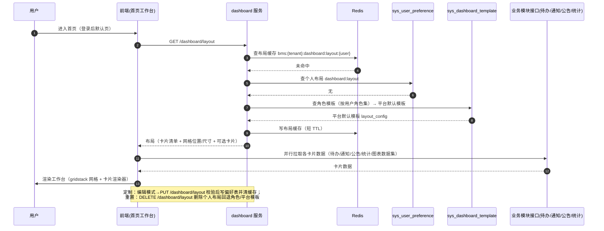

# 概要设计 · 首页工作台

> BMS · 登录默认首页：卡片聚合、三级模板与个人定制

[概要设计](01_概要设计_总览.md) › 37-首页工作台　|　[← 36-收付款管理](36_概要设计_收付款管理.md)

本节对应[《项目规划说明》](../../规划/项目规划说明.md)「功能模块」之**首页工作台**模块与「用户喜好」「初始化数据」
章节（卡片式工作台、三级模板、卡片双轨制扩展、待办角标），架构设计依据[《架构设计》](../架构设计/01_架构设计_总览.md)25-首页工作台子系统节点、
28-前端架构节点；个人布局存储复用[《概要设计-用户喜好》](04_概要设计_用户喜好.md)的 sys_user_preference 机制。

## 1. 模块概述与职责 

首页工作台是登录后默认首页（PC 主框架固定 Tab 之一），以卡片聚合待办/已办、通知、公告、快捷入口、数据统计与报表图表，
支持用户按 **个人布局 → 角色模板 → 平台默认模板** 三级回退自行定制（卡片显隐/排序/网格拖拽布局/尺寸/自建图表卡片，一键重置）。
卡片扩展采用**双轨制**：功能卡由卡片注册表提供（内置前端渲染器组件），图表卡挂接报表数据集（rpt_dataset）动态渲染。

- **模块定位**：登录后第一屏，聚合各模块高频信息，提供低成本个性化入口；不承载业务数据落库，只做聚合展示与配置
- **职责边界**：卡片注册（builtin/dataset）、平台默认模板与角色模板维护、个人布局解析与定制、卡片数据聚合；待办/通知/公告的**数据来源**归各自模块（工作流、通知中心、公告管理），本模块仅按布局引用并聚合展示
- **协作关系**：
  - 工作流（[架构 16](../架构设计/17_架构设计_子系统_工作流.md)）：待办/已办卡与顶栏待办角标的数据来源（wf_task）
  - 通知中心/公告管理（[架构 17](../架构设计/18_架构设计_子系统_通知公告.md)）：通知卡、公告卡数据来源
  - 报表中心（[架构 18](../架构设计/19_架构设计_子系统_报表BI.md)）：数据集图表卡挂接 rpt_dataset 渲染
  - 用户喜好（[概要 03](04_概要设计_用户喜好.md)）：个人布局存 sys_user_preference（pref_key=dashboard:layout），PC 与移动端跨端同步
  - 实时推送（[架构 13](../架构设计/14_架构设计_子系统_实时推送.md)）：待办/通知角标实时刷新

## 2. 功能分解与业务流程 

### 2.1 功能点分解 

| 功能点 | 说明 | 权限码 |
| --- | --- | --- |
| 工作台渲染与数据聚合 | 按 个人 → 角色 → 平台 三级回退解析布局，聚合卡片数据（待办/已办、通知、公告、统计、图表）并行下发 | 登录即可（无权限码） |
| 个人布局定制 | 卡片显隐、排序、网格拖拽布局、卡片尺寸调整；自建图表卡片（选数据集 + 图表类型）；保存、一键重置 | 登录即可（操作自己的布局） |
| 卡片注册管理 | 内置卡（builtin）注册与停用（平台内置种子，租户侧仅可停用、不可增删改定义）；租户自建数据集卡（dataset）增删改查（引用 rpt_dataset） | dashboard:manage |
| 平台默认模板维护 | 平台默认模板（scope=platform）编辑布局与卡片启停，作为全部用户初始布局来源；仅允许一份 | dashboard:manage |
| 角色模板维护 | 角色模板（scope=role）按角色绑定，覆盖平台默认模板；角色无模板时回退平台默认 | dashboard:manage |
| 待办角标 | 顶栏/侧边栏待办数与通知未读数角标，Socket.IO 实时刷新（数据来自工作流/通知中心既有能力） | 登录即可 |

### 2.2 布局解析与定制流程 

1. **布局解析**：用户进入首页 → GET /api/v1/dashboard/layout → 服务端按 个人（sys_user_preference dashboard:layout）→ 角色（用户角色集内命中的 sys_dashboard_template scope=role，多角色时优先级最高的一个）→ 平台默认（scope=platform）回退解析 → 返回布局（卡片清单 + 网格位置/尺寸）与可选用卡片清单
2. **卡片渲染**：前端按布局渲染卡片容器（gridstack 网格），builtin 卡加载对应渲染器组件并拉取数据；dataset 卡按 dataset_id + chart_type 调图表数据接口渲染 ECharts
3. **个人定制**：进入编辑模式 → 显隐/排序/拖拽/调尺寸/添加卡片（面板列出可选卡片与数据集图表卡创建入口）→ 保存 PUT /api/v1/dashboard/layout（校验布局合法）→ 写 sys_user_preference 并清 Redis 布局缓存
4. **一键重置**：DELETE /api/v1/dashboard/layout → 删除个人布局 → 回退角色模板；角色模板重置由管理员在模板维护页恢复为平台默认内容
5. 异常分支：
   - 布局引用已停用/不存在的卡片：解析时忽略该卡片并记录日志，不阻断整页渲染
   - 数据集卡引用的数据集被停用：卡片显示降级占位（提示数据集不可用），不报错
   - 卡片数据接口超时/失败：单卡降级显示错误态，不影响其他卡片

## 3. 关键时序与协作 

协作要点：布局解析为单接口（服务端回退，前端不做级联逻辑）；卡片数据由前端**并行**拉取、互不阻塞；
布局与卡片注册表走 Redis 缓存（卡片注册表变更时清缓存）；个人布局保存后仅失效该用户布局缓存，不广播。

## 4. 数据模型与表设计 

核心表（均租户库，与 sys_config 同模式：平台内置卡在租户开通时复制，平台升级由批量迁移脚本向存量租户同步新增）：

| 表 | 关键字段 | 说明 |
| --- | --- | --- |
| sys_dashboard_card | code、name、card_type（builtin/dataset）、render_key、dataset_id、chart_type、default_width、default_height、sort、status | 工作台卡片注册表；builtin 卡 render_key 指向前端渲染器组件标识（如 todo、notice、notification、quick_links、help、stats），租户仅可停用；dataset 卡引用 rpt_dataset（dataset_id 逻辑外键）+ ECharts 图表类型，租户自建 |
| sys_dashboard_template | scope（platform/role）、role_id、name、layout_config（JSON）、is_default、status | 模板表：平台默认模板（scope=platform，仅一份）与角色模板（scope=role，role_id 关联，一角色至多一份）；layout_config 存卡片引用（card code / dataset_id）+ gridstack 网格位置 + 尺寸 |
| sys_user_preference | user_id、pref_key、pref_value（JSON）、updated_at | 复用（概要 03）：个人工作台布局存 pref_key=dashboard:layout，PC 与移动端跨端同步 |

- **通用规范**：雪花 ID 主键、软删除（deleted_at，卡片 code 复合唯一约束 `(code, deleted_at)`）、审计字段、乐观锁（version）、时间 UTC；role_id 跨实体逻辑引用（不建物理外键）
- **索引**：sys_dashboard_template（scope, role_id）组合索引；sys_dashboard_card.code 唯一索引
- **多语言**：卡片名称多语言存 sys_dashboard_card_i18n 附表，查询按当前 locale 关联，缺省回退主表默认文案
- **归档/分片**：卡片与模板表体量极小，不分片不归档；布局属偏好数据，随用户生命周期保留
- **缓存**：卡片注册表 Redis 缓存 `bms:{tenant}:dashboard:cards`（变更清缓存）；布局缓存 `bms:{tenant}:dashboard:layout:{user_id}`（短 TTL + 随机偏移）

## 5. 接口设计 

| 方法 | 路径 | 说明 | 权限码 |
| --- | --- | --- | --- |
| GET | /api/v1/dashboard/layout | 解析当前用户布局（三级回退）+ 可选卡片清单（含卡片元数据与数据接口地址） | 登录即可 |
| PUT | /api/v1/dashboard/layout | 保存个人布局（校验卡片引用合法、尺寸合规） | 登录即可 |
| DELETE | /api/v1/dashboard/layout | 一键重置个人布局（删除偏好，回退角色/平台模板） | 登录即可 |
| GET | /api/v1/dashboard/stats | 统计聚合卡数据（单据数/审批数等，聚合查询，支持时间范围） | 登录即可 |
| GET/POST | /api/v1/dashboard/cards | 卡片列表（按 card_type 筛选）/ 新建（仅 dataset 卡可租户新建） | dashboard:query / manage |
| PUT/DELETE | /api/v1/dashboard/cards/{code} | 编辑（dataset 卡）/ 停用（内置卡）或删除（dataset 卡） | dashboard:manage |
| GET/POST/PUT | /api/v1/dashboard/templates | 模板列表 / 新建 / 编辑（平台默认模板仅一份，角色模板绑定角色） | dashboard:manage |
| DELETE | /api/v1/dashboard/templates/{id} | 删除模板（删除后相关用户回退下一级模板） | dashboard:manage |

- **通用规范**：前缀 `/api/v1`、统一响应 `{code, message, data}`、分页 `{list, total, page, size}`、Bearer 鉴权 + require_permission 两级校验；生产环境按子域名解析租户，一人多租户走 X-Tenant-ID
- **卡片数据接口**：待办/已办、通知、公告等卡片数据复用工作流/通知中心/公告管理既有接口（前端按布局元数据拼接请求），本模块不重复造接口；数据集图表数据复用报表中心数据集执行接口（只读从库 + 安全校验）
- **幂等**：保存布局为覆盖式写入，无需幂等键；模板新建/编辑走常规 REST
- **限流**：/dashboard/layout 与 /dashboard/stats 按用户限流（统计卡防止高频刷新打库）
- **发布事件**：无（卡片/模板/布局变更只影响本人或本租户渲染，无外部订阅场景）

## 6. 权限与配置 

- **权限码**：业务 `dashboard`（首页工作台，默认归属系统管理员）；动作 query/manage 归属 dashboard 业务（`dashboard:manage` 覆盖卡片注册与模板维护）；个人布局的读写是登录用户对自己数据的操作，**不要求任何权限码**
- **菜单挂接**：首页工作台为登录后默认页 + 主框架固定 Tab（无菜单挂接）；「工作台卡片管理」「工作台模板管理」两个管理页分别挂表单（1:1），表单挂业务 dashboard，工具栏按钮挂动作（新建=create、编辑=manage、停用=manage）
- **数据权限**：卡片与模板属系统配置，不设数据范围；卡片数据（待办/通知等）沿用各来源模块自身的数据权限
- **sys_config 参数**：无独立业务参数（布局缓存 TTL 等并入通用缓存配置）
- **种子数据**：dashboard 业务码与 manage 动作码入平台库；内置卡种子（待办/已办、通知、公告、快捷入口、帮助入口、数据统计）与平台默认模板种子随租户开通复制入租户库，含 sys_dashboard_card_i18n 英文文案；平台升级时批量迁移向存量租户同步新增内置卡

## 7. 错误码与异常处理 

按《项目规划说明》5 位错误码分段表，工作台属**系统配置段 4xxxx**（40001-49999），
段内已分配菜单 400xx、字典 401xx、参数 402xx、国际化 440xx，本模块使用 **403xx 子段**（一经发布稳定不变）：

| 错误码 | 说明 | 场景 |
| --- | --- | --- |
| 40301 | 卡片不存在或已停用 | 布局/模板引用无效卡片 code |
| 40302 | 卡片 code 重复 | 新建/编辑 dataset 卡唯一性校验失败 |
| 40303 | 数据集不存在或不可用 | dataset 卡引用的 rpt_dataset 已停用/删除 |
| 40304 | 布局校验失败 | 保存布局时卡片引用非法、尺寸越界、网格位置重叠 |
| 40305 | 角色不存在或已停用 | 角色模板绑定已停用角色 |
| 40306 | 平台默认模板仅允许一份 | 重复创建 scope=platform 模板 |
| 40307 | 该角色已存在模板 | 为已有模板的角色重复创建角色模板 |
| 40308 | 内置卡不可修改定义 | 租户对 builtin 卡执行编辑/删除 |

- 异常处理：布局解析遇到坏引用**不整体失败**——单卡跳过并记操作日志，前端降级占位；卡片数据接口超时按单卡超时隔离（前端 Promise 竞速 + 后端卡片数据接口独立限流）
- 文案由前端按 i18n 映射（error.403xx），后端不承担文案拼装

## 8. 页面清单与验收要点 

| 页面 | 端 | 说明 |
| --- | --- | --- |
| 首页工作台 | PC | 登录后默认页（主框架固定 Tab）：网格卡片展示待办/已办、通知、公告、快捷入口、统计、图表；编辑模式（显隐/排序/拖拽/尺寸/添加卡片/自建图表卡）；一键重置 |
| 工作台卡片管理 | PC | 内置卡查看/停用、数据集卡增删改查（选数据集 + 图表类型 + 默认尺寸） |
| 工作台模板管理 | PC | 平台默认模板与角色模板维护（编辑布局、绑定角色、启停） |
| 首页工作台 | 移动端 | 简化卡片布局（待办/通知/公告/快捷入口），布局配置与 PC 同源跨端同步（概要 03 偏好机制） |

**验收要点**：

- 布局解析三级回退正确：个人布局优先，无个人布局用角色模板，再无则平台默认；一键重置逐级回退生效
- 内置卡片（待办/已办、通知、公告、快捷入口、统计）数据渲染正确，角标随 Socket.IO 实时刷新
- 个人定制全流程可用：显隐/排序/拖拽/尺寸调整保存后刷新保持；坏引用卡片降级占位不阻断整页
- 自建图表卡：选数据集 + 图表类型生成卡片并正确渲染；数据集停用后卡片显示降级提示
- 模板管理：平台默认模板唯一约束、角色模板绑定与回退正确；内置卡不可增删改定义（40308 拦截）
- 卡片注册表与布局缓存失效策略正确（改模板后用户刷新可见新布局）

> 概要设计节点 · 与《项目规划说明》《架构设计》《文档生成规范》《命名规范》配套 · 生成日期：2026-08-13