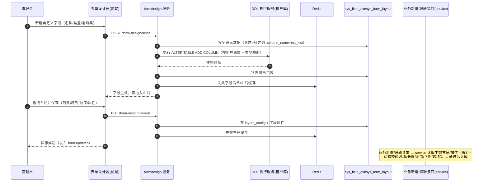

# 概要设计 · 表单定制

> BMS · 三级布局、字段属性与租户自建字段（动态 DDL）

[概要设计](01_概要设计_总览.md) › 38-表单定制　|　[← 37-首页工作台](37_概要设计_首页工作台.md)

本节对应[《项目规划说明》](../../规划/项目规划说明.md)「功能模块」之**表单定制**模块与「权限模型」「初始化数据」
章节（三级布局、字段属性、租户自建字段动态 DDL、查询区与明细区配置），架构设计依据[《架构设计》](../架构设计/01_架构设计_总览.md)31-表单定制子系统节点；
平台字段定义与字段权限仍由[《概要设计-菜单管理》](07_概要设计_菜单管理.md)、[《概要设计-角色管理》](06_概要设计_角色管理.md)维护，本模块在其上叠加布局与扩展能力。

## 1. 模块概述与职责 

表单定制模块提供业务表单的在线定制能力：**布局定制**（分区/分组、1/2/3 列栅格、字段跨列与顺序、标签宽度，含列表页查询表单区与明细区列配置）、
**字段属性**调整（必填/默认值/提示/校验规则、组件类型与选项集、只读/隐藏，服务端按布局动态校验）、
**租户自建字段**（运行时动态 DDL 加物理列）。布局按 **角色视图 → 租户覆盖 → 平台默认 → 空布局回退** 四级解析，
与字段权限（sys_role_field）叠加、权限优先；一套布局三态共用。

- **模块定位**：系统管理员配置能力（formdesign 业务），把表单布局与字段属性从代码下沉为在线配置，改配置不发版
- **职责边界**：布局配置、字段属性、自建字段与 DDL、动态校验、查询区与明细区配置；平台字段定义（sys_field）、字段权限授予（sys_role_field）归菜单管理/角色管理模块
- **协作关系**：
  - 菜单管理（[架构 06](../架构设计/06_架构设计_接口与集成.md)）：动态菜单接口字段来源合并 sys_field + sys_field_ext；form.updated 事件同源
  - 角色管理（[架构 10](../架构设计/11_架构设计_子系统_权限计算引擎.md)）：sys_role_field 权限叠加；角色视图定位角色集
  - 数据访问与分片（[架构 08](../架构设计/09_架构设计_子系统_数据访问与分片.md)）：动态 DDL 按租户路由执行；分片表禁止自建字段
  - 任务调度（[架构 12](../架构设计/13_架构设计_子系统_任务调度.md)）：DDL 失败重试任务、元数据一致性巡检
  - 文件管理（[架构 15](../架构设计/16_架构设计_子系统_文件管理.md)）：文件类型自定义字段走文件组件
  - 导入导出（[概要 19](20_概要设计_导入导出.md)）：模板列按布局动态生成（含自建字段）

## 2. 功能分解与业务流程 

### 2.1 功能点分解 

| 功能点 | 说明 | 权限码 |
| --- | --- | --- |
| 布局定制 | 分区/分组、列数（1/2/3）、跨列、字段顺序、标签宽度；查询表单区与明细区列配置；保存/恢复默认/发布 | formdesign:manage |
| 三级布局解析 | 角色视图 → 租户覆盖 → 平台默认 → 空布局回退字段 sort 默认栅格；与字段权限叠加（权限优先） | 登录即可（渲染路径） |
| 字段属性调整 | 必填/默认值/提示/校验规则（长度/范围/正则）、组件类型切换、选项集（字典/自定义）、只读/隐藏 | formdesign:manage |
| 租户自建字段 | 新建自定义字段（文本/长文本/数字/日期/字典单选多选/开关/文件）→ 动态 DDL 建物理列（ext_ 前缀）→ 生效可用；停用不删列、重建复用列 | formdesign:manage |
| 服务端动态校验 | 新增/编辑接口按当前生效布局配置动态校验必填/长度/范围/正则/选项集，改属性无需发版 | 接口内部（service 层） |
| 导入导出联动 | 导入导出模板列按布局配置生成（平台字段 + 已生效自建字段），校验规则与表单一致 | import:execute / export |

### 2.2 布局解析与自建字段流程 

1. **布局解析**：进入业务表单页 → 渲染器携带 form_id 调布局接口 → 按 角色视图（角色集命中）→ 租户覆盖 → 平台默认 → 空布局回退 解析 → 返回 layout_config + 合并字段清单（sys_field + sys_field_ext）+ 当前用户字段权限标记 → 渲染；布局变更清缓存即对新请求生效
2. **新建自定义字段**：字段面板「＋ 新建自定义字段」→ 填写名称（含 i18n）/类型/选项集 → 提交创建（元数据入库状态=待建列，生成 column_name=ext_{蛇形}）→ 后端 DDL 服务在目标租户库执行 ALTER TABLE ADD COLUMN（类型按四库映射）→ 成功置已生效并清字段缓存 → 字段出现在字段面板可拖入布局
3. **字段属性调整**：属性面板修改 → 保存（布局/属性写库 + 清缓存）→ 发布 form.updated → 后续新增/编辑请求按新属性动态校验；前端渲染同时生效
4. **恢复默认**：删除当前层级布局配置 → 回退下一级（角色视图删除回退租户/平台，租户删除回退平台/空）
5. 异常分支：
   - DDL 失败：字段标记「建列失败」可重试（重试任务 + 手动按钮），元数据状态回滚
   - 布局引用失效字段（停用/删除）：渲染自动跳过并提示清理，不阻断页面
   - 分片表/平台库表申请自建字段：拒绝（404xx 错误码）

## 3. 关键时序与协作 

协作要点：DDL 单租户串行（Redis 锁）；元数据与物理列双写一致（待建列 → 已生效，失败回滚）；
动态校验在 service 层强制执行（不依赖前端）；布局/字段变更仅清缓存，不阻断在途请求。

## 4. 数据模型与表设计 

核心表（sys_field_ext、sys_form_layout 均租户库；平台字段 sys_field 仍为平台库，布局逻辑引用 sys_form.code）：

| 表 | 关键字段 | 说明 |
| --- | --- | --- |
| sys_form_layout | form_id、scope（platform/tenant/role）、role_id、layout_config（JSON）、status | 布局配置：scope=platform 为平台默认（租户开通种子复制）、scope=tenant 为租户覆盖、scope=role 为角色视图；layout_config 存分区/分组、列数、字段引用与跨列/顺序、标签宽度、查询表单区、明细区列配置 |
| sys_field_ext | form_id、field_key、name、type（text/longtext/number/datetime/select/multi_select/switch/file）、options、column_name（ext_ 蛇形）、ddl_status（pending/active/failed）、sort、status | 租户自建字段元数据；column_name 与业务表动态物理列一一对应；ddl_status 跟踪建列生命周期；多语言名称存 sys_field_ext_i18n |
| sys_field | form_id、field_key、name、type、sort、status | 【平台库】平台字段（复用菜单管理定义，本模块在其上叠加属性与布局引用） |
| 业务表 ext_* 物理列 | — | 运行时 DDL 生成，不在 Alembic 基线；类型四库映射：VARCHAR(255)/TEXT(CLOB)/DECIMAL(18,4)/TIMESTAMP/SMALLINT/VARCHAR |

- **通用规范**：雪花 ID 主键、软删除（deleted_at）、审计字段、乐观锁（version）、时间 UTC；form_id 跨库逻辑外键（sys_form.code）
- **索引**：sys_form_layout（form_id, scope, role_id）组合唯一（同一 form+scope+role 仅一条）；sys_field_ext（form_id, field_key）唯一、（form_id, column_name）唯一
- **多语言**：自建字段名称存 sys_field_ext_i18n，布局接口按 locale 关联回退默认
- **归档/分片**：布局与字段元数据不分片；分片表（操作日志等）与平台库表禁止自建字段
- **缓存**：布局 `bms:{tenant}:form:layout:{form_id}`、字段清单 `bms:{tenant}:form:fields:{form_id}`（短 TTL + 随机偏移，变更即失效）
- **审计**：布局/字段属性/自建字段变更落字段级审计（sys_data_audit_log 关键表）

## 5. 接口设计 

| 方法 | 路径 | 说明 | 权限码 |
| --- | --- | --- | --- |
| GET | /api/v1/form-design/layouts?form_id= | 布局列表（三级 + 生效解析结果，含合并字段清单与权限标记） | formdesign:query（渲染路径登录即可，见下） |
| PUT | /api/v1/form-design/layouts | 保存某层级布局（scope/role_id/layout_config，校验字段引用与格式） | formdesign:manage |
| DELETE | /api/v1/form-design/layouts/{id} | 删除某层级布局（恢复默认回退下一级） | formdesign:manage |
| GET/POST | /api/v1/form-design/fields | 自建字段列表/新建（新建触发动态 DDL） | formdesign:query / manage |
| PUT/DELETE | /api/v1/form-design/fields/{id} | 编辑字段属性/停用（不删列）；停用字段禁止加入新布局 | formdesign:manage |
| POST | /api/v1/form-design/fields/{id}/retry | DDL 失败后手动重试建列 | formdesign:manage |
| GET | /api/v1/forms/{form_code}/layout-effective | 渲染路径：当前用户生效布局 + 字段清单 + 权限标记（登录即可，业务表单页/列表页渲染用） | 登录即可 |

- **通用规范**：前缀 `/api/v1`、统一响应 `{code, message, data}`、Bearer 鉴权 + require_permission 两级校验；生产环境按子域名解析租户，一人多租户走 X-Tenant-ID
- **动态校验**：业务新增/编辑接口（各模块既有 create/update）在 service 层读取生效布局属性构建校验器——不改各模块接口签名，通过统一校验组件注入
- **幂等**：新建自建字段幂等键（Idempotency-Key，防重复 DDL）；布局保存为覆盖式写入
- **限流**：DDL 类接口按租户限流（低频 + 单租户串行锁）；渲染路径接口普通限流
- **发布事件**：布局/字段/属性变更发布 `form.updated`（AI 帮助更新触发，不订阅 Webhook）

## 6. 权限与配置 

- **权限码**：业务 `formdesign`（表单定制，默认归属系统管理员）；动作 query/manage 归属 formdesign 业务（`formdesign:manage` 覆盖布局/属性/自建字段维护）；渲染路径接口无权限码（按用户角色集解析布局 + 字段权限叠加）
- **菜单挂接**：「表单布局管理」菜单挂表单（1:1），表单挂业务 formdesign，工具栏按钮挂动作（保存=manage、新建字段=manage、停用=manage）
- **数据权限**：布局/字段属系统配置，不设数据范围；角色视图按角色集解析（权限引擎主体链结果）
- **sys_config 参数**：无独立业务参数；DDL 重试间隔与缓存 TTL 并入通用任务/缓存配置
- **种子数据**：formdesign 业务码与 query/manage 动作码入平台库；平台默认布局（scope=platform）随租户开通复制（可为空——空布局回退字段 sort 默认栅格，与既有表单页行为一致）

## 7. 错误码与异常处理 

按《项目规划说明》5 位错误码分段表，表单定制属**系统配置段 4xxxx**（40001-49999），
段内已分配菜单 400xx、字典 401xx、参数 402xx、工作台 403xx、国际化 440xx，本模块使用 **404xx 子段**（一经发布稳定不变）：

| 错误码 | 说明 | 场景 |
| --- | --- | --- |
| 40401 | 表单不存在或不可定制 | 引用无效 sys_form.code 或平台库表/分片表申请定制 |
| 40402 | 字段 key 重复 | 自建字段与平台字段/既有自建字段 key 冲突 |
| 40403 | 布局配置校验失败 | 字段引用失效、列数非法、分区结构错误 |
| 40404 | 字段类型非法 | 类型不在白名单（text/longtext/number/datetime/select/multi_select/switch/file） |
| 40405 | 建列失败 | DDL 执行异常（锁冲突/连接失败），可重试 |
| 40406 | 物理列已存在且元数据不一致 | 同名列已存在（复用需先恢复元数据）/列命名冲突 |
| 40407 | 停用字段不可用于新布局 | 布局引用已停用自建字段 |
| 40408 | 属性校验规则非法 | 正则非法、长度/范围参数错误、选项集引用失效 |

- 异常处理：DDL 失败回滚元数据状态（pending → failed）并告警，重试任务 + 手动重试按钮；动态校验失败返回字段级错误（字段 key + 规则类型），文案走 i18n
- 一致性巡检：定时任务校验 sys_field_ext 元数据与物理列一致（多租户遍历），发现漂移告警

## 8. 页面清单与验收要点 

| 页面 | 端 | 说明 |
| --- | --- | --- |
| 表单布局管理 | PC | 表单选择器 + 设计器（字段面板/布局画布/属性面板）：三级层级切换、拖拽编排、查询区与明细区配置、自建字段、保存/恢复默认/发布 |
| 业务表单页/列表页（受影响） | PC + 移动端 | 按生效布局渲染（主表单区/查询区/明细区），三态共用，字段权限叠加 |

**验收要点**：

- 三级布局解析正确：角色视图 → 租户覆盖 → 平台默认 → 空布局回退默认栅格；权限叠加（权限优先）生效
- 布局要素全部可配置：分区/分组、列数、跨列、顺序、标签宽度；查询表单区与明细区配置生效（明细个人偏好可覆盖）
- 字段属性（必填/默认值/校验/组件类型/选项集/只读/隐藏）保存后，前端渲染与服务端动态校验一致；改规则不发版
- 自建字段全链路：建字段 → DDL 加列（四库类型映射验证）→ 生效 → 拖入布局 → 数据录入/编辑/列表筛选/导入导出可用；停用不删列、重建复用列；DDL 失败可重试；分片表/平台库表拒绝
- 动态 DDL 单租户串行（并发建列被锁）、跨租户隔离（只影响目标租户库）
- form.updated 事件发布；布局/字段缓存失效后新请求生效

> 本文档为 AI 生成 · 概要设计节点 · 与《项目规划说明》《架构设计》《文档生成规范》《命名规范》配套 · 生成日期：2026-08-13
