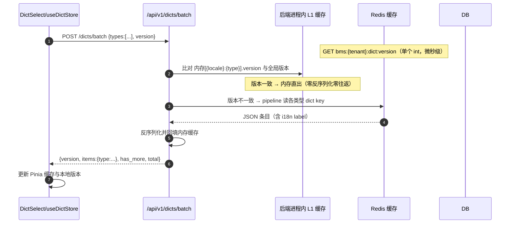
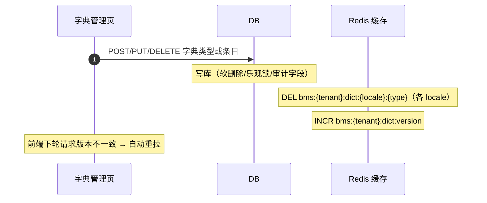

# 组件设计 · 字典字段

> DictSelect · DictCascader · getDictLabel · useDictStore

[文档首页](../../文档首页.md) › [项目规划说明](../../规划/项目规划说明.md) › 组件设计 › 字典字段　|　[关联：09-概要设计-字典管理 →](../概要设计/09_概要设计_字典管理.md)

## 1. 目的与适用范围 <a id="purpose"></a>

定义 BMS 前端**字典字段**的通用组件设计：下拉选择（DictSelect）、树形级联（DictCascader）、标签翻译工具（getDictLabel）与字典缓存（useDictStore）。适用于 `frontend/` 管理端全部业务表单页（用户、部门、角色、采购申请等）与列表页中的字典列渲染。

本节对应[《项目规划说明》](../../规划/项目规划说明.md)「字典管理」模块与「性能与高并发设计（缓存策略）」；架构设计依据[《架构设计》](../架构设计/01_架构设计_总览.md)**26-前端架构**节点（组件目录与状态管理）、**05-数据架构**节点（4.1 字典管理、缓存三防）；上游设计依据[《概要设计·09 字典管理》](../概要设计/09_概要设计_字典管理.md)（运行时查询接口与缓存键）；表单页字段形态依据[《布局设计·08 表单页》](../布局设计/08_布局设计_表单页.html)（只读/编辑分态、字段权限）。

> 组件设计体系为新增设计文档体系；本文档为第 01 篇。文档涉及多处上游变更（批量接口新增、运行时查询接口扩展、sys_dict_item 增加 parent_id、L1 缓存与压测计划），见第 8 节「需同步的既有设计」，待用户确认后同步修订[《概要设计·09 字典管理》](../概要设计/09_概要设计_字典管理.md)、《项目规划说明》核心数据表清单与相关架构节点。

## 2. 组件清单与职责 <a id="components"></a>

| 组件 / 工具 | 位置 | 职责 |
| --- | --- | --- |
| `DictSelect.vue` | `src/components/dict/` | 字典下拉选择：单选/多选、大小字典自动切换（虚拟滚动）、远程搜索、级联过滤、只读回显 |
| `DictCascader.vue` | `src/components/dict/` | 树形级联选择（el-cascader）：多级父子字典（如省市区） |
| `getDictLabel()` | `src/utils/dict.ts` | 字典值 → 当前 locale label 翻译，供列表列渲染与表单只读回显 |
| `useDictStore` | `src/stores/dict.ts` | Pinia 字典缓存：版本号比对、预加载、失效重拉、localStorage 二次缓存 |

- 组件命名遵循[《命名规范》](../../规范/命名规范.md)前端命名（PascalCase 组件、use + 模块 + Store 的 store、camelCase 工具函数）。
- 移动端（frontend-mobile）工程独立，不引用上述 PC 组件，取数逻辑复用后端接口与版本号机制（见第 11 节）。

## 3. 数据流与缓存设计 <a id="dataflow"></a>

### 3.1 读路径（L1 + 版本比对） <a id="dataflow-read"></a>



- 组件首次加载统一以 `limit=2001` 探针请求：返回条数未达上限说明是小字典，全量缓存；`has_more=true` 说明是超大字典，切换虚拟滚动 + 远程搜索模式（见 4.2）。
- 缓存键 `bms:{tenant}:dict:{locale}:{type}`、版本键 `bms:{tenant}:dict:version` 遵循[《命名规范》](../../规范/命名规范.md)基础设施 Redis key 约定。
- 后端进程内内存字典缓存消除 JSON 反序列化与 Redis 往返开销，细节见 3.4。

### 3.2 写路径（删 key + 版本递增） <a id="dataflow-write"></a>



> 与[《概要设计·09 字典管理》](../概要设计/09_概要设计_字典管理.md)一致：不发布异步事件，变更通过缓存删除即时生效；本文档在其基础上补充**全局版本号**，解决前端 Pinia/localStorage 缓存感知失效的问题（见 3.3）。

### 3.3 版本号机制 <a id="dataflow-version"></a>

| 项 | 设计 |
| --- | --- |
| 版本载体 | Redis 整型 key `bms:{tenant}:dict:version`（租户维度），字典写操作成功后 `INCR` |
| 下发方式 | 运行时查询接口响应 data 内携带 `version` 字段；客户端请求携带本地 `version` 参数 |
| 比对规则 | 请求版本 = 全局版本 → `items` 返回 null（前端复用本地缓存，省流量）；不一致 → 返回全量条目 + 新版本 |
| 失效传播 | 无需推送：任意页面下一次字典请求自然感知；多租户隔离（版本键含租户前缀） |

> 版本比对只承担「缓存是否新鲜」判断，不承担数据正确性兜底；Redis 故障降级直连 DB 时始终返回全量 items（版本比对仅作优化，见[架构 05](../架构设计/05_架构设计_数据架构.md)降级协议）。

### 3.4 进程内内存字典缓存 <a id="dataflow-l1"></a>

Redis 中字典以 JSON 字符串存储，Python 每次读取都要 `json.loads` 反序列化（单类型 ≤ 2000 条约 1-2ms）；且后端业务翻译场景（导出/通知/报表/审批等）若逐个字典字段查 Redis，30 个字段 = 30 次网络往返（3-15ms/请求），高并发下同步阻塞调用（Celery worker、报表）会耗尽连接池排队。因此后端增加**进程内内存字典缓存**，统一由 **dogpile.cache**（SQLAlchemy 作者 Mike Bayer 官方配套缓存库，Region 机制分域管理、支持内存/Redis 后端）承载，字典查询接口与业务翻译共用：

| 项 | 设计 |
| --- | --- |
| Region 划分 | **Region 1 小字典整类型**：`{tenant}:{locale}:{type} → {version, items}`（LRU + 条目数上限，内存有界）；**Region 2 超大字典局部条目**：`{tenant}:{locale}:{type} → {value: label} 已查子集`（LRU 有界 + 版本号比对失效） |
| 读路径 | 每次请求仅 `GET bms:{tenant}:dict:version`（单个 int，微秒级）→ 与缓存中该类型 version 比对 → 一致直出；小字典缺失才读 Redis 整类型回填；超大字典缺失走批量 DB IN 查询回填局部子集（见 9.2） |
| 服务对象 | ① 字典查询接口（GET /dicts/{type}、POST /dicts/batch）② 后端业务翻译（get_dict_label / get_dict_labels，见第 6 节）——两者共用同一份缓存，业务翻译零往返 |
| 失效 | 写路径 DEL key + INCR 版本（见 3.2）；Region 1 按版本惰性比对重载，Region 2 版本变化即整区失效（重新按需回填） |
| 一致性 | INCR 原子性保证多实例同步；极端时序下最长一个请求窗口陈旧，业务可接受 |
| 缓存库后端 | Region 1 用内存后端（dict/LRU）；Redis 仍为数据一致性源与跨实例共享层（Region 2 可选 Redis 后端，按部署规模配置） |

> 《项目规划说明》及架构文档中「弃用本地内存缓存」原则已**彻底删除**（经确认）：一般业务数据的本地缓存仍有一致性问题不鼓励，但字典为只读热配置，其进程内内存缓存由全局版本号保证多实例一致，属明确允许场景。

## 4. DictSelect 组件 <a id="dict-select"></a>

### 4.1 Props 与事件 <a id="dict-select-props"></a>

| 属性 | 类型 | 默认 | 说明 |
| --- | --- | --- | --- |
| `modelValue` | string \| number \| string[] | — | 绑定值；多选为数组 |
| `type` | string | — | 字典类型码（必填） |
| `mode` | 'single' \| 'multiple' | single | 单选 / 多选 |
| `parentValue` | string \| number \| null | null | 级联过滤：上级字典值，变化时自动重载（见 4.4） |
| `clearable` | boolean | true | 可清空 |
| `placeholder` | string | 请选择 | 占位文案（走 i18n） |
| `disabled` | boolean | false | 禁用（字段权限 editable=false 时由表单页置 true） |
| `valueField / labelField` | string | value / label | 取值字段与显示字段（默认取条目 value / label） |

| 事件 | 载荷 | 说明 |
| --- | --- | --- |
| `update:modelValue` | 选中值 | v-model 绑定 |
| `change` | 选中值 | 变化通知（级联父级监听用） |
| `loaded` | {type, has_more, total} | 字典数据加载完成（可统计/调试） |

### 4.2 大小字典切换（阈值 2000） <a id="dict-select-mode"></a>

- 首次加载以 `limit=2001` 探针请求（见 3.1，表单页批量场景经 POST /dicts/batch 每类型统一截断），按返回结果自动切换渲染模式：
- **小字典**（条目 < 2000）：内部渲染 `el-select` + 全量 `el-option`，毫秒级渲染；全部缓存入 Pinia 与 localStorage。
- **超大字典**（条目 ≥ 2000，如行政区划、物料编码）：内部渲染 `el-select-v2`（Element Plus 虚拟滚动，几十万条流畅滚动）+ 远程搜索（见 4.3）；仅缓存已加载片段，不持久化。
- 阈值常量 `DICT_OPTION_THRESHOLD = 2000` 定义于 `src/utils/dict.ts`，全站统一。

### 4.3 远程搜索 <a id="dict-select-search"></a>

- 超大字典开启 `filterable` + 远程搜索：输入关键词防抖 300ms 后请求 `GET /dicts/{type}?keyword=xxx`（模糊匹配 label/value/code），结果仅影响当前下拉候选项；远程搜索与级联过滤不走批量接口（见 8.1）。
- 已选值回显不受搜索影响：组件按已选值调用 `getDictLabel` 从缓存/接口回显 label，搜索清空后仍显示已选项。
- 搜索态显示 loading（el-select-v2 内置），空结果显示「无匹配数据」。

### 4.4 级联过滤 <a id="dict-select-cascade"></a>

- 传入 `parentValue` 后，组件请求自动携带 `parent_id=parentValue`，仅加载该父级下的子条目（如「市」选中后「区」只显示该市的区）。
- `parentValue` 变化（父级切换/清空）时：清空当前选中值并自动重载；清空父级则回到顶层条目。
- 级联依赖 `sys_dict_item.parent_id` 字段（逻辑引用条目自身 id），该字段当前不在[《概要设计·09》](../概要设计/09_概要设计_字典管理.md)表设计中，见 8.2 需同步变更。
- 多级（≥3 级）树形场景用 `DictCascader`（第 5 节）；两级过滤场景直接用 `DictSelect` 的 parentValue 更轻。

### 4.5 只读回显 <a id="dict-select-readonly"></a>

- 表单只读态（见[《布局设计·08 表单页》](../布局设计/08_布局设计_表单页.html)第 3 节）组件置 `disabled`，显示当前值对应 label（经 `getDictLabel` 解析）；label 缺失时回显原始 value。
- 多选只读态同样显示全部 label（顿号/逗号分隔）。

## 5. DictCascader 树形级联 <a id="dict-cascader"></a>

- 基于 `el-cascader` 封装，数据源为树形化字典：顶层条目 `parent_id` 为空，子级经 `parent_id` 关联。
- 请求策略：一次 `limit=2001` 探针；树总量小则一次拉全量构建树；超阈值改按级联逐级加载（选中上级后再拉下级）。
- Props：`modelValue`（路径数组）、`type`、`checkStrictly`（是否允许选任意级）；事件同 `DictSelect`。
- 列表/详情页展示树形路径时复用 `getDictLabel` 逐级解析。

## 6. 字典标签翻译 getDictLabel <a id="dict-label"></a>

```typescript
getDictLabel(type: string, value: string | number | string[] | null,
              locale?: string): string | string[]
// 单值 → 字符串 label；多值数组 → 逐个翻译后的数组（供列渲染拼接）
// 依赖 useDictStore 缓存；缓存未命中先加载再翻译（异步内部处理）
```

- 列表页字典列渲染统一使用（`el-table-column` formatter 或作用域插槽），与表单页回显共用同一实现，保证两端文案一致。
- label 优先取当前 locale 的 `_i18n` 附表翻译（接口已按 locale 下发），缺失回退主表默认 label。
- 缓存未命中时触发一次按需加载（含版本比对），不阻塞渲染：先显示原值，加载完成后自动刷新 label。

### 6.1 后端字典翻译 <a id="dict-label-backend"></a>

后端 service 层提供翻译工具（`get_dict_label` / 批量版 `get_dict_labels(type, values)`），数据源为 3.4 的 dogpile.cache 内存缓存（纯内存查找，微秒级、零往返）：

| 场景 | 说明 |
| --- | --- |
| Excel 导出 | 导出列字典值 → label（openpyxl 生成前批量翻译） |
| 邮件/通知模板 | Jinja2 模板渲染时翻译（审批提醒、告警通知） |
| 报表数据集 | 报表字段字典翻译（rpt 只读从库执行后翻译） |
| 审批辅助/全文检索 | 审批意见、检索高亮等场景的字典文案 |
| 明细行批量翻译 | 1000 行明细 × 超大字典字段：批量版 `get_dict_labels` 先查局部缓存子集 → 缺失 values 一次 DB IN 查询回填 → 二次起零查询（见 9.2） |
| 职责边界 | 列表页/表单页 label 由前端 getDictLabel 翻译（前端有缓存），后端不重复返回；后端翻译仅服务后端场景 |

## 7. useDictStore（Pinia 缓存） <a id="dict-store"></a>

| 成员 | 说明 |
| --- | --- |
| `cache: Map<string, DictEntry>` | 按 `{locale}:{type}` 缓存 {version, items, hasMore, total, loading}；超大字典仅存已加载片段与已查条目子集 |
| `fetchDicts(types, opts)` | **批量**请求 `POST /dicts/batch` 一次获取多类型（带版本比对）；`opts` 支持 parent_id / keyword / limit 探针 |
| `translateDictValues(type, values)` | 批量翻译：缓存子集内命中直接返回 → 缺失 values 一次 `GET /dicts/{type}?values=...` 回填子集（超大字典列渲染收集缺失值后调用，防逐行请求） |
| `getItems(type)` | 同步读取缓存条目（组件渲染用） |
| `preload(types)` | 登录成功后预加载常用小字典（清单来自表单元数据/静态配置） |
| `invalidate(type?)` | 主动失效：清除缓存并重拉（刷新按钮/调试用） |

- **批量合并**：表单页渲染时先收集全部字典类型，一次 `fetchDicts` 完成，100 个字典字段 = 1 个 HTTP 请求；同屏多表单共享 store 缓存，不会重复请求。
- **列渲染批量翻译**：列表 1000 行 × 超大字典列，先收集全部行的缺失 values 一次 `translateDictValues` 请求（1 个 HTTP 请求），而非逐行逐值请求。
- **localStorage 二次缓存**：仅小字典（< 2000 条）写入，键 `bms:dict:{locale}:{type}`，内容为 {version, items}；页面刷新后先读 localStorage 再按版本比对，版本一致零网络请求。
- 超大字典不持久化（体积不可控），仅内存态（含已查条目子集，LRU 有界）。
- store 单例（Pinia），组件共享同一份缓存，避免同一字典被多个表单重复请求。

## 8. 依赖接口与上游变更 <a id="api"></a>

### 8.1 运行时查询接口扩展 <a id="api-interface"></a>

在[《概要设计·09 字典管理》](../概要设计/09_概要设计_字典管理.md)既有 `GET /api/v1/dicts/{type}`（登录即可）基础上**扩展参数、新增批量接口**，不改变既有行为（不传新参数时行为与现设计一致）：

| 接口 | 说明 |
| --- | --- |
| `POST /api/v1/dicts/batch`（新增） | 请求体 `{types: [...], version?, locale?}`；响应 `data = {version, items: {type: {items, has_more, total} \| null}}`，`items` 为 null 表示该类型版本一致（前端复用本地缓存）。表单页多字典字段的**首选取数路径**（一次请求合并全部类型）；单字段场景与移动端可继续用单类型接口 |
| `GET /dicts/{type}`（扩展） | 增加可选参数：`version`（客户端本地版本，一致时 items 返回 null）、`keyword`（远程搜索，模糊匹配 label/value/code）、`parent_id`（级联过滤）、`values`（逗号分隔的指定 value 集合，仅返回这些条目的子集——前端超大字典列批量翻译用）、`limit`（返回条数上限，探针传 2001 判别超大字典）；响应 data 扩展 `{version, items, has_more, total}` |

> 批量接口的 limit 探针为每类型统一截断（2001 条），响应逐类型带 has_more/total；超大字典远程搜索与级联过滤走单类型接口（请求带 keyword/parent_id），批量接口只承载小字典的合并取数。

### 8.2 需同步的既有设计 <a id="api-upstream"></a>

| 变更点 | 目标文档 | 内容 |
| --- | --- | --- |
| 接口扩展与新增 | [《概要设计·09 字典管理》](../概要设计/09_概要设计_字典管理.md)5.1 | GET /dicts/{type} 增加 version/keyword/parent_id/limit 参数与响应字段；**新增 POST /dicts/batch 批量接口**；5.2 注明远程搜索与批量接口限流 |
| sys_dict_item 增加 parent_id | 《概要设计·09》4.1、4.2；[《项目规划说明》](../../规划/项目规划说明.md)核心数据表清单 | sys_dict_item 增 `parent_id`（逻辑引用条目自身 id）；索引补 `(type_id, parent_id, sort)`、label 前缀索引 |
| 版本号机制 | 《概要设计·09》2.1、3 时序 | 缓存失效管理补充「INCR 全局版本键」；读路径时序补 L1 反序列化缓存与版本比对分支 |
| 内存字典缓存与压测 | [《架构设计·05 数据架构》](../架构设计/05_架构设计_数据架构.md)5 缓存架构；[《架构设计·27 测试与质量》](../架构设计/27_架构设计_测试与质量.md)；[《项目规划说明》](../../规划/项目规划说明.md) | 彻底删除「弃用本地内存缓存」原则；缓存架构补充进程内内存字典缓存（dogpile.cache 双 Region + 版本号一致 + 超大字典批量 IN 翻译）；技术栈表补 dogpile.cache 依赖；测试与质量补字典并发压测场景（loadtest/，四场景） |

> 按《文档生成规范》8.4「设计文档变更须先更新对应体系节点」，上述变更需用户确认后由上游文档同步，本文档不单独裁决接口。

## 9. 性能与大数据量设计 <a id="performance"></a>

| 场景 | 设计 |
| --- | --- |
| 单类型条目 100 万 | 探针判别超大字典 → el-select-v2 虚拟滚动（DOM 只渲染可见行）+ 远程搜索；首次仅拉 2001 条，绝不整量渲染/传输 |
| 查询性能 | DB 索引 `(type_id, parent_id, sort)`、`(type_id, label)` 前缀索引，单类型百万内查询毫秒级；Redis 缓存按类型分键（单 key 不超过 2000 条，无超大 key） |
| 高并发（500 用户） | 批量接口把「100 字段 × 500 用户」的 5 万次 HTTP 请求合并为 500 次；后端每次请求仅一次 int 版本比对（3.1）后内存直出，DB 由互斥锁回源收敛为每类型 1 次；业务翻译零往返无连接池排队 |
| 网络流量 | 版本比对命中时零传输（items=null）；localStorage 二次缓存免除重复请求 |
| 缓存雪崩/击穿/穿透 | 沿用[架构 05](../架构设计/05_架构设计_数据架构.md)缓存三防：短 TTL + 随机偏移、SETNX 互斥锁回源、空值缓存 |
| 并发加载 | 同类型并发请求合并（store 内 pending Promise 去重），避免同屏多表单重复请求同一字典 |

### 9.1 内存缓存与序列化开销 <a id="performance-l1"></a>

- 纯 Redis + JSON 方案下，Python 每请求需 `json.loads` 反序列化：小类型 1-2ms，批量组装 100 类型可达 10-20ms 纯 CPU 开销，且每次请求重复支付。
- 进程内内存字典缓存（3.4）把读路径收敛为「int 版本比对（微秒）+ 内存直出（零序列化零往返）」，批量场景 CPU 开销降到毫秒级；后端业务翻译（6.1）同样零往返，无 Redis 连接池排队风险。
- 内存有界：仅小字典（< 2000 条）整类型载入、LRU 淘汰、条目数上限可配；超大字典片段不入内存（见 9.2），无超大内存问题。

### 9.2 超大字典策略（批量翻译 + DB 直查） <a id="performance-big"></a>

- 超大字典（≥ 2000 条，如 100 万条行政区划）**不整量入内存、不整量缓存 Redis**：单 key JSON 100-200MB 不现实（网络传输/反序列化/内存全爆炸），整类型载入进程内存同样不可接受。
- **批量翻译防 N+1**：明细行/列表批量场景（1000 行 × 30 字典字段）绝不允许逐值逐行查询——`get_dict_labels(type, values)` 一次 IN 查询返回全部缺失条目（每字段 1 次 = 30 次而非 30000 次），并回填局部缓存子集，二次起零查询：

| 查询形态 | 实现 |
| --- | --- |
| 批量翻译（values[] → labels） | 内存局部缓存子集命中 → 缺失 values 一次 `WHERE type_id=? AND value IN (...)`（走 `(type_id, value)` 唯一索引）→ 回填 Region 2；版本号变化整区失效 |
| 远程搜索（keyword） | DB `LIKE` 走 `(type_id, label)` 前缀索引，LIMIT 2001 |
| 级联过滤（parent_id） | DB 走 `(type_id, parent_id)` 索引，只取该父级子条目 |
| 单值翻译（value → label） | 局部缓存未命中走批量 IN（同批量翻译），不单独查单条 |

### 9.3 并发压测计划 <a id="performance-loadtest"></a>

纳入阶段一压测计划（脚本放 `loadtest/`，命名 `scenario_字典并发.py`，遵循[《测试规范》](../../规范/测试规范.md)与[《命名规范》](../../规范/命名规范.md)）：

| 场景 | 说明 | 观测指标 |
| --- | --- | --- |
| 首次全缓存未命中 | 500 并发同时打开含 100 字典字段的表单页（字典缓存全部失效/冷启动），验证 DB 互斥锁回源收敛与内存缓存回填 | p95/p99 延迟、错误率、DB 查询次数（应 ≈ 类型数）、内存缓存命中率 |
| 全命中 | 500 并发重复打开表单页（内存 + Redis 均命中），验证批量接口与版本比对的稳定吞吐 | p95/p99 延迟、错误率、Redis/内存命中率、CPU 占比 |
| 后端翻译 | 500 并发导出含 30 个字典字段的列表（后端批量翻译），验证内存缓存零往返 | p95/p99 延迟、错误率、Redis 往返次数（应为版本比对 1 次/请求级） |
| 明细行批量翻译 | 1000 行明细 × 30 字典字段（以超大字典字段为主）批量翻译：验证首次每字段 1 次 IN 查询（共 30 次而非 30000 次）、二次起零查询 | 首次/二次延迟对比、DB 查询次数（应 = 超大字典字段数）、局部缓存命中率 |

> 验收目标（建议值，压测前确认）：四场景 p95 延迟 < 500ms、错误率 0；未命中场景 DB 查询次数不超过字典类型数 × worker 数（互斥锁收敛验证）；明细场景二次翻译 DB 查询次数应降为 0。

## 10. 与字段权限 / i18n / 脱敏协作 <a id="cooperate"></a>

- **字段权限**：`visible=false` 的字段由表单页直接不渲染（组件无感知）；`editable=false` 时表单页向组件传 `disabled`（编辑态保持禁用）。
- **i18n**：字段标签由表单元数据接口下发（sys_field_i18n），组件不重复渲染 label；下拉占位文案、空结果文案走 vue-i18n 语言包；字典条目 label 由接口按 locale 下发（sys_dict_item_i18n 附表，缺省回退主表）。
- **脱敏**：字典字段值为枚举码，本身无脱敏需求；业务字段脱敏（如手机号）由表单页在组件外层处理，组件不承担。

## 11. 移动端说明 <a id="mobile"></a>

- frontend-mobile（Vue 3 + Vant）工程独立，不引用 PC 端组件。
- 取数层复用：同一 `GET /api/v1/dicts/{type}` 与版本号机制，移动端实现轻量版字典 store（仅内存态，不做 localStorage 二次缓存，存储空间受限）。
- 展示组件用 Vant 生态：`van-picker` / 下拉选择；超大字典在移动端默认远程搜索模式（网络与内存约束更敏感）。

## 12. 检查清单 <a id="checklist"></a>

- □ 组件归属 src/components/dict/，命名符合《命名规范》（DictSelect/DictCascader 组件、useDictStore、getDictLabel）
- □ 大小字典按阈值 2000 自动切换（el-select ↔ el-select-v2 + 远程搜索），首次探针 limit=2001
- □ 表单页多字典字段合并为一次 POST /dicts/batch；远程搜索与级联走单类型接口
- □ 版本比对（3.3）、写路径删 key + INCR（3.2）、进程内内存字典缓存（3.4）与缓存三防引用和架构 05 一致
- □ 超大字典（≥ 2000 条）不整量入内存/Redis：批量翻译走局部缓存子集 + 一次性 IN 查询回填（9.2）；后端翻译走 dogpile.cache 内存缓存零往返（6.1）
- □ parentValue 级联过滤生效，父级变化清空重载；树形级联走 DictCascader
- □ 只读回显与列表列渲染统一走 getDictLabel，label 缺失回显原值；超大字典列渲染走 translateDictValues 批量收集
- □ 字段权限（visible/editable）、i18n、脱敏协作边界符合第 10 节
- □ 接口扩展（批量接口、GET /dicts/{type} 参数含 values）与 sys_dict_item.parent_id 的上游同步变更已确认并落表（8.2）
- □ 500 并发四场景压测脚本纳入 loadtest/（9.3），验收指标压测前确认
- □ 移动端取数复用与组件隔离符合第 11 节

> 本文档为 AI 生成 · 组件设计节点 · 与[《09-概要设计-字典管理》](../概要设计/09_概要设计_字典管理.md)[《08-布局设计-表单页》](../布局设计/08_布局设计_表单页.html)[《文档生成规范》](../../规范/文档生成规范.md)[《命名规范》](../../规范/命名规范.md)配套 · 生成日期：2026-08-14