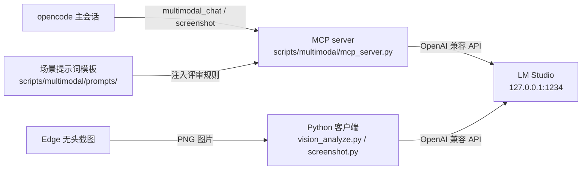

# 本地多模态接入方案

> MCP 工具 · 原型视觉评审

[文档首页](../../文档首页.md) › [项目规划说明](../../规划/项目规划说明.md) › 资料 › 本地多模态接入方案

## 1. 目的与适用范围 <a id="purpose"></a>

为 BMS 项目（[《项目规划说明》](../../规划/项目规划说明.md)）建设**本地多模态能力接入**：
把本机 LM Studio 上的多模态模型（Qwen3.8-27B，模型详情见《[Qwen3.8-27B 技术介绍](../知识档案/AI/Qwen3.8-27B技术介绍.md)》）的**全部能力**（识图、多模态对话、文本理解）开放给 AI 助手使用。
方案以 MCP server 为核心——把多模态能力暴露为标准工具，主会话直接调用；
另配同一套 Python 客户端、截图服务与场景提示词模板，**与具体场景解耦**。

> 背景：原型设计工作流缺少视觉校验环节。本方案补齐「截图 → 识图 → 问题清单 → 修正」闭环，并顺带把本地模型的对话、文档理解能力接入主会话。

## 2. 总体架构 <a id="architecture"></a>



### 2.1 MCP server <a id="arch-track"></a>

| 形态 | 适用 |
| --- | --- |
| 标准协议工具（`multimodal_chat` / `screenshot`），opencode 的 `mcp` 段登记，跨客户端可复用 | 主会话直接调用：识图、看图、文档理解、临时问答；模型可动态发现工具 |

### 2.2 方案取舍（插件 → MCP） <a id="arch-choice"></a>

早期方案为 opencode 插件（`vision.js`）注册三个识图工具，功能单一且绑定 opencode/JavaScript。本次演进为 MCP 的原因：

- **能力面完整**：MCP 暴露的是模型全部多模态能力（对话、识图、文档），不局限于识图三件套；模型可动态发现工具。
- **跨客户端复用**：同一 MCP server 可被其他支持 MCP 的客户端使用，换客户端零重写。
- **语言统一**：server 用 Python（官方 mcp SDK），与 `scripts` 全 Python 工具链一致。
- **场景拆解**：评审组合动作（多档截图 + 逐图识图 + 报告）从插件逻辑拆出，由主会话按场景模板编排完成。

> 调研结论：社区现成的"LMStudio-MCP"类项目以模型管理（list/load/unload）为主，无对口的"多模态全能力"方案，故自写（官方 SDK）。

## 3. 本地模型接入（LM Studio） <a id="model"></a>

### 3.1 接口契约 <a id="model-api"></a>

采用 **OpenAI 兼容**格式（chat/completions + 图片 data URI），LM Studio 本地服务即此格式，云端 OpenAI 兼容服务也可替换：

```bash
POST http://127.0.0.1:1234/v1/chat/completions
Authorization: Bearer local
Content-Type: application/json

{
  "model": "qwen/qwen3.8-27b",
  "reasoning_effort": "none",
  "messages": [
    { "role": "system", "content": "{系统提示}" },
    {
      "role": "user",
      "content": [
        { "type": "text", "text": "{提示词}" },
        { "type": "image_url",
          "image_url": { "url": "data:image/png;base64,{base64}" } }
      ]
    }
  ],
  "temperature": 0.2
}
```

### 3.2 provider 配置 <a id="model-config"></a>

opencode 通过自定义 provider（`@ai-sdk/openai-compatible`）接入 LM Studio，固化在 `.opencode/opencode.json`：

```json
"provider": {
  "lmstudio": {
    "npm": "@ai-sdk/openai-compatible",
    "name": "本地多模态（LM Studio）",
    "options": {
      "baseURL": "http://127.0.0.1:1234/v1",
      "apiKey": "local"
    },
    "models": {
      "qwen3.8-27b": {
        "id": "qwen/qwen3.8-27b",
        "name": "qwen3.8-27b 本地多模态",
        "tool_call": true,
        "reasoning": true,
        "attachment": true,
        "temperature": true
      }
    }
  }
}
```

- 模型引用格式：`lmstudio/qwen3.8-27b`。
- 本地 LM Studio 无鉴权时 apiKey 填占位值（`local`）；云端密钥仅走环境变量（见第 9 节）。
- 修改 opencode.json 后需**重启 opencode** 生效。

### 3.3 思考模式注意 <a id="model-reasoning"></a>

> Qwen3.8-27B 是推理模型：思考模式（thinking）默认开启，回答前先输出思考过程（`reasoning_content`），带图评审可能几万 token 都未结束。工具链默认携带 `reasoning_effort: "none"` 关闭思考（实测评审数秒完成）；不识别该参数的 API 会自动去掉后重试（见 [MCP server](#mcp-server) 实现）。

官方思考控制与采样参数对照（详见《[Qwen3.8-27B 技术介绍](../知识档案/AI/Qwen3.8-27B技术介绍.md)》）：

| 项 | 官方值 | 本工具链处理 |
| --- | --- | --- |
| 思考开关 | 默认开启，可按请求关闭（`enable_thinking: false`） | `reasoning_effort: none` + 400 兜底重试 |
| 思考强度 | `reasoning_effort`：`xhigh`（默认）/ `medium` / `low` | 默认 `none`（关闭）；复杂任务可试 `low` / `medium` |
| 历史思考保留 | `preserve_thinking` 默认开启 | LM Studio 侧行为，未单独设置 |
| 采样（非思考） | temperature=0.7，top_p=0.80，top_k=20，presence_penalty=1.5 | 现用 temperature=0.2，实测可用 |
| 采样（思考） | temperature=1.0，top_p=0.95，top_k=20 | — |

- 本地模型零费用，可对同一张图反复调用、聚焦区域迭代复查（如评审报告某处不清楚，再调一次着重看该区域）。
- 模型预热：LM Studio 中把模型设为**常驻内存**（Keep model loaded），避免每次首次调用冷加载等待；首次调用即使超时也可能只是加载慢，重试即恢复。
- 多图对比建议不超过 2 张：模型上下文 262K tokens 不是瓶颈，真实约束是本地显存与生成速度（高分辨率截图的图像 token 量大）。

## 4. 本地多模态能力清单 <a id="capabilities"></a>

本节回答「本地多模态能做多模态的哪些事」：按**模型能力**（Qwen3.8-27B 原生支持）与**工具链当前暴露面**（MCP 工具实际可传的参数）两层对照，能力边界一目了然。

### 4.1 能力矩阵 <a id="cap-matrix"></a>

| 能力 | 可用 | 说明 |
| --- | --- | --- |
| 识图（单图） | ✅ | 界面截图、文档图、架构/流程图、图表、数学图、实景照片；`multimodal_chat` + `images` 参数 |
| 多图对比（≤2 张） | ✅ | 同一界面多尺寸/多状态、修正前后对比；受本地显存约束 |
| 界面 / 原型评审 | ✅ | PC 三档断点、移动端 375×812，四个场景模板（见 [场景适配](#scenes)） |
| OCR 式文字提取 | ✅ | 从图片/扫描件提取文字、表格、表单字段，`text` 传提取指令（OmniDocBench 1.5 官方 91.1） |
| 图表 / 公式图理解 | ✅ | 科学图表、数学题图（官方 CharXiv 开 CI 90.2、MathVision 开 CI 94.6） |
| 长文 / 文档理解 | ✅ | 262K 上下文；日志、配置、代码、长文整理、翻译、摘要（`documents` 参数，16 种文本格式） |
| 截图取图 | ✅ | HTML/URL → PNG（Edge 无头，`screenshot` 工具），为识图提供图片来源 |
| 模型交叉检查 | ✅ | 主模型不支持多模态、或需要第二模型复核结论时 |
| 视频理解 | ⚠️ 模型支持、工具未暴露 | 模型原生支持小时级视频（`video_url`）；`multimodal_chat` 暂无 `videos` 参数，需扩展后使用 |
| 图像 / 视频生成 | ❌ | 模型只输出文本，无生成能力 |
| 音频理解 | ❌ | 模型无音频模态 |
| 直接操作电脑（OSWorld 式） | ❌ | 官方评测 84.3 分，但依赖外部 agent 执行框架，本工具链无 GUI 操作环境 |

### 4.2 使用建议 <a id="cap-usage"></a>

- **适合**：识图（主模型看不了图或需交叉验证）、界面评审闭环、日志/配置整理的重复劳动、OCR 式提取。
- **不适合**：图像/视频/音频生成；主模型本身支持多模态且需求简单时（多此一举）；BMS 业务的高精度 OCR（业务侧用 PaddleOCR，见《[PaddleOCR 技术介绍](../知识档案/后端核心/PaddleOCR技术介绍.md)》）。
- **扩展点**：给 `multimodal_chat` 增加 `videos` 参数（`video_url`）即可补齐视频理解；新场景 = 新增一个场景模板（模板即场景，不改代码）。

## 5. MCP server <a id="mcp-server"></a>

入口 `scripts/multimodal/mcp_server.py`（mcp 官方 SDK 2.x，uv 项目 `scripts/multimodal/pyproject.toml`），stdio 协议，暴露两个工具：

### 5.1 注册的工具 <a id="mcp-tool"></a>

| 工具 | 参数 | 行为 |
| --- | --- | --- |
| `multimodal_chat`（核心） | `text`（指令，必填）、`images`（图片路径列表）、`documents`（文本文档路径列表）、`prompt`（模板名或路径，与 `system` 二选一）、`system`（系统提示）、`temperature`（默认 0.2）、`reasoning`（默认 none） | **通用多模态对话**：文本 + 图片 + 文本文档，返回模型回复；识图、看图、文档理解、交叉检查的基础工具 |
| `screenshot` | `url`（HTML 路径或 URL）、`out`（PNG 输出路径）、`width`/`height`（默认 1440×900）、`budget`（渲染等待毫秒，默认 3000） | Edge 无头截图（任意页面），为识图提供图片来源；内部调用同目录 `screenshot.py` |

- 环境变量（均有默认值，一般无需设置）：`MULTIMODAL_API_ENDPOINT`（默认 127.0.0.1:1234）、`MULTIMODAL_API_KEY`（默认 local）、`MULTIMODAL_API_MODEL`（默认 qwen/qwen3.8-27b）、`MULTIMODAL_API_TIMEOUT`（默认 60）、`MULTIMODAL_API_REASONING`（默认 none）。
- 失败容错：调用失败自动重试 2 次（2s/4s 退避）；模型输出非 JSON 时由主会话自行解析，工具原样返回文本。
- 文档参数支持文本类文件（md/txt/json/log/py/js/ts/html/css/yml/toml/ini/csv/sql/xml），内容拼入消息。

### 5.2 配置（opencode.json） <a id="mcp-config"></a>

```json
"mcp": {
  "multimodal-local": {
    "type": "local",
    "command": [
      "uv",
      "run",
      "--project",
      "D:/Develop/bms/scripts/multimodal",
      "python",
      "D:/Develop/bms/scripts/multimodal/mcp_server.py"
    ],
    "enabled": true
  }
}
```

- 依赖安装：`uv sync --project scripts/multimodal --index https://mirrors.aliyun.com/pypi/simple/`（虚拟环境 `.venv` 已 gitignore）。
- 修改配置后需**重启 opencode** 生效；MCP 工具与插件工具同样在会话中直接可调用。

### 5.3 运行与验证 <a id="mcp-run"></a>

```bash
# 手动启动（stdio，等待主机连接，Ctrl-C 退出）
uv run --project scripts/multimodal python scripts/multimodal/mcp_server.py

# 冒烟验证（uv run 进入项目虚拟环境后）
uv run --project scripts/multimodal python -c "import sys; sys.path.insert(0, 'scripts/multimodal'); import mcp_server; print(mcp_server.multimodal_chat(text='你好'))"
```

## 6. Python CLI 备用 <a id="cli"></a>

与 MCP server 共用同一套实现，供 bash 直接调用（不占主会话工具）：

```bash
# 通用识图客户端（需环境变量 VISION_API_ENDPOINT / VISION_API_KEY / VISION_API_MODEL）
python scripts/multimodal/vision_analyze.py --image page.png --prompt prototype-review
python scripts/multimodal/vision_analyze.py --dir screenshots/ --out report.json
python scripts/multimodal/vision_analyze.py --images a.png,b.png --text "对比两张图"

# 截图（Edge 无头）
python scripts/multimodal/screenshot.py --url "file:///D:/.../03_主框架.html" --out temp/vision/out.png
```

- `vision_analyze.py` 仅依赖标准库（`urllib`），支持单图 / 多图一次调用 / 目录批量，输出 JSON 契约：`ok / summary / issues[{severity, area, problem, rule, suggestion}]`。
- 环境变量：`VISION_API_ENDPOINT` / `VISION_API_KEY` / `VISION_API_MODEL` / `VISION_API_TIMEOUT`（默认 60）/ `VISION_API_REASONING`（默认 none）。

## 7. 截图服务（Edge 无头） <a id="screenshot"></a>

本机 Windows 环境使用系统自带 Edge 无头模式渲染 HTML/URL 为 PNG，无需安装额外浏览器：

```bash
python scripts/multimodal/screenshot.py --url "file:///D:/Develop/bms/文档/设计/原型设计/03_通用骨架/03_主框架.html" --out temp/vision/out.png --width 1440 --height 900 --budget 3000
```

- `--width/--height`：分辨率参数，评审默认三档 1440×900 / 1366×768 / 1024×768（覆盖[《布局设计-响应式适配》](../../设计/布局设计/11_布局设计_响应式适配.html)断点），移动端用 375×812。
- `--budget`：等待渲染完成（动画/角标模拟），默认 3000ms。
- 截图输出目录：项目下临时目录 `temp/vision/`（已 gitignore，不入库不提交），同一 HTML 的同名截图会覆盖旧文件。
- Edge 可执行路径探测顺序：`C:\Program Files (x86)\Microsoft\Edge\Application\msedge.exe` → `C:\Program Files\...\msedge.exe` → Chrome 兜底。

## 8. 场景适配（模板即场景） <a id="scenes"></a>

**多模态对话是能力主体，场景是使用方式**：`multimodal_chat` 可处理任意图片与文档（界面截图、文档图、流程图、图表、对比图），提示词用 `text` 直传、`system` 直给或 `prompts/` 下的模板；**新场景 = 新增一个模板文件**，无需改代码。

### 8.1 场景机制 <a id="scene-mechanism"></a>

- **一张图 + 一段提示词**：`multimodal_chat` 接受任意本地图片路径与提示词（模板名或直传文本），模板名解析顺序：`prompts/` 下文件 → 文件路径 → 直接当文本用。
- **模板即场景**：每个场景对应一个 `scripts/multimodal/prompts/` 下的 md 模板，已有模板：

    | 模板 | 场景 | 输出 |
    | --- | --- | --- |
    | `image-understanding.md` | 通用图片理解：文档图、架构图、流程图、图表、截图内容提取 | summary / elements / relations / highlights |
    | `general-review.md` | 通用界面走查：用户提供任意界面截图，对照需求检查 | summary / issues |
    | `prototype-review.md` | PC 原型评审（含设计令牌/列表页/表单页/弹窗规则） | summary / issues |
    | `mobile-review.md` | 移动端 H5 评审（TabBar/NavBar/安全区/触控目标） | summary / issues |

- **直接使用**：不建模板时用 `text` 直传提示词，临时场景即刻可用。

### 8.2 场景示例：原型视觉评审 <a id="scene-prototype"></a>

- 提示词模板 `prompts/prototype-review.md` 注入评审规则：[设计令牌](../../设计/布局设计/02_布局设计_设计令牌.html)色值/间距/栅格、[列表页](../../设计/布局设计/07_布局设计_列表页.html)三段式（工具栏/筛选/表格/分页）、[表单页](../../设计/布局设计/08_布局设计_表单页.html)分态工具栏、弹窗规格、设计说明文字不得出现在界面等检查项。
- 触发方式：用户要求「评审原型 XX」→ 主会话自己组合 MCP 工具：`screenshot` 多档截图 → `multimodal_chat` 逐图识图 → 生成 HTML 报告。
- 报告落位：项目下临时目录 `temp/vision/`（HTML，含截图缩略图 + 问题清单，缺省文件名 `{页面名}_{时间}.html`，已 gitignore 不入库）；需留档时输出到项目内其他位置。
- 修正闭环：按问题清单修正 → 重新截图复评，直到无高危问题。

### 8.3 场景清单 <a id="scene-other"></a>

| 场景 | 说明 | 模板/动作 | 状态 |
| --- | --- | --- | --- |
| 通用图片理解 | 分析文档中引用的架构图/流程图/图表截图，提取元素与关系 | `image-understanding.md` | 已就绪 |
| 界面截图走查 | 用户提供任意界面截图，对照需求检查 | `general-review.md` | 已就绪 |
| PC 原型评审 | 对[主框架原型](../../设计/原型设计/03_通用骨架/03_主框架.html)等按三档断点截图评审 | `prototype-review.md` + MCP 工具组合 | 已就绪 |
| 移动端评审 | 对[移动端原型](../../设计/原型设计/14_移动端/01_设计说明.html)按 375×812 手机视口截图评审 | `mobile-review.md` + 375×812 截图 | 已就绪 |
| 文档理解 | 把日志/配置文件/长文整理为结构化清单、翻译、摘要 | `documents` 参数 | 已就绪 |
| 多图对比 | 同一界面多尺寸/多状态对比、修正前后对比 | `images` 参数（建议 ≤2 张） | 已就绪 |

## 9. 安全与隐私 <a id="security"></a>

- 全部推理在本机 LM Studio 完成，图片与文档不出本机；API 密钥只从环境变量读取（`MULTIMODAL_API_KEY` / `VISION_API_KEY`），不写入配置、文档或代码。
- MCP 工具只接受图片/文档路径，不暴露任意代码执行入口。
- 截图与分析日志留存项目下临时目录（`temp/vision/`，已 gitignore），定期清理；本地模型零费用，但注意批量评审占用的显存与时长。
- 模型只见传入的图片与提示词，不接触代码库其他内容；提示词模板内不写敏感信息。

## 10. 实施步骤与检查清单 <a id="deploy"></a>

### 实施步骤

1. 确认本机 Python/uv 环境与 LM Studio 服务可用（`http://127.0.0.1:1234/v1/models` 返回模型列表）。
2. 建 uv 项目 `scripts/multimodal/`（依赖 `mcp` 官方 SDK），迁移 `vision_analyze.py` / `screenshot.py` / `prompts/` / 报告模板。
3. 编写 `mcp_server.py`（`multimodal_chat` + `screenshot`），官方 Client 冒烟测试通过。
4. 配置 `.opencode/opencode.json`（mcp 段 + provider 段）。
5. 删除旧插件 `vision.js` 及 `scripts/vision/` 目录，重启 opencode 验证 MCP 工具可用。
6. 对主框架原型做一次端到端演示评审，验证闭环。

### 检查清单

- □ `multimodal_chat` 通用对话 / 识图 / 文档理解可用（`reasoning_effort: none` 默认关闭思考）
- □ `screenshot` 截图可用，输出到 `temp/vision/` 不入库
- □ MCP 与 provider 配置固化在 `.opencode/opencode.json`
- □ 模板即场景：image-understanding / general-review / prototype-review / mobile-review 齐备
- □ 原型评审提示词覆盖设计令牌/列表页/表单页/弹窗规则；移动端模板覆盖 TabBar/NavBar/安全区
- □ 旧插件 vision.js 已删除，无残留引用
- □ 端到端演示验证通过（识图 + 原型评审）

> 依《文档生成规范》编写 · 本地多模态接入方案（原《视觉识图辅助方案》演进） · 生成日期：2026-08-18 · 修订：2026-08-21（新增第 4 节本地多模态能力清单；补充 Qwen3.8-27B 思考控制与采样参数；关联《Qwen3.8-27B 技术介绍》）