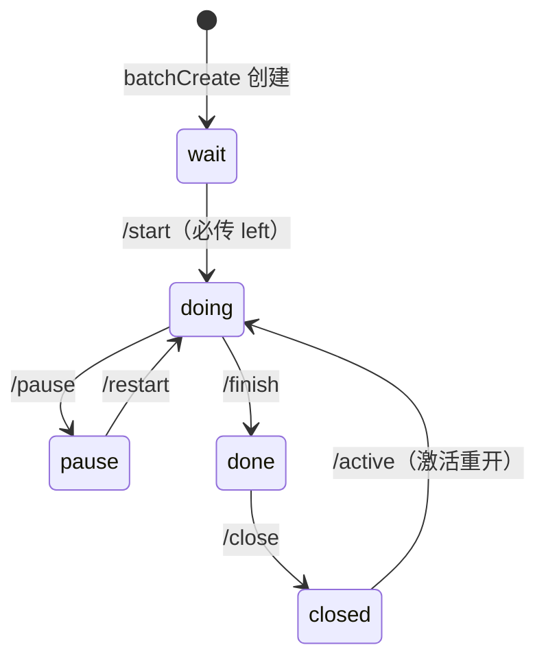

# 禅道 API 使用说明

> 禅道（ZenTao 22.5）REST API 与 BMS 工具包使用指南 · 2026-08-21

[文档首页](../../文档首页.md) › 资料 › 禅道 API 使用说明　|　[开发服务器：禅道部署 →](../开发服务器/禅道部署使用说明.md)

## 1. 目的与范围 <a id="purpose"></a>

本文档固化禅道开源版 REST API（`/api.php/v1`）的调用方法与**实测踩坑**，并说明 BMS 项目配套 Python 工具包（`deploy/tools/zentao/`）的用法，供后继 AI 与开发者直接使用，**无需重新摸索**。

> **版本说明**：镜像 `easysoft/zentao:latest` 为滚动发布，2026-08-21 实测容器版本为 **22.5**（`/apps/zentao/VERSION`）。本文「21.x 实测」表述即指本容器早期版本，行为随镜像升级可能变化，**升级镜像后需对踩坑条目复核**。

适用：禅道部署于 mjbk（`http://192.168.0.107:8070`，见《[禅道部署使用说明](../开发服务器/禅道部署使用说明.md)》）；职责分工：禅道管需求/任务/迭代，GitLab Issue 管代码缺陷，Kiwi TCMS 管测试用例（禅道缺陷/测试模块不使用）。

## 2. 认证 <a id="auth"></a>

```bash
# 获取 token（account/password 为禅道管理员）
curl -s -X POST http://192.168.0.107:8070/api.php/v1/tokens \
  -H "Content-Type: application/json" \
  -d '{"account":"minjian","password":"<密码>"}'
# => {"token":"<token>"}
```

- 后续所有请求带请求头 **`Token: <token>`**（不是 `Authorization: Bearer`，实测 Bearer 返回 Unauthorized）。
- token 即会话，长期有效；每次脚本运行获取一次即可。

**token 生命周期与失效处理**：

- 失效表现：token 过期/被吊销后请求返回 HTTP 401（`Unauthorized`）；工具包处理方式是重新调 `client.get_token(force=True)` 换新 token 重试一次。
- 吊销途径：禅道无独立的「登出 API」；改密码或后台强制下线会话即令旧 token 失效。token 泄露时改管理员密码即可全部作废。
- 工具包 `ZentaoClient.get_token()` 默认懒获取并缓存（实例级），无需手动管理。

**安全提醒**：

- 密码/token 不要写进 shell 历史、脚本注释或任何入库文件；示例中 `<密码>` 一律走占位符，正式调用从 `deploy/.env` 读凭据（工具包已内置）。
- 踩坑 #14 的 Web 登录走 **GET 参数传明文密码**——GET 会进 Web 访问日志（nginx access log / 禅道日志），属已知风险面；仅限内网使用，日志定期清理，勿在公网环境复用此法。

## 3. BMS 工具包（推荐） <a id="toolkit"></a>

位置：`deploy/tools/zentao/`，仅依赖 Python 标准库（urllib），Windows/Linux 均可用。

| 文件 | 说明 |
| --- | --- |
| `zentao_client.py` | 核心客户端 `ZentaoClient`：token 认证、通用请求、取全 `fetch_all`（兼容分页怪癖）、.env 凭据读取 |
| `zentao_products.py` / `zentao_projects.py` / `zentao_executions.py` / `zentao_stories.py` / `zentao_tasks.py` / `zentao_users.py` | 各资源操作（列表/查看/搜索/创建/更新/删除） |
| `zentao_tasks.py` | 任务操作；22.5 新增 `search_server()`（服务端过滤 `?search=1`：name/assigned_to/status/pri/ids + 分页/排序/merge_children） |
| `zentao_search.py` | 客户端过滤 `filter_items`（取全量后按名称/指派人/状态/优先级/父任务/日期筛；服务端没有的日期区间、父任务维度靠它） |
| `zentao_web.py` | Web 会话删除（`web_delete`/`web_delete_many`/`delete_task`） |
| `zentao_sync_push.py` | 文档 → 禅道：解析需求/任务/计划文档，建/更 story+任务、落排期、状态流转、回填 id |
| `zentao_sync_pull.py` | 禅道 → 文档：读回任务实际状态/完成日期，写回需求/任务文档（默认回写，`--dry-run` 只读） |
| `zentao_sync_common.py` | 两个同步脚本共用的解析与口径（文档发现/解析、状态映射、id 回填） |
| `zentao.py` | 命令行入口 |
| `README.md` | 工具包快速上手 |

凭据（`deploy/.env`，不入库）：`ZENTAO_API_URL`、`ZENTAO_API_ACCOUNT`、`ZENTAO_API_PASSWORD`；也支持 `--url/--account/--password` 参数覆盖。

### 3.1 命令行用法 <a id="cli"></a>

```bash
cd deploy/tools/zentao

python zentao.py token                                # 获取 token
python zentao.py products list                        # 产品列表
python zentao.py products create --name "XX" --code xx
python zentao.py projects list
python zentao.py projects create --name "P" --type scrum --begin 2026-08-24 --end 2027-09-20 --products 1
python zentao.py executions list --project 1          # 项目 1 的迭代
python zentao.py executions create --project 1 --name "M0 启动就绪" --begin 2026-08-24 --end 2026-09-07
python zentao.py stories list --product 1             # 产品 1 的需求
python zentao.py tasks list --execution 3             # 迭代 3 的任务（取全）
python zentao.py tasks search --name 接口              # 按名称模糊查（取全后客户端筛）
python zentao.py tasks search --assigned-to minjian --status doing
python zentao.py tasks search --parent 1              # 某父任务下的子任务
python zentao.py tasks search --deadline-from 2026-09-01 --deadline-to 2026-09-30
python zentao.py stories search --product 1 --name 用户   # 需求（name 匹配 title）
python zentao.py tasks create --execution 3 --name "接口测试" --estimate 16 --begin 2026-08-24 --end 2026-09-07 --to minjian
python zentao.py tasks create --execution 3 --parent 1 --name "子任务" --estimate 4 --begin 2026-08-24 --end 2026-09-07 --to minjian
python zentao.py tasks batch-create --execution 3 --parent 1 --file subtasks.json   # 批量挂到父任务 1 下
python zentao.py tasks assign --id 1 --to minjian
python zentao.py tasks update --id 1 --pri 1
python zentao.py tasks update --id 1 --desc "单行描述"
python zentao.py tasks update --id 1 --desc-file desc.txt     # 多行描述走文件（优先于 --desc）
python zentao.py tasks start --id 1                   # 开始
python zentao.py tasks finish --id 1 --consumed 16    # 完成
python zentao.py tasks close --id 1                   # 关闭
python zentao.py users list
```

`tasks.json`（batch-create）：`[{"name":"...","estimate":16,"estStarted":"2026-08-24","deadline":"2026-09-07","pri":2,"type":"devel"}, ...]`

### 3.2 作为库使用 <a id="lib"></a>

```python
import sys
sys.path.insert(0, r"D:\Develop\bms\deploy\tools\zentao")
from zentao_client import ZentaoClient, ZentaoError
import zentao_tasks as tasks
import zentao_executions as executions

c = ZentaoClient()          # 凭据自动读 deploy/.env
for ex in executions.list_(c, project=1):
    print(ex["id"], ex["name"])

created = tasks.batch_create(c, execution=3, tasks=[
    {"name": "接口测试", "type": "devel", "pri": 2, "estimate": 16,
     "estStarted": "2026-08-24", "deadline": "2026-09-07"},
])
```

### 3.3 文档 ↔ 禅道双向同步 <a id="sync"></a>

`文档/项目/{stage}/`（需求/任务/计划文档）与禅道（产品需求 + 迭代任务）双向同步；文档格式以《[任务文档规范](../../规范/任务文档规范.md)》《[需求文档规范](../../规范/需求文档规范.md)》《[计划文档规范](../../规范/计划文档规范.md)》为强制契约。

```bash
cd deploy/tools/zentao

# 文档 → 禅道：建/更 story+任务、落排期、状态流转、回填 id
python zentao_sync_push.py --stage 00_准备期 --dry-run     # 只解析+打印计划，不写禅道、不改文档
python zentao_sync_push.py --stage 00_准备期               # 实跑（新建任务指派默认 minjian，--assign 覆盖，空串=不指派）

# 禅道 → 文档：读回任务状态/完成日期，写回需求/任务文档
python zentao_sync_pull.py --stage 00_准备期 --dry-run     # 只读比对，不改文档
python zentao_sync_pull.py --stage 00_准备期               # 实跑（默认回写）
```

`--stage` 阶段目录名（默认 `00_准备期`）；push 另用 `--product`（默认 1）/`--execution`（默认 3=M0）；pull 用 `--execution`（默认 3）。

**push（文档 → 禅道）**：只处理需求与任务**编号相同**的条目（不一致的告警跳过）；每条依次建/更 story（title/pri/spec，幂等）→ 建/更子任务（父任务、estStarted/deadline、desc，新建即指派）→ 状态流转 → id 回填文档。状态流转（文档 → 禅道）：

| 文档状态 | 禅道动作 |
| --- | --- |
| 未开始 / 搁置 | 保持 `wait`（搁置原因记正文） |
| 进行中 / 部分完成 | 若 `wait` 先 `start`（必传 `left`，踩坑 #21）（→ `doing`） |
| 已完成 | 若 `wait` 先 `start` → `finish`（必填 currentConsumed/realStarted/finishedDate，→ **`done`**）→ `close`（→ `closed`） |

日期推导：已完成取文档完成日期（兜底计划完成日 → M1 锚点 2026-09-28）；其余取计划排期窗口，搁置/缺失用锚点占位。

**pull（禅道 → 文档）**：每个任务文档按已回填 id（否则父任务+名称）定位禅道任务，读回状态/完成日期（done/closed 取 `finishedDate`，兜底 `deadline`），写回任务文档信息表与需求文档元信息行（禅道 → 文档）：

| 禅道状态 | 文档状态 |
| --- | --- |
| `wait` | 未开始（文档原为"搁置"则保留搁置） |
| `doing` | 进行中（文档原为"部分完成"则保留部分完成） |
| `done` / `closed` | 已完成 |
| `pause` / `cancel` | 搁置 / 已取消 |

> 禅道任务状态全集为 `wait/doing/done/pause/cancel/closed`（见 4.1 字段字典），**没有 `finished`/`canceled`**；工具包映射表对这两种历史写法做了容错兼容。

**冲突策略（双向同步以谁为准）**：本项目为个人开发 + AI 辅助模式，**以本地文档为准**——禅道只作为可视化看板，是文档的投影。具体口径：

- push 时无条件按文档覆盖禅道对应字段（title/pri/spec/desc/排期/状态），禅道侧的手工改动会被冲掉，属预期行为。
- pull 只把禅道的**实际进度**（状态/完成日期）回写到文档的信息表字段，不改文档正文内容；即 pull 是「读回事实」，push 是「落实意图」。
- 不要直接在禅道 Web 界面上改任务内容（名称/描述/工时）——那不是事实源，下次 push 会被覆盖；要改就改文档再 push。

幂等可重跑：push 优先复用已回填 id；未建时按"产品内标题全等"/"父任务+名称全等"查已有复用，查不到才创建。

## 4. API 端点总表 <a id="endpoints"></a>

来源：禅道 22.5 容器源码（`/apps/zentao/api/v1/entries/` 与 `config/apiv1.php`）逐一核对。

| 资源 | 方法/路径 | 必填/要点 |
| --- | --- | --- |
| Token | `POST /tokens` | body `{account,password}` |
| 产品 | `GET /products`、`GET /products/:id`、`POST /products`、`PUT /products/:id`、`DELETE /products/:id` | 创建必填 `name`（`code` 21.x 下会被清空，可省略） |
| 项目 | `GET /projects`、`POST /projects`、`PUT /projects/:id`、`DELETE /projects/:id` | 创建必填 `name,begin,end,products`（products 为产品 ID 数组）；类型 `model`: scrum/kanban/waterfall |
| 迭代 | `GET /executions?status=all`（全量）、`GET /executions/:id`、`POST /executions?project={id}`、`PUT /executions/:id`、`DELETE /executions/:id` | 创建必填 `name,begin,end`；**`project` 走 URL 参数**；`/projects/:id/executions` 只返回项目根执行（子迭代不出现），不要用它列迭代 |
| 需求 | `GET /products/:id/stories`（可加 `status=<browseType>`）、`GET /stories/:id`、`POST /stories?product={id}`、`PUT /stories/:id`、`DELETE /stories/:id` | 创建必填 `title,spec,pri,category`，且 **`reviewer` 必须传数组**（22.5 踩坑 #7，不传/传字符串触发服务端 `array_filter` TypeError）；category 枚举：feature/interface/performance/safe/experience/improve/other；REST `DELETE /stories/:id` 22.5 已验证可用（读回 `deleted=true`）；**列表 `status` 参数是 browseType（非状态值）**：unclosed(默认)/all/closedstory/activestory/reviewingstory/assignedtome/openedbyme/unplan 等 |
| 任务（列表/编辑） | `GET /executions/:id/tasks`、`GET /tasks/:id`、`PUT /tasks/:id`、`DELETE /tasks/:id` | 编辑字段含 name/desc/pri/estimate/left/assignedTo/estStarted/deadline/status 等；`desc` 支持多行文本（CLI 可 `--desc`/`--desc-file`）；**`DELETE /tasks/:id` 有 bug 不生效（踩坑 #13），删除用 `zentao_web.delete_task`/CLI `tasks web-delete`（单 `--id`/批量 `--ids`），或通用 `zentao_web.web_delete(module,id)`** |
| 任务（服务端查询，22.5） | `GET /tasks?search=1&name=&assignedTo=&status=&pri=&id=&limit=&page=&order=&mergeChildren=` | **服务端过滤**（踩坑 #15）：`name` 走 LIKE、`assignedTo` 传**账号名**（可逗号列表）、`status`/`pri`/`id` 走 IN 列表；分页 `limit`（无上限）/`page`/`order`；`mergeChildren=1` 子任务并入父任务；不带 `search=1` 落入「我的任务」分支、参数被忽略 |
| 任务（批量创建） | `POST /executions/:id/tasks/batchCreate` | **唯一创建入口**；body `{"tasks":[{name,type,...}]}`；每项必填 `estStarted,deadline`；**子任务：父任务 ID 走 URL 参数 `?task={id}`**（body 写 `parent` 被覆盖无效）；body 不接受 `assignedTo`（建后走 `assignto` 指派） |
| 任务动作 | `POST /tasks/:id/assignto`（必填 `assignedTo,left`）、`/start`、`/pause`、`/restart`、`/finish`（必填 `currentConsumed,realStarted,finishedDate`）、`/close`、`/active`、`/estimate` | — |
| 用户 | `GET /users`（可加 `full=1`）、`GET /users/:id`、`POST /users`、`DELETE /users/:id` | 创建必填 `account,password,realname,role,gender`（**`gender` 不传报「『性别』不能为空」**，取值 m/f；22.5 实测可用，明文密码直接生效）；REST `DELETE /users/:id` 22.5 已验证可用；**`full=1` 返回全字段**（id/dept/role/email/pinyin 等，默认只基础字段） |

### 4.1 字段字典（枚举与状态机） <a id="fields"></a>

来源：22.5 容器源码 `module/task/lang/zh-cn.php`（statusList/typeList）与实测读回。

**任务状态（`status`）**——全集 6 个值，流转由动作端点触发：



| 值 | 含义 | 触发动作 |
| --- | --- | --- |
| `wait` | 未开始 | 创建后初始态 |
| `doing` | 进行中 | `start` / `restart` / `active` |
| `pause` | 已暂停 | `pause` |
| `done` | 已完成（未关闭） | `finish` |
| `closed` | 已关闭 | `close` |
| `cancel` | 已取消 | Web 端操作取消 |

> 注意：**没有 `finished`/`canceled` 这两个值**；完成日期字段是 `finishedDate`（done 态有值，closed 态被清空、用 deadline 兜底）。

**任务类型（`type`）**：`design`(设计) / `devel`(开发) / `request`(需求) / `test`(测试) / `study`(研究) / `discuss`(讨论) / `ui`(界面) / `affair`(事务) / `misc`(其他)。

**优先级（`pri`）**：1~4，数字越小越高（1 最高）；CLI create 不传默认 2。

**需求分类（`category`）**：`feature/interface/performance/safe/experience/improve/other`（见 §4 需求行）。

**需求 browseType（列表参数 `status`）**：`unclosed`(默认)/`all`/`closedstory`/`activestory`/`reviewingstory`/`assignedtome`/`openedbyme`/`unplan` 等——是浏览视图名而非需求状态值。

### 4.2 通用约定 <a id="conventions"></a>

- 列表响应：`{"page":1,"total":N,"limit":100,"<资源key>":[...]}`；工具包 `fetch_all()` 取全量（见踩坑 #15/#16）。
- 错误：HTTP 4xx/5xx + JSON `{"error": ...}` 或 `{"error":{字段:文案}}`；工具包统一抛 `ZentaoError`（含状态码与原文）。
- **超时与重试**：REST 客户端超时 60s（`zentao_client.py`）、Web 会话 30s（`zentao_web.py`），均不可配；工具包无自动重试——幂等的读请求可安全重试，写请求重试前先查目标是否已建成（创建类接口可能成功但响应超时）。
- **限流**：未观测到服务端限流/频控；批量脚本（如 web-delete 批删）复用会话连续请求数十次正常。镜像升级后若出现 429 类行为请补充本条。
- **过滤（22.5 起分两种）**：
  - **服务端**：任务 `GET /tasks?search=1&name=&assignedTo=&status=&pri=&id=`（`assignedTo` 传**账号名**，可逗号列表；分页 `limit`（无上限）/`page`/`order`；`mergeChildren=1` 子任务并入父任务）→ 工具包 `zentao_tasks.search_server()` / CLI `tasks search --server`。需求 `GET /products/:id/stories?status=<browseType>`（`unclosed/closedstory/all/assignedtome/...`，**不是状态值**）→ 工具包 `browse_type=` / CLI `--browse-type`。
  - **客户端**：取全量 + `zentao_search.filter_items`（支持服务端没有的日期区间 `deadline/est` 与父任务 `parent` 维度）→ 工具包 `search()` / CLI `tasks search`（不带 `--server`）。

## 5. 踩坑记录（实测） <a id="pitfalls"></a>

| # | 坑 | 现象 | 正确做法 |
| --- | --- | --- | --- |
| 1 | 认证头 | `Authorization: Bearer <token>` 返回 Unauthorized | 用请求头 `Token: <token>` |
| 2 | 迭代创建 project 参数 | `POST /executions` body 带 `project` 报「所属项目不能为空」 | `project` 从 **URL 参数**传：`/executions?project={id}`（源码 `setPost('project', $projectID)` 会覆盖 body 值） |
| 3 | 任务创建走错入口 | `POST /tasks/:id`（或 `/tasks`）返回 **200 空体**、任务未创建 | `/tasks/:id` 路由到单数 entry（无 post 方法）静默失败；必须走 `POST /executions/{id}/tasks/batchCreate` |
| 4 | 任务必填日期 | 批量创建缺 `estStarted/deadline` 时静默失败 | 每项必须带 `estStarted`、`deadline`（建议用迭代起止日期）。**2026-08-21 复测（22.5）行为已漂移**：缺日期不再静默失败、能建出任务，但 `estStarted=''`/`deadline=null`（无排期）——仍按必填传，冒烟脚本持续观测该行为 |
| 5 | 指派必填 left | `assignto` 缺 `left` 报「《预计剩余》不能为空」 | body 带 `left`（未开始的任务取 estimate） |
| 6 | 完成任务必填 | `finish` 缺 `currentConsumed/realStarted/finishedDate` 报错 | 三个字段都传（工具包默认今天） |
| 7 | 需求创建 reviewer 必须传数组 | 22.5：`POST /stories` 不传 `reviewer`（或传字符串）时，REST 入口把 `$_POST['reviewer']` 默认成空字符串，服务端 `array_filter($_POST['reviewer'])`（`module/story/zen.php:1254`）直接抛 TypeError，返回 PHP 报错页、需求未创建；旧版本（21.x）现象为 200 空体静默失败 | `reviewer` 传**数组**（账号名或用户 ID 均可，如 `["minjian"]`），工具包 `zentao_stories.create` 已内置（默认当前登录账号，可 `reviewer=`/CLI `--reviewer` 覆盖） |
| 8 | 用户创建 gender 必填 | 22.5：`POST /users` 缺 `gender` 报「『性别』不能为空」；旧版本文档曾记为「需会话 rand 拼盐、建议走 Web」——22.5 已不需要，明文密码直接生效 | 传 `account,password,realname,role,gender`（gender 取 m/f），工具包 `zentao_users.create` 已封装（gender 未传时本地直接报错，不打 API）；REST `DELETE /users/:id` 同版已验证可用 |
| 9 | 批量创建响应 | 单条创建也走 batchCreate，返回 `{"task":{id:{...}}}`（**dict 按 id 键**，非数组） | 工具包 `batch_create` 已统一解包为任务列表（兼容 dict/list） |
| 10 | 迭代列表少数据 | `GET /projects/:id/executions` 只返回项目根执行（如 id=2），M0~M15 子迭代不出现 | 列迭代统一用 `GET /executions?status=all`（工具包已按 project 内存过滤） |
| 11 | 子任务父级走 URL 参数 | body 里写 `parent` 被忽略，建出的任务 `parent=0` | 父任务 ID 走 **URL 参数** `?task={id}`（源码 `buildTasksForBatchCreate` 内 `$task->parent=$taskID` 强制覆盖 body）；工具包 `batch_create(parent=…)` / CLI `--parent` 已封装 |
| 12 | batchCreate 不接受指派 | body 带 `assignedTo` 被忽略，建出任务 `assignedTo=''` | 建任务后逐个走 `POST /tasks/:id/assignto`（必填 `assignedTo,left`）指派 |
| 13 | 任务删除 API 失效 | `DELETE /tasks/:id` 返回 `{"message":"success"}`，但任务仍在、`deleted=False` | 禅道 21.x entry 参数错位（`$control->delete(0,$taskID,'true')`），实为空操作；**删除改用工具包 `zentao_web.delete_task` / CLI `tasks web-delete`**（单 `--id`、批量 `--ids` 复用同一登录会话），或通用 `zentao_web.web_delete(module,id)`（Web 会话调 `m={模块}&t=ajax&f=delete&{模块}ID={id}`，走正确 controller，真正生效）；`delete` 接口保留但不可靠 |
| 14 | Web 登录必须用 GET | POST body 提交 `account/password` 会被返回登录页（登录未建立） | 用 **GET 参数**登录：`GET /index.php?m=user&t=json&f=login&account=..&password=..`，成功返回 `{status:success, token, user}` 并种下会话 cookie `zentaosid`，之后即可带 cookie 调 Web 端点；工具包 `zentao_web.WebSession` 已封装。⚠️ GET 密码会进访问日志（安全面见 §2），仅限内网 |
| 15 | 服务端过滤要显式 `search=1` | **21.x**：列表接口带 `assignedTo/status/name` 等参数全被忽略（传了仍返回全量）；**22.5**：任务已支持服务端过滤，但必须显式带 `search=1`（不带时落入「我的任务」分支，参数仍被忽略——即 21.x 观察到的现象） | 任务服务端过滤：`GET /tasks?search=1&name=&assignedTo=&status=&pri=&id=`（`assignedTo` 传**账号名**、可逗号列表；`name` 走 LIKE）→ 工具包 `zentao_tasks.search_server()` / CLI `tasks search --server`；日期区间、父任务维度服务端不支持，仍走客户端 `search()`（`fetch_all` + `filter_items`） |
| 16 | 「我的任务」分支分页怪癖（22.5 残留） | 不带 `search=1` 的 `GET /tasks` 是「我的任务」分支：`limit`/`page` 失效、恒返回 1 条（21.x 的怪癖在此分支残留）；**带 `search=1` 的分支分页正常**（`limit` 无上限、`page` 真页码、`order` 排序） | 任务取全量/服务端查询统一走 `search=1`：`search_server(limit=10000)` 或 `tasks search --server`（一次取全）；「我的任务」分支不要用其分页；其它端点（`/products`、`/projects`、`/executions`、`/executions/:id/tasks`）`limit` 正常 |
| 17 | `assignedTo` 是字典 | 任务/需求的 `assignedTo` 返回 `{id,account,avatar,realname}` 字典（非账号字符串），直接字符串比对匹配不到 | 过滤时取 `account` 字段比对（`zentao_search._assignee` 已兼容 dict/字符串） |
| 18 | 项目页「当前迭代」切不动（22.5） | `multiple=0`（单迭代，scrum 项目默认）的项目页绑定建项目时自动生成的「影子迭代」（同名 sprint，`execution.multiple=0`、0 任务），迭代里的任务项目页看不到；`GET /projects/:id` 的 `executionID` 是**读时计算值**（`executionModel->getNoMultipleID()`＝该项目 multiple=0 且未删的迭代），`PUT /projects/1 {"executionID":3}` 无效（字段被忽略，实测） | 单/多迭代由 `zt_project.multiple` 决定（创建时固定，API 不可写）：multiple=0 → 项目页即影子迭代（任务须落在影子迭代）；multiple=1 → 项目页为迭代列表、可下钻各迭代看任务。切换需直改 DB：`UPDATE zt_project SET multiple=1 WHERE id=1;`（可逆）。BMS 已于 2026-08-21 转多迭代，空影子迭代 id=2 已关闭（任务数据未动） |
| 19 | 影子迭代会被同步覆盖 | 单迭代项目（multiple=0）**每次编辑项目**，`syncNoMultipleSprint` 都用项目的 name/begin/end/status/PO/QD/PM/RD 覆盖影子迭代（`module/project/model.php:1630` 触发） | 单迭代模式不能靠「换 multiple 标志」把里程碑迭代变当前迭代：该迭代日期/名称会被覆盖，且从迭代列表消失（`/executions?project=` 只返回 multiple=1）；要里程碑迭代做工作台，先转多迭代模式（见 #18） |
| 20 | `/executions/:id` 静默回退（22.5） | `GET /executions/1`（id 不存在）不 404，返回**可见迭代列表的第一个**（本例 M0 id=3）；请求已关闭迭代同样回退（id=2 关闭后 `/executions/2` → id=3） | `executionControl::view` → `checkAccess()`（`module/execution/model.php:249`）：id 不在可见迭代列表时取 `key($executions)` 第一个；**2026-08-21 复测：库中不存在 id 现返回 HTTP 400 `{"error":"error"}`（曾记 404，状态码随镜像漂移），核心口径不变——务必回读返回体 `id` 核对**；列表取数用 `GET /executions?status=all` 再按 id 过滤 |
| 21 | start 不带 left 报错 | 对 `wait` 任务调 `POST /tasks/:id/start` 只传 `realStarted` 时报「总计消耗和预计剩余不能同时为0」——start 端点按请求体里的 `left` 校验，不带会被当 0 | 开始任务必须传 `left`（未开始的任务取 estimate）；工具包 `zentao_tasks.start()` 已处理，CLI `tasks start --id N` 可直接用 |

**报错反查**：按报错文案关键词定位坑号——

| 报错文案（关键词） | 坑号 |
| --- | --- |
| Unauthorized | #1 |
| 所属项目不能为空 | #2 |
| （200 空体、任务未创建） | #3 |
| （批量创建静默失败） | #4 |
| 《预计剩余》不能为空 | #5 |
| （finish 必填字段报错） | #6 |
| array_filter / TypeError（PHP 报错页） | #7 |
| 「性别」不能为空 | #8 |
| （删除返回 success 但没删） | #13 |
| （登录页循环返回） | #14 |
| （过滤参数不生效、返回全量/1 条） | #15/#16 |
| 总计消耗和预计剩余不能同时为0 | #21 |

## 6. 版本兼容与升级复核 <a id="version"></a>

镜像 `easysoft/zentao:latest` 滚动发布，本文踩坑结论绑定实测时的容器版本；升级后按本节复核。

### 6.1 踩坑 × 版本适用矩阵

| 坑 | 21.x | 22.5（2026-08-21 实测） | 备注 |
| --- | --- | --- | --- |
| #1 认证头 Token | ✗ Bearer 拒绝 | 同左 | 稳定 |
| #2 迭代 project URL 参数 | ✓ | ✓ | 源码级行为，预期稳定 |
| #3/#11/#12 batchCreate 系列 | ✓ | ✓ | 源码级行为，预期稳定 |
| #4 缺日期静默失败 | ✓ 静默失败 | **漂移**：能建但无排期 | 冒烟脚本观测中 |
| #7 reviewer 数组 | 200 空体 | TypeError 报错页 | 现象随版本变，结论不变：必传数组 |
| #8 用户 gender 必填 | 曾记需 rand 盐（误） | 明文密码直接生效 | 结论已修正 |
| #10 迭代列表少数据 | ✓（单迭代项目） | multiple=1 后正常列出 | 与 #18 转多迭代联动 |
| #13 REST 删任务失效 | ✓ | ✓（bug 仍在） | 冒烟脚本观测中 |
| #15/#16 search=1 分页 | 21.x 全忽略 | search=1 正常、怪癖分支残留 | 冒烟脚本观测中 |
| #20 不存在 id 回退 | — | 回退仍在，但状态码 **404→400 漂移** | 以「报错不回退」为准 |

### 6.2 升级复核流程（冒烟脚本）

升级镜像（或行为存疑）时跑 `deploy/tools/zentao/zentao_smoke.py`：

```bash
cd deploy/tools/zentao
python zentao_smoke.py                # 只读检查：认证/分页/回退/结构等（9 项）
python zentao_smoke.py --with-write   # 含写检查：建测试任务复现创建/删除坑，自动清理（共 15 项）
```

- 输出分两类：`CHECK` 为契约断言（FAIL=必须处理），`OBSERVE` 为怪癖现状快照（变化时提示复核文档对应坑号）。
- 复核后更新本文对应条目（版本沿革由 git 提交记录体现）；容器版本以 `/apps/zentao/VERSION` 为准（`docker exec bms-zentao cat /apps/zentao/VERSION`）。
- 写检查会在默认迭代建 `smoke-*` 前缀测试任务并自动删除；异常中断残留时可 `python zentao.py tasks web-delete --ids ...` 手工清理。

## 7. 典型场景 <a id="scenarios"></a>

### 7.1 初始化项目结构（产品 → 项目 → 迭代 → 任务）

本项目已完成（2026-08-21）：产品「BMS 基础管理系统」、项目「BMS 开发」、迭代 M0~M15、80 个阶段任务已指派 minjian。新建业务项目可照此流程：

> 注意：API 创建的项目默认**单迭代模式**（`multiple=0`），项目页是自动生成的空影子迭代、迭代里的任务看不到；BMS 已于 2026-08-21 转多迭代模式（踩坑 #18）。新建项目若任务要落在迭代下，建完先转多迭代再建迭代/任务。

```bash
python zentao.py products create --name "新产品" 
python zentao.py projects create --name "新项目" --begin 2026-09-01 --end 2026-12-31 --products <产品id>
python zentao.py executions create --project <项目id> --name "迭代一" --begin 2026-09-01 --end 2026-09-30
python zentao.py tasks batch-create --execution <迭代id> --file tasks.json
```

### 7.2 任务状态批量维护（AI 日常）

```python
import sys
sys.path.insert(0, r"D:\Develop\bms\deploy\tools\zentao")
from zentao_client import ZentaoClient
import zentao_tasks as tasks

c = ZentaoClient()
for t in tasks.list_(c, execution=3):        # 迭代 3 全部任务
    if t["status"] == "wait":
        tasks.start(c, t["id"])              # 开始
    # tasks.finish(c, t["id"], consumed=8)   # 完成（自动带日期）
```

### 7.3 里程碑进度核对

迭代 `M0~M15`（id 3~18）对应《[总体项目规划](../../规划/总体项目规划.md)》里程碑；`GET /executions/:id/tasks` 统计各状态数量即可核算进度（工具包 `tasks.list_`；状态枚举见 4.1，完成态是 `done/closed`）。

### 7.4 批量补充任务描述（按项目文档回填 desc）

任务描述（`desc`）支持多行文本。批量回填时按任务建文本文件，用 `--desc-file` 逐个更新；更新后读回校验 `desc` 与源文件一致：

```bash
# 单任务单行
python zentao.py tasks update --id 1 --desc "准备期（M0）：环境与工具链就绪"
# 单任务多行（内容存 desc-1.txt）
python zentao.py tasks update --id 1 --desc-file desc-1.txt
# 读回校验
python zentao.py tasks get --id 1
```

作为库批量回填（2026-08-21 已对 M0 迭代 4 个任务执行）：

```python
import sys
sys.path.insert(0, r"D:\Develop\bms\deploy\tools\zentao")
from zentao_client import ZentaoClient
import zentao_tasks as tasks

c = ZentaoClient()
for task_id, desc in DESC.items():      # {任务id: 描述文本}，内容取自项目文档
    tasks.update(c, task_id, desc=desc)
    assert tasks.get(c, task_id)["desc"].strip() == desc.strip()
```

> 描述内容以《[总体项目规划](../../规划/总体项目规划.md)》WBS 与《[开发部署规划](../../规划/开发部署规划.md)》对应阶段为准，回填后任务卡即可自解释。

### 7.5 创建子任务（父任务拆解）

在父任务下建子任务：父任务 ID 走 `--parent`（URL 参数 `?task=`），body 里写 `parent` 无效（踩坑 #11）。建完后再指派（body 不接受 `assignedTo`，踩坑 #12）：

```bash
# 单个子任务
python zentao.py tasks create --execution 3 --parent 1 --name "mjbk Ubuntu 基础" \
  --estimate 4 --begin 2026-08-24 --end 2026-09-07 --to minjian
# 批量子任务（subtasks.json 同 tasks.json 格式），统一挂到父任务 1
python zentao.py tasks batch-create --execution 3 --parent 1 --file subtasks.json
```

作为库批量拆解 + 指派：

```python
import sys
sys.path.insert(0, r"D:\Develop\bms\deploy\tools\zentao")
from zentao_client import ZentaoClient
import zentao_tasks as tasks

c = ZentaoClient()
created = tasks.batch_create(c, execution=3, parent=1, tasks=[
    {"name": "mjbk Ubuntu 基础", "type": "devel", "pri": 2, "estimate": 4,
     "estStarted": "2026-08-24", "deadline": "2026-09-07"},
    {"name": "Docker Engine 与 ufw", "type": "devel", "pri": 2, "estimate": 2,
     "estStarted": "2026-08-24", "deadline": "2026-09-07"},
])
for t in created:                                  # body 不含 assignedTo，需补指派
    tasks.assign(c, t["id"], "minjian")
```

> 2026-08-21 已对 M0 任务 1「开发服务器环境与工具链就绪」拆解 6 个子任务（id 85~90，工时 4/2/4/3/2/1 合计 16h 与父任务一致，均指派 minjian）。

### 7.6 删除资源（task 走 Web 会话，story/user REST 已可用）

> ⚠️ **风险提示**：删除属破坏性操作且不可逆。批量删除前建议先做数据库快照（`docker exec bms-mysql mysqldump ...`，见《[禅道部署使用说明](../开发服务器/禅道部署使用说明.md)》）；`web-delete` 无 `--dry-run`，批量 `--ids` 前先单条验证。删除方式按资源区分（22.5 实测）：

| 资源 | 推荐方式 | 说明 |
| --- | --- | --- |
| 任务 task | `zentao_web`（Web 会话） | `DELETE /tasks/:id` 有参数错位 bug（踩坑 #13），返回 success 但不生效 |
| 需求 story | REST `DELETE /stories/:id` | 22.5 已验证，读回 `deleted=true`；Web 删除备用（需加 `confirm=yes`，见下） |
| 用户 user | REST `DELETE /users/:id` | 22.5 已验证，返回 `{"message":"success"}` |
| 产品/项目/迭代 | REST 或 Web | 未逐一复测，REST 优先、失败转 Web |

任务删除（走 Web 会话，踩坑 #14 的 GET 登录；删除端点 `index.php?m={模块}&t=ajax&f=delete&{模块}ID={id}`）：

```bash
python zentao.py tasks web-delete --id 82         # 单个，读回 deleted=True 确认
python zentao.py tasks web-delete --ids 82 83 84  # 批量，复用同一登录会话（只登录一次）
python zentao.py stories delete --id 5            # 需求：REST 删除（22.5 可用）
python zentao.py users delete --id 2              # 用户：REST 删除（22.5 可用）
python zentao.py stories web-delete --id 5        # 通用 Web 删除（备用）
```

> Web 删除注意：22.5 的 `story::delete` 默认 `confirm=no` 只返回确认弹窗（响应 `fail`），必须加 **`confirm=yes`** 参数才真正删除（`index.php?m=story&t=ajax&f=delete&storyID={id}&confirm=yes`）；task 的 `delete` 无此确认步骤。

作为库调用：

```python
import sys
sys.path.insert(0, r"D:\Develop\bms\deploy\tools\zentao")
from zentao_client import ZentaoClient
import zentao_tasks as tasks
import zentao_web as web

c = ZentaoClient()
# 任务删除（单 id 或 id 列表），读回 deleted 确认
r = tasks.web_delete(c, 82)        # {user, results:[{taskID, success, deleted, ...}]}
assert all(x["deleted"] is True for x in r["results"]), r
r = tasks.web_delete(c, [82, 83])  # 批量，复用同一登录会话

# 通用删除（任意资源，无读回确认）
r = web.web_delete(c, "story", 5)        # {module, id, user, httpStatus, success, response}
r = web.web_delete_many(c, "story", [5, 6])  # 批量，复用同一登录会话
```

> Web 删除走的是普通 controller（如 `task::delete($taskID)`，参数正确、真正生效）；REST 的 `taskEntry::delete` 参数错位删 0，不生效。2026-08-21 已用此法删除测试任务 82/83/84，并验证批量链路（单次登录删 3 条、幂等重删均正常）。⚠️ 2026-08-22 实测：**删除父任务对子任务的级联不确定**——同一批实测中 `wait` 子任务被级联软删，而已关闭（closed）子任务不被级联、被摘挂为顶层（parent=0）、`deleted=false`；批量删除时把子任务 id 一并列进 `--ids` 最稳妥，删后逐个读回 `deleted` 核对。

### 7.7 按条件查询资源（服务端 / 客户端两种过滤）

22.5 起任务支持**服务端过滤**（`GET /tasks?search=1`，踩坑 #15/#16）；日期区间、父任务等维度服务端不支持，仍用**客户端过滤**（取全 + `zentao_search.filter_items`）。需求用 `browseType` 服务端预筛。

**服务端过滤（推荐，`--server`）**——任务支持 `name`（LIKE 模糊）/`assigned-to`（**账号名**，可逗号列表）/`status`/`pri`，加分页 `--limit`（无上限）/`--page`/`--order`、`--merge-children`（子任务并入父任务）：

```bash
python zentao.py tasks search --server --name 接口                  # 服务端 LIKE 模糊
python zentao.py tasks search --server --assigned-to minjian --status doing   # 指派人+状态
python zentao.py tasks search --server --limit 50 --order id_desc    # 分页 + 排序
python zentao.py tasks search --server --merge-children              # 子任务并入父任务
```

**客户端过滤（默认，不带 `--server`）**——额外支持 `parent`（父任务）、`deadline_from/deadline_to`、`est_from/est_to`（日期区间含边界）、`--execution`（限定迭代）：

```bash
python zentao.py tasks search --name 开发                          # 名称模糊（取全 86 条中筛）
python zentao.py tasks search --parent 1                           # 任务 1 的子任务
python zentao.py tasks search --pri 1 --deadline-from 2026-09-01   # 优先级 + 截止区间
python zentao.py tasks search --execution 3 --name 接口             # 限定迭代 3 内查
python zentao.py stories search --product 1 --name 用户             # 需求（name 匹配 title）
python zentao.py stories list --product 1 --browse-type closedstory # 需求服务端 browseType 预筛
python zentao.py users list --full                                  # 用户全字段（full=1）
python zentao.py products search --name BMS
```

作为库调用：

```python
import sys
sys.path.insert(0, r"D:\Develop\bms\deploy\tools\zentao")
from zentao_client import ZentaoClient
import zentao_tasks as tasks

c = ZentaoClient()
# 服务端过滤（22.5）
d = tasks.search_server(c, name="接口")
for t in d["tasks"]:
    print(t["id"], t["name"], t["deadline"])
# 客户端过滤（含日期区间/父任务）
for t in tasks.search(c, assigned_to="minjian", status="wait"):
    print(t["id"], t["name"], t["deadline"])
```

> 2026-08-21 实测（22.5）：服务端 `--server --name 接口` 命中 2 条（#37/#21）、`--server --assigned-to minjian` 命中 86 条（`assignedTo` 传账号名）、`--server --merge-children` 顶层 81 条（87−6 子任务）；客户端 `--parent 1` 命中 6 条子任务（#85~90）；需求 browseType：关闭后 `unclosed` 排除、`closedstory` 命中、`all` 全含；`users list --full` 返回 id/dept/role/email 等全字段。

## 8. 参考 <a id="ref"></a>

| 资源 | 网址 | 说明 |
| --- | --- | --- |
| 禅道 API 文档 | https://www.zentao.net/book/api/1397.html | 官方 API 配置与常见问题（官方文档版本与本文档实测（22.5）有出入时以本文档为准） |
| 禅道 Docker 部署 | https://www.zentao.net/book/zentaopms/docker-1111.html | 官方镜像部署说明 |
| 禅道官网 | https://www.zentao.net/ | 产品与社区 |

项目内关联：工具包 `deploy/tools/zentao/`（README.md、冒烟脚本 `zentao_smoke.py`）、《[任务文档规范](../../规范/任务文档规范.md)》《[需求文档规范](../../规范/需求文档规范.md)》《[计划文档规范](../../规范/计划文档规范.md)》（文档 ↔ 禅道同步契约）、《[禅道部署使用说明](../开发服务器/禅道部署使用说明.md)》、《[禅道技术介绍](../知识档案/工程化与质量/禅道技术介绍.md)》、《[总体项目规划](../../规划/总体项目规划.md)》里程碑与 WBS。

> 依《文档生成规范》编写 · 记录 2026-08-21 实测（禅道 22.5，easysoft/zentao:latest 滚动镜像，mjbk 192.168.0.107:8070）
