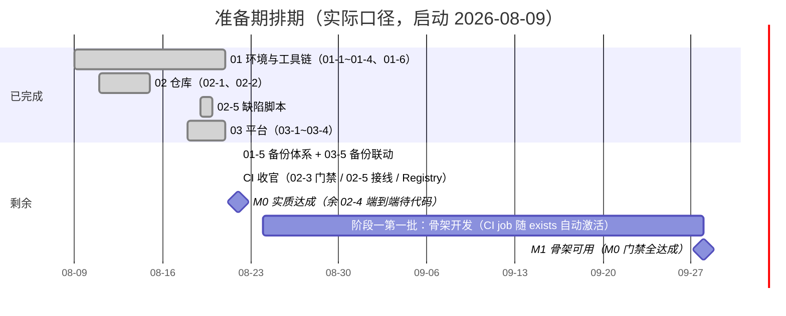

# 准备期计划

> BMS 基础管理系统 · 阶段0（准备期 / M0）排期计划：17 项任务逐条排期（实际口径）

[文档首页](../../../文档首页.md) › 准备期计划 › 准备期计划　|　[任务基线 →](../任务/01_环境与工具链.md)　[需求基线 →](../需求/00_需求_准备期.md)

## 1. 计划说明 

- **排期对象**：准备期 17 项任务（[任务基线](../任务/01_环境与工具链.md)：3 父任务 + 17 子任务），逐项排期。
- **实际口径**：准备期实际启动于 2026-08-09，截至 2026-08-22 已完成 16 项（CI 三项 02-3/02-5/02-6 提前于排期完成）；剩余仅 02-4 的端到端验证部分（框架已就绪），随阶段一骨架代码激活后收口。
- **里程碑锚点**（《总体项目规划》7.2，T+0 = 2026-08-24）：M0 = 2026-09-07（2 周）、M1 = 2026-09-28（累计 5 周）。本计划不调整《总体项目规划》，达成日期与之对照标注。
- **口径继承**：02-4 框架（Registry/job 骨架/空载流水线）已于 2026-08-22 落地并实测，端到端验证依赖阶段一代码；进度事实源为禅道 M0 迭代。
- **负责人**：minjian（兼职，单人）。

## 2. 已完成任务（2026-08-09 ~ 2026-08-22） 

| 编号 | 任务 | 工时（重估） | 完成日期 | 任务文件 |
| --- | --- | --- | --- | --- |
| 01-1 | mjbk Ubuntu 基础 | 4h | 2026-08-15 | [01-1](../任务/01_环境与工具链_01-1_mjbk_Ubuntu基础.md) |
| 01-2 | Docker Engine 与 ufw 防火墙 | 2h | 2026-08-15 | [01-2](../任务/01_环境与工具链_01-2_Docker_Engine与ufw防火墙.md) |
| 01-3 | 常驻服务（三库 / Redis / MinIO） | 4h | 2026-08-15 | [01-3](../任务/01_环境与工具链_01-3_常驻服务.md) |
| 01-4 | 运维工具链 | 3h | 2026-08-21 | [01-4](../任务/01_环境与工具链_01-4_运维工具链.md) |
| 01-5 | 备份体系 | 3h（提前完成） | 2026-08-22 | [01-5](../任务/01_环境与工具链_01-5_备份体系.md) |
| 01-6 | mjpc 开发机 | 1h | 2026-08-14 | [01-6](../任务/01_环境与工具链_01-6_mjpc开发机.md) |
| 02-1 | GitLab CE 与 runner 部署 | 4h | 2026-08-15 | [02-1](../任务/02_仓库与CI_02-1_GitLab_CE与runner部署.md) |
| 02-2 | 仓库迁移与分支模型 | 2.5h | 2026-08-14 | [02-2](../任务/02_仓库与CI_02-2_仓库迁移与分支模型.md) |
| 02-5 | 缺陷自动上报（脚本部分） | —（剩 6h 接线） | 2026-08-19 | [02-5](../任务/02_仓库与CI_02-5_缺陷自动上报.md) |
| 03-1 | Kiwi TCMS 部署 | 2h | 2026-08-19 | [03-1](../任务/03_测试与项目管理平台_03-1_KiwiTCMS部署.md) |
| 03-2 | 禅道部署 | 2h | 2026-08-21 | [03-2](../任务/03_测试与项目管理平台_03-2_禅道部署.md) |
| 03-3 | 禅道初始化 | 4h | 2026-08-21 | [03-3](../任务/03_测试与项目管理平台_03-3_禅道初始化.md) |
| 03-4 | 三方平台分工 | 1h | 2026-08-21 | [03-4](../任务/03_测试与项目管理平台_03-4_三方平台分工.md) |
| 03-5 | 平台备份联动 | 0.5h（提前完成） | 2026-08-22 | [03-5](../任务/03_测试与项目管理平台_03-5_平台备份联动.md) |
| 02-6 | Renovate 与 GitHub 归档启用 | 1h（提前完成） | 2026-08-22 | [02-6](../任务/02_仓库与CI_02-6_Renovate与GitHub归档.md) |
| 02-3 | MR 流水线门禁 | 8h（提前完成） | 2026-08-22 | [02-3](../任务/02_仓库与CI_02-3_MR流水线门禁.md) |
| 02-5 | 缺陷自动上报（接线，整体完成） | 6h（提前完成） | 2026-08-22 | [02-5](../任务/02_仓库与CI_02-5_缺陷自动上报.md) |

已完成合计约 48h（CI 三项提前完成；02-5 含脚本与接线两段）。

## 3. 剩余任务排期 

| 编号 | 任务 | 工时 | 依赖 | 排期窗口 | 备注 |
| --- | --- | --- | --- | --- | --- |
| 02-4 | main 流水线端到端验证 | 3h（重估，原 11h 框架部分已完） | 阶段一骨架代码 | 搁置（随阶段一第一批激活） | E2E / 三库集成 / 镜像构建推 Registry / Trivy 扫描 / 契约 / Allure 的真实数据验证；job 骨架与 Registry 已于 08-22 就绪并空载通过 |

剩余合计 3h（17 项总计约 65.5h）；准备期实质收工，仅余随阶段一代码自动激活的端到端验证。

## 4. 排期甘特图 

里程碑对照（《总体项目规划》7.2 基线）：

| 里程碑 | 基线日期 | 本计划预计 | 说明 |
| --- | --- | --- | --- |
| M0 启动就绪 | 2026-09-07 | 2026-08-22（实质达成） | 环境/仓库/平台/备份/CI 就绪；仅余 02-4 端到端验证随阶段一代码自动补齐 |
| M1 骨架可用 | 2026-09-28 | 2026-09-28 | 骨架 + main 流水线端到端 + 全部门禁达成 |

## 5. M0 验收门禁 

门禁定义与逐项核对见 [需求总览 · M0 验收门禁](../需求/00_需求_准备期.md#accept)（环境 / 仓库 / CI 就绪，可进入骨架开发）。本计划下的达成路径：

| 验收点 | 对应任务 | 达成情况 |
| --- | --- | --- |
| 环境可达 / 工具链可用 / 平台可用 / 仓库就绪 | 01-1~01-4、01-6、02-1/02-2、03-1~03-4 | 已达成（2026-08-21） |
| 备份就绪 | 01-5、03-5 | 已达成（2026-08-22） |
| MR 门禁 + 缺陷上报 | 02-3、02-5 | 已达成（2026-08-22，含阻断与端到端实测） |
| main 流水线端到端 | 02-4 框架已就绪 | 随阶段一代码激活（空载流水线已通过） |

## 6. 风险与对策 

| 风险 | 影响 | 对策 |
| --- | --- | --- |
| GitHub 类下载偶发不通 | 工具下载受阻 | 走 ghfast.top 镜像代理（《AGENTS.md》网络与镜像节）；push mirror 实测不受影响 |
| dmPython 与 Python 3.14 不兼容 | 三库集成受阻 | 整体降 3.13，按《总体项目规划》第 10 节风险口径执行 |
| CI 挤占 GitLab 与开发服务 | mjbk 资源争用 | runner `concurrent = 2`（02-1 已固化） |
| 禅道内存占用超限 | 服务不稳定 | 预算上限 1.5 GB，`docker stats` 监控（03-2） |
| 禅道 M0 任务状态仍为 wait | 进度事实源失真 | 2026-08-26 前人工流转；11 个子任务（02-x/03-x）创建后回填任务文件编号 |
| 兼职单人开发 | 排期无冗余 | 排期已含缓冲；02-6 单独搁置不占主路径 |

## 7. 变更记录 

| 日期 | 变更 |
| --- | --- |
| 2026-08-21 | 初版：17 项逐条排期，实际口径（启动 2026-08-09，剩余自 2026-08-24 排起） |
| 2026-08-22 | 同步上游规划修订：02-4 补镜像扫描 job（Trivy，GitLab 内置模板、不加工时，外网不可达时预缓存或随 02-6 暂缓）
| 2026-08-22 | 01-5 提前完成（原排期 08-24~25）：总控备份脚本 + cron 02:30 落地、四组件手动全 OK、恢复验证通过；达梦实测为原生安装走 dexp，PG 改单库 pg_dump |

> 本文档依《文档生成规范》编写 · 生成日期：2026-08-21 · 更新日期：2026-08-22
