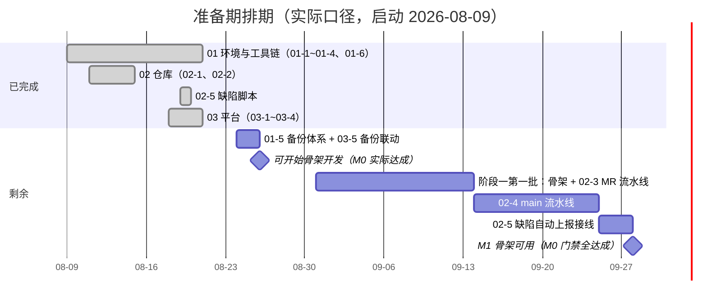

# 准备期计划

> BMS 基础管理系统 · 阶段0（准备期 / M0）排期计划：17 项任务逐条排期（实际口径）

[文档首页](../../../文档首页.md) › 准备期计划 › 准备期计划　|　[任务基线 →](../任务/01_环境与工具链.md)　[需求基线 →](../需求/00_需求_准备期.md)

## 1. 计划说明 

- **排期对象**：准备期 17 项任务（[任务基线](../任务/01_环境与工具链.md)：3 父任务 + 17 子任务），逐项排期。
- **实际口径**：准备期实际启动于 2026-08-09，截至 2026-08-21 已完成 11 项（12 条含 02-5 脚本）；剩余 5 项 + 1 项搁置，自 2026-08-24（下周一）起排。
- **里程碑锚点**（《总体项目规划》7.2，T+0 = 2026-08-24）：M0 = 2026-09-07（2 周）、M1 = 2026-09-28（累计 5 周）。本计划不调整《总体项目规划》，达成日期与之对照标注。
- **口径继承**：02-3/02-4 随阶段一第一批（骨架）落地（《开发部署规划》第 10 节）；02-6 因 mjbk 外网不可达搁置（《开发部署规划》第 11 节）；进度事实源为禅道 M0 迭代。
- **负责人**：minjian（兼职，单人）。

## 2. 已完成任务（2026-08-09 ~ 2026-08-21） 

| 编号 | 任务 | 工时（重估） | 完成日期 | 任务文件 |
| --- | --- | --- | --- | --- |
| 01-1 | mjbk Ubuntu 基础 | 4h | 2026-08-15 | [01-1](../任务/01_环境与工具链_01-1_mjbk_Ubuntu基础.md) |
| 01-2 | Docker Engine 与 ufw 防火墙 | 2h | 2026-08-15 | [01-2](../任务/01_环境与工具链_01-2_Docker_Engine与ufw防火墙.md) |
| 01-3 | 常驻服务（三库 / Redis / MinIO） | 4h | 2026-08-15 | [01-3](../任务/01_环境与工具链_01-3_常驻服务.md) |
| 01-4 | 运维工具链 | 3h | 2026-08-21 | [01-4](../任务/01_环境与工具链_01-4_运维工具链.md) |
| 01-6 | mjpc 开发机 | 1h | 2026-08-14 | [01-6](../任务/01_环境与工具链_01-6_mjpc开发机.md) |
| 02-1 | GitLab CE 与 runner 部署 | 4h | 2026-08-15 | [02-1](../任务/02_仓库与CI_02-1_GitLab_CE与runner部署.md) |
| 02-2 | 仓库迁移与分支模型 | 2.5h | 2026-08-14 | [02-2](../任务/02_仓库与CI_02-2_仓库迁移与分支模型.md) |
| 02-5 | 缺陷自动上报（脚本部分） | —（剩 6h 接线） | 2026-08-19 | [02-5](../任务/02_仓库与CI_02-5_缺陷自动上报.md) |
| 03-1 | Kiwi TCMS 部署 | 2h | 2026-08-19 | [03-1](../任务/03_测试与项目管理平台_03-1_KiwiTCMS部署.md) |
| 03-2 | 禅道部署 | 2h | 2026-08-21 | [03-2](../任务/03_测试与项目管理平台_03-2_禅道部署.md) |
| 03-3 | 禅道初始化 | 4h | 2026-08-21 | [03-3](../任务/03_测试与项目管理平台_03-3_禅道初始化.md) |
| 03-4 | 三方平台分工 | 1h | 2026-08-21 | [03-4](../任务/03_测试与项目管理平台_03-4_三方平台分工.md) |

已完成合计约 29.5h（另 02-5 脚本部分已就绪）。

## 3. 剩余任务排期（自 2026-08-24） 

| 编号 | 任务 | 工时 | 依赖 | 排期窗口 | 备注 |
| --- | --- | --- | --- | --- | --- |
| 01-5 | 备份体系 | 4h | 01-1/01-3/02-1/03-2（均已完成） | 2026-08-24 ~ 2026-08-25 | 三库 dump + GitLab + 禅道页面备份，08-25 恢复演练 |
| 03-5 | 平台备份联动 | 1h | 01-5 | 2026-08-26 | Kiwi/禅道数据纳入 01-5 备份脚本 |
| 02-3 | MR 流水线门禁 | 8h | 阶段一第一批（骨架） | 2026-08-31 ~ 2026-09-14 | `.gitlab-ci.yml` 随骨架落地，含覆盖率门禁 |
| 02-4 | main 流水线 | 11h | 02-3 | 2026-09-14 ~ 2026-09-25 | E2E / 三库集成 / 镜像 / 镜像扫描（Trivy，CVSS≥9 阻断） / 契约 / Allure + Kiwi 导入 |
| 02-5 | 缺陷自动上报接线 | 6h | 02-4（脚本已就绪） | 2026-09-25 ~ 2026-09-28 | REPRO 包 + GitLab Issue + ai_fix 指派 |
| 02-6 | Renovate 与 GitHub 归档 | 3h | mjbk 外网恢复 | 搁置（暂排 M1 之后） | 不入甘特图，外网恢复后排期 |

剩余合计 30h（另 02-6 搁置 3h）；17 项总计 62.5h。

## 4. 排期甘特图 

里程碑对照（《总体项目规划》7.2 基线）：

| 里程碑 | 基线日期 | 本计划预计 | 说明 |
| --- | --- | --- | --- |
| M0 启动就绪 | 2026-09-07 | 2026-08-26 | 环境/仓库/平台/备份达标；「CI 就绪」项按口径随阶段一第一批落地 |
| M1 骨架可用 | 2026-09-28 | 2026-09-28 | 骨架 + MR 门禁 + main 流水线 + 缺陷上报全通过，M0 门禁 6 项全达成 |

## 5. M0 验收门禁 

门禁定义与逐项核对见 [需求总览 · M0 验收门禁](../需求/00_需求_准备期.md#accept)（环境 / 仓库 / CI 就绪，可进入骨架开发）。本计划下的达成路径：

| 验收点 | 对应任务 | 预计达成 |
| --- | --- | --- |
| 环境可达 / 工具链可用 / 平台可用 / 仓库就绪 | 01-1~01-4、01-6、02-1/02-2、03-1~03-4 | 已达成（2026-08-21） |
| 备份就绪 | 01-5、03-5 | 2026-08-26 |
| CI 就绪 | 02-3、02-4、02-5 | 2026-09-28（随阶段一第一批/第二批） |

## 6. 风险与对策 

| 风险 | 影响 | 对策 |
| --- | --- | --- |
| mjbk 外网不可达 | 02-6 搁置、镜像拉取受阻 | 镜像预缓存；GitHub 归档与 Renovate 暂缓，不阻塞内网主路径（《开发部署规划》11） |
| dmPython 与 Python 3.14 不兼容 | 三库集成受阻 | 整体降 3.13，按《总体项目规划》第 10 节风险口径执行 |
| CI 挤占 GitLab 与开发服务 | mjbk 资源争用 | runner `concurrent = 2`（02-1 已固化） |
| 禅道内存占用超限 | 服务不稳定 | 预算上限 1.5 GB，`docker stats` 监控（03-2） |
| 禅道 M0 任务状态仍为 wait | 进度事实源失真 | 2026-08-26 前人工流转；11 个子任务（02-x/03-x）创建后回填任务文件编号 |
| 兼职单人开发 | 排期无冗余 | 排期已含缓冲；02-6 单独搁置不占主路径 |

## 7. 变更记录 

| 日期 | 变更 |
| --- | --- |
| 2026-08-21 | 初版：17 项逐条排期，实际口径（启动 2026-08-09，剩余自 2026-08-24 排起） |
| 2026-08-22 | 同步上游规划修订：02-4 补镜像扫描 job（Trivy，GitLab 内置模板、不加工时，外网不可达时预缓存或随 02-6 暂缓） |

> 本文档依《文档生成规范》编写 · 生成日期：2026-08-21 · 更新日期：2026-08-22
