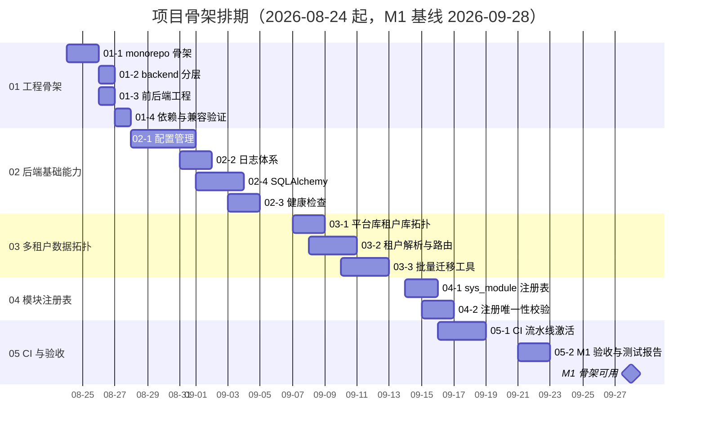

# 项目骨架计划

> BMS 基础管理系统 · 阶段一（项目骨架 / M1）排期计划：15 项任务逐条排期（2026-08-24 起）

[文档首页](../../../文档首页.md) › 项目骨架计划 › 项目骨架计划　|　[任务基线 →](../任务/01_工程骨架.md)　[需求基线 →](../需求/00_需求_项目骨架.md)

## 1. 计划说明 

- **排期对象**：项目骨架 15 项任务（[任务基线](../任务/01_工程骨架.md)：5 父任务 + 15 子任务），逐项排期。
- **排期口径**：2026-08-24 起排——M0 已于 2026-08-22 实质达成（准备期计划口径），阶段一提前开工；任务窗口排至 2026-09-22，其后留缓冲至 M1 门禁。
- **里程碑锚点**（《总体项目规划》7.2，T+0 = 2026-08-24）：M1 = 2026-09-28（累计 5 周）。本计划不调整《总体项目规划》，达成日期与之对照标注。
- **口径继承**：CI 流水线框架已于准备期 02-3/02-4 落地并空载通过；05-1 随阶段一代码落地激活六类 job 并把准备期遗留 02-4 端到端验证收口（激活后回写准备期文档）。进度事实源为禅道 M1 迭代（id 4）。
- **负责人**：minjian（兼职，单人）。

## 2. 已完成任务（暂无） 

| 编号 | 任务 | 工时（重估） | 完成日期 | 任务文件 |
| --- | --- | --- | --- | --- |

阶段一自 2026-08-24 起排，截至 2026-08-23 尚未启动，暂无已完成任务。

## 3. 剩余任务排期（自 2026-08-24） 

| 编号 | 任务 | 工时 | 依赖 | 排期窗口 | 备注 |
| --- | --- | --- | --- | --- | --- |
| 01-1 | monorepo 仓库骨架 | 4h | 无 | 2026-08-24 ~ 2026-08-25 | 三工程最小骨架占位 + 根 README |
| 01-2 | backend 分层骨架 | 4h | 01-1 | 2026-08-25 ~ 2026-08-26 | 分层目录与职责落地，空应用可启动 |
| 01-3 | 前后端工程骨架 | 3h | 01-1 | 2026-08-26 ~ 2026-08-27 | Vue3+Vite 双工程，.nvmrc ≥ 20.19 |
| 01-4 | 依赖锁定与兼容验证 | 4h | 01-2 | 2026-08-27 ~ 2026-08-28 | Python 3.14 逐依赖验证（含 dmPython），结论决定版本口径 |
| 02-1 | 配置管理 | 2h | 01-2 | 2026-08-28 ~ 2026-08-31 | config.toml + BMS_ENV 三环境 |
| 02-2 | 日志体系 | 2h | 02-1 | 2026-08-31 ~ 2026-09-01 | structlog JSON，脱敏与上下文字段 |
| 02-4 | SQLAlchemy 接入 | 4h | 01-4/02-1 | 2026-09-01 ~ 2026-09-03 | 异步引擎四库方言，SQLite 迁移冒烟 |
| 02-3 | 健康检查 | 2h | 02-1/02-4 | 2026-09-03 ~ 2026-09-04 | /healthz /readyz，依赖停时 readyz 不健康 |
| 03-1 | 平台库租户库拓扑 | 3h | 02-4 | 2026-09-07 ~ 2026-09-08 | 三库模型 + 基类，软删除复合唯一索引达梦验证 |
| 03-2 | 租户解析与路由 | 4h | 03-1 | 2026-09-08 ~ 2026-09-10 | 中间件 + 动态 engine 路由 |
| 03-3 | 批量迁移工具 | 4h | 03-1 | 2026-09-10 ~ 2026-09-14 | Alembic 三库可执行 + 新租户建库实测 |
| 04-1 | sys_module 注册表 | 3h | 03-1 | 2026-09-14 ~ 2026-09-15 | 表 + 种子（sys_/wf_/rpt_/ai_ + 业务模块） |
| 04-2 | 注册唯一性校验 | 2h | 04-1 | 2026-09-15 ~ 2026-09-16 | 启动 + CI 校验，冲突被拒 |
| 05-1 | CI 流水线激活 | 4h | 02-3/03-3/04-2 | 2026-09-16 ~ 2026-09-18 | 六类 job 真实执行；02-4 端到端收口并回写 00 文档 |
| 05-2 | M1 验收与测试报告 | 2h | 05-1 | 2026-09-21 ~ 2026-09-22 | 门禁五项核对 + 测试报告 + README |

合计 47h；2026-09-23 ~ 2026-09-28 留缓冲（修尾、滚动调整），M1 门禁 2026-09-28 核对。

## 4. 排期甘特图 

里程碑对照（《总体项目规划》7.2 基线）：

| 里程碑 | 基线日期 | 本计划预计 | 说明 |
| --- | --- | --- | --- |
| M0 启动就绪 | 2026-09-07 | 2026-08-22（已实质达成） | 准备期收口，仅余 02-4 端到端验证随 05-1 补齐 |
| M1 骨架可用 | 2026-09-28 | 2026-09-28 | 门禁五项核对通过 |

## 5. M1 验收门禁 

门禁定义与逐项核对见 [需求总览 · M1 验收门禁](../需求/00_需求_项目骨架.md#accept)（本地起服务 / CI 通过 / /healthz /readyz 正常 / 三库拓扑可路由 / 模块注册校验生效）。本计划下的达成路径：

| 验收点 | 对应任务 | 达成路径 |
| --- | --- | --- |
| 本地起服务 | 01-1 ~ 01-4、02-1、02-4 | 08-24 ~ 09-04 骨架与基础能力落地 |
| CI 通过 | 05-1 | 09-16 ~ 09-18 六类 job 真实执行全绿 |
| 健康检查正常 | 02-3 | 09-03 ~ 09-04 探针与依赖状态明细 |
| 三库拓扑可路由 | 01-4、02-4、03-1 ~ 03-3 | 09-01 ~ 09-14 三库迁移与租户路由实测 |
| 模块注册校验生效 | 04-1、04-2 | 09-14 ~ 09-16 冲突种子被启动/CI 拒绝 |

## 6. 风险与对策 

| 风险 | 影响 | 对策 |
| --- | --- | --- |
| Python 3.14 与核心依赖/dmPython 不兼容 | 骨架阻塞 | 01-4 首周验证，任一核心依赖不兼容整体回退 3.13（《总体项目规划》第 10 节既定口径） |
| 达梦方言差异（软删除复合唯一索引、迁移脚本） | 03-1/03-3 受阻 | 按 Oracle 兼容口径验证，迁移脚本三库分环境验证（《项目规划说明》第 11 节） |
| CI 六类 job 真实执行暴露工程问题 | 05-1 延期 | 框架已空载通过（准备期 02-3/02-4），逐 job 修复；缓冲周兜底 |
| mjbk 外网不可达（Trivy 镜像扫描） | 05-1 部分项受阻 | 镜像预缓存或暂缓扫描，不阻塞其余 job（准备期既定口径） |
| 兼职单人投入不稳 | 排期顺延 | 串行排期 + 缓冲周（09-23 ~ 09-28），里程碑评审滚动调整 |

## 7. 变更记录 

| 日期 | 变更 |
| --- | --- |
| 2026-08-23 | 初版：15 项逐条排期，2026-08-24 起排、M1 基线 2026-09-28；准备期遗留 02-4 并入 05-1 收口 |

> 本文档依《文档生成规范》编写 · 生成日期：2026-08-23
