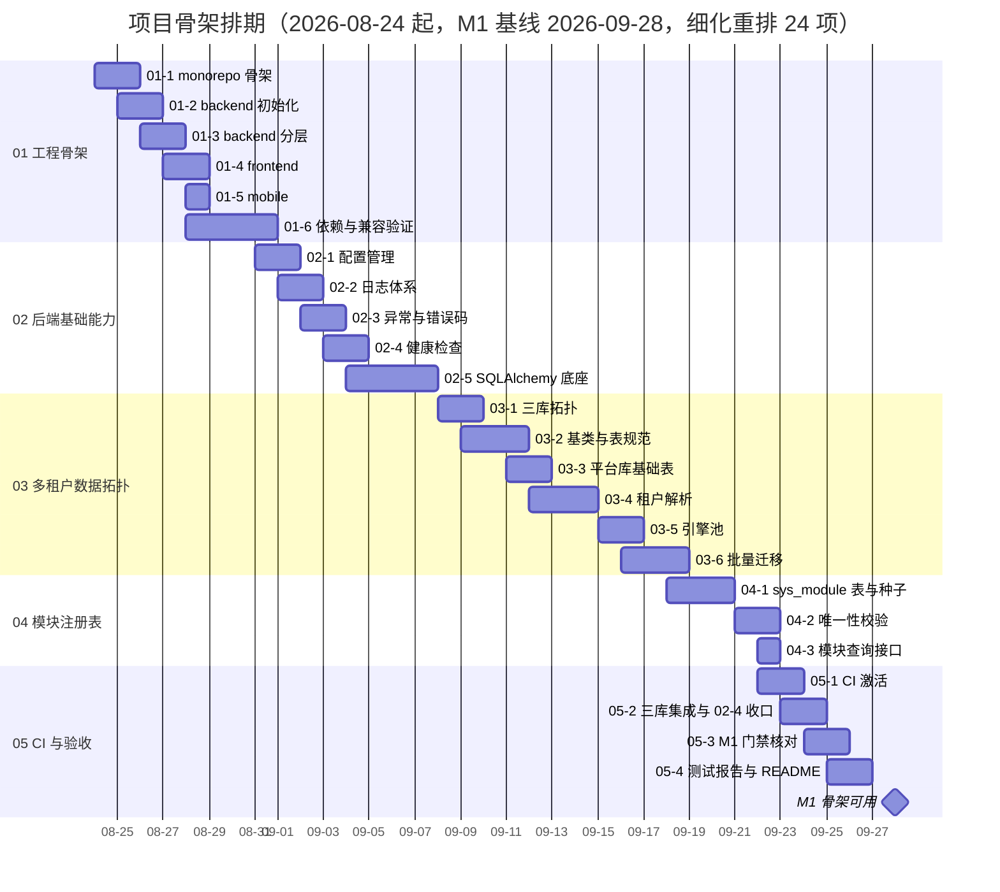

# 项目骨架计划

> BMS 基础管理系统 · 阶段一（项目骨架 / M1）排期计划：24 项任务逐条排期（2026-08-24 起，细化重排口径）

[文档首页](../../../文档首页.md) › 项目骨架计划 › 项目骨架计划　|　[任务基线 →](../任务/01_工程骨架.md)　[需求基线 →](../需求/00_需求_项目骨架.md)

## 1. 计划说明 

- **排期对象**：项目骨架 24 项任务（[任务基线](../任务/01_工程骨架.md)：5 父任务 + 24 子任务），逐项排期。
- **排期口径**：2026-08-24 起排——M0 已于 2026-08-22 实质达成（准备期计划口径），阶段一提前开工；任务窗口排至 2026-09-26，其后留缓冲至 M1 门禁。
- **细化重排口径**：2026-08-23 需求细化重写（15 条 → 24 条），任务随动拆细；总工时由初版 47h 上调至 **68h**（需求细化识别出更多交付物：异常错误码骨架、引擎池管理、模块查询接口、达梦口径修订、CI 分层口径等）。
- **里程碑锚点**（《总体项目规划》7.2，T+0 = 2026-08-24）：M1 = 2026-09-28（累计 5 周）。本计划不调整《总体项目规划》，达成日期与之对照标注。
- **口径继承**：CI 流水线框架已于准备期 02-3/02-4 落地并空载通过；05-1 随阶段一代码落地激活（单人开发期直推 main 冒烟层 + 重验证层口径），05-2 把准备期遗留 02-4 端到端验证收口（回写准备期文档）。进度事实源为文档（需求/任务/计划三类）。
- **负责人**：minjian（兼职，单人）。

## 2. 已完成任务（暂无） 

| 编号 | 任务 | 工时（重估） | 完成日期 | 任务文件 |
| --- | --- | --- | --- | --- |

阶段一自 2026-08-24 起排，截至 2026-08-23 尚未启动，暂无已完成任务。

## 3. 剩余任务排期（自 2026-08-24） 

| 编号 | 任务 | 工时 | 依赖 | 排期窗口 | 备注 |
| --- | --- | --- | --- | --- | --- |
| 01-1 | monorepo 仓库根骨架 | 3h | 无 | 2026-08-24 ~ 2026-08-25 | 顶层目录 + 根 README + .gitignore/.editorconfig |
| 01-2 | backend 工程初始化 | 3h | 01-1 | 2026-08-25 ~ 2026-08-26 | pyproject/uv、应用工厂、/docs 可用 |
| 01-3 | backend 分层目录与职责 | 3h | 01-2 | 2026-08-26 ~ 2026-08-27 | 分层目录 + 职责 docstring + 示例模块走通 |
| 01-4 | frontend 工程初始化 | 3h | 01-1 | 2026-08-27 ~ 2026-08-28 | Vue3+Vite+TS、代理连通、ESLint/Vitest |
| 01-5 | frontend-mobile 工程初始化 | 2h | 01-1 | 2026-08-28 | Vant 双工程独立配置 |
| 01-6 | 依赖锁定与 Python 3.14 兼容验证 | 3h | 01-2 | 2026-08-28 ~ 2026-08-31 | 验证矩阵（含达梦实测），结论决定版本口径 |
| 02-1 | 配置管理 | 3h | 01-2 | 2026-08-31 ~ 2026-09-01 | config.toml 分区 + BMS_ 覆盖 + 校验 |
| 02-2 | 日志体系 | 3h | 02-1 | 2026-09-01 ~ 2026-09-02 | structlog JSON、上下文字段、脱敏 |
| 02-3 | 异常与错误码骨架 | 2h | 02-1 | 2026-09-02 ~ 2026-09-03 | BizError + 全局处理器 + 基础错误码 |
| 02-4 | 健康检查 | 2h | 02-1/02-5 | 2026-09-03 ~ 2026-09-04 | /healthz /readyz 契约，依赖停 readyz 503 |
| 02-5 | SQLAlchemy 数据访问底座 | 6h | 01-6/02-1 | 2026-09-04 ~ 2026-09-08 | 四库方言 + 达梦口径修订（先修订架构 09/后端规范 8 节）+ 读写分离占位 |
| 03-1 | 三库拓扑与建库 | 2h | 02-5 | 2026-09-08 ~ 2026-09-09 | 三库模型 + SQLite 模拟 + 建库标准 |
| 03-2 | 模型基类与表规范 | 4h | 02-5/03-1 | 2026-09-09 ~ 2026-09-11 | 雪花 ID/软删除/审计/乐观锁/四库类型映射 |
| 03-3 | 平台库基础表 | 2h | 03-1/03-2 | 2026-09-11 ~ 2026-09-12 | sys_tenant 字段索引 + demo 种子 |
| 03-4 | 租户解析中间件 | 3h | 03-3 | 2026-09-12 ~ 2026-09-15 | 解析链 + TenantContext + 豁免路径 |
| 03-5 | 引擎注册表与池管理 | 3h | 02-5/03-3 | 2026-09-15 ~ 2026-09-16 | 懒加载 + LRU 回收 + 连接预算 + 创建加锁 |
| 03-6 | 批量迁移与租户库初始化 | 5h | 03-3 | 2026-09-16 ~ 2026-09-18 | Alembic 三套方言 + 批量脚本 + 新租户初始化 |
| 04-1 | sys_module 表与种子 | 3h | 03-1/03-3 | 2026-09-18 ~ 2026-09-21 | 字段 + i18n 附表 + 9 行初始种子 |
| 04-2 | 注册唯一性校验 | 2h | 04-1 | 2026-09-21 ~ 2026-09-22 | 启动校验 + CI 查重，冲突被拒 |
| 04-3 | 模块查询接口 | 1h | 04-1 | 2026-09-22 | GET /api/v1/modules 只读契约 |
| 05-1 | CI 流水线激活 | 3h | 02-4/03-6/04-2 | 2026-09-22 ~ 2026-09-23 | 冒烟层 + 重验证层六类 job + 覆盖率门禁 |
| 05-2 | 三库集成与 02-4 收口 | 3h | 05-1 | 2026-09-23 ~ 2026-09-24 | bms_test 建库流程 + 集成用例 + 准备期回写 |
| 05-3 | M1 验收门禁核对 | 2h | 05-1/05-2 | 2026-09-24 ~ 2026-09-25 | 五项门禁证据 + 状态回写 + 文档收口 |
| 05-4 | 测试报告与 README | 2h | 05-3 | 2026-09-25 ~ 2026-09-26 | 报告四章节 + README 更新 + Kiwi 导入 |

合计 68h；2026-09-26 ~ 2026-09-28 留缓冲（修尾、滚动调整），M1 门禁 2026-09-28 核对。

## 4. 排期甘特图 

里程碑对照（《总体项目规划》7.2 基线）：

| 里程碑 | 基线日期 | 本计划预计 | 说明 |
| --- | --- | --- | --- |
| M0 启动就绪 | 2026-09-07 | 2026-08-22（已实质达成） | 准备期收口，仅余 02-4 端到端验证随 05-2 补齐 |
| M1 骨架可用 | 2026-09-28 | 2026-09-28 | 门禁五项核对通过 |

## 5. M1 验收门禁 

门禁定义与逐项核对见 [需求总览 · M1 验收门禁](../需求/00_需求_项目骨架.md#accept)（本地起服务 / CI 通过 / /healthz /readyz 正常 / 三库拓扑可路由 / 模块注册校验生效）。本计划下的达成路径：

| 验收点 | 对应任务 | 达成路径 |
| --- | --- | --- |
| 本地起服务 | 01-1 ~ 01-6、02-1、02-5 | 08-24 ~ 09-08 三工程骨架与后端底座落地 |
| CI 通过 | 05-1、05-2 | 09-22 ~ 09-24 冒烟层 + 重验证层全绿 |
| 健康检查正常 | 02-4 | 09-03 ~ 09-04 探针与依赖状态明细 |
| 三库拓扑可路由 | 01-6、02-5、03-1 ~ 03-6 | 09-04 ~ 09-18 三库迁移与租户路由实测 |
| 模块注册校验生效 | 04-1、04-2、04-3 | 09-18 ~ 09-22 冲突种子被启动/CI 拒绝、查询接口可用 |

## 6. 风险与对策 

| 风险 | 影响 | 对策 |
| --- | --- | --- |
| Python 3.14 与核心依赖/dmPython 不兼容 | 骨架阻塞 | 01-6 首周验证，任一核心依赖不兼容整体回退 3.13（《总体项目规划》第 10 节既定口径） |
| 达梦同步驱动与全链路异步约束口径缺口 | 02-5 受阻 | 实现前先修订《架构设计 09》与《后端开发规范》第 8 节（同步 engine + asyncio.to_thread 封装例外口径），修订动作计入 02-5 工时 |
| 达梦方言差异（软删除复合唯一索引、迁移脚本、schema 前缀） | 03-2/03-6 受阻 | 按 Oracle 兼容口径实测验证，不通过按《项目规划说明》第 11 节口径调整并修订对应需求 |
| CI 六类 job 真实执行暴露工程问题 | 05-1 延期 | 框架已空载通过（准备期 02-3/02-4），逐 job 修复；缓冲周（09-26 ~ 09-28）兜底 |
| mjbk 外网不可达（Trivy 镜像扫描） | 05-1 部分项受阻 | 镜像预缓存或暂缓扫描，不阻塞其余 job（准备期既定口径） |
| 兼职单人投入不稳 | 排期顺延 | 串行排期 + 缓冲周，里程碑评审滚动调整 |

## 7. 变更记录 

| 日期 | 变更 |
| --- | --- |
| 2026-08-23 | 初版：15 项逐条排期，2026-08-24 起排、M1 基线 2026-09-28；准备期遗留 02-4 并入 05 域收口 |
| 2026-08-23 | 细化重排：需求细化重写（15 → 24 条），任务与排期随动拆细重排；总工时 47h → 68h；CI 口径按 2026-08-23 单人期分层（直推 main 冒烟层 + 重验证层）；新增达梦口径修订、引擎池、模块查询接口等任务窗口 |

> 本文档依《文档生成规范》编写 · 生成日期：2026-08-23
